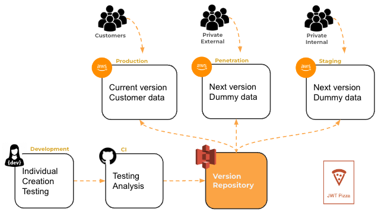

# Deployment environments

🔑 **Key points**

- Deployment environments allow you to target specific customer requirements.
- Common environments include production, staging, and development.

---

To this point you have been deploying your code directly to your production environment using what is called a `reboot` strategy. If you look at your GitHub Actions CI workflow for `jwt-pizza` you will see something like the following step.

```yml
- name: Push to AWS S3
  run: |
    aws s3 cp dist s3://pizza.byucsstudent.click --recursive
```

This has several problems. First, it just copies the deployment package files directly into the S3 location that CloudFront hosts to the world using your application URL. That means that old files that are no longer used by the application (and therefore will not be overwritten by copying) are still available for public access. This creates a security, as well as a maintenance problem.

If you delete the old version before you copy up the new version, then this introduces the possibility of the customer getting a 404 error if they try to load the application between the deletion and the copying up of the new files.

Additionally, if you want to roll back to a previous version of the application, you would need to rerun your CI pipeline with a previous Git commit. This is not something that you are currently configured to easily do, and it would take several minutes to execute. That is not a good position to be in when a critical failure is occurring.

Finally, there is the problem that there is only one environment that hosts your entire application stack. You have a development environment where individual developers can create and experiment. You have a CI environment where a version is built, tested, and analyzed. But there is no place that you can go to see how the application actually works without doing that in the same place as your customers.

What you really need is a central repository of all the candidate versions that can be quickly deployed to different environments that each serve a specific purpose.



The above diagram shows three such possible environments. This includes a production, penetration, and staging environment. Each of these environments hosts the entire stack of the application, but may have different data, device configurations, or versions of the software. The environments may also have different access controls that limit who can access it, and from where.

Each environment has the same starting flow where the software is tested, analyzed, and cataloged to ensure quality and automated access, but the deployment environments themselves target different purposes.

- **Development**: Commonly the machine that a software engineer does their work on is considered one of many development environments. Your team can formalize what that environment looks like, what tools are required, and how it is configured. Additionally, there are several cloud based development environments that you can choose from such as [AWS Cloud 9](https://aws.amazon.com/cloud9/), [GitHub Codespaces](https://github.com/features/codespaces), or [Replit](https://replit.com/). These types of tools have an advantage of creating uniformity across teams, sharing access and configuration, and being accessible from anywhere.

- **Production**: This environment is where the live application is hosted, accessible to end-users and customers. It must be highly reliable, secure, and performant since it directly impacts the user experience. Changes to this environment should be thoroughly tested and rolled out carefully to minimize downtime and avoid introducing new bugs.

- **Staging**: A staging environment is a pre-production environment that mirrors the production environment as closely as possible. It is used to perform final testing before deploying to production. This environment allows you to catch any last-minute issues that might not have been caught in earlier testing phases. It ensures that the deployment process works smoothly and that the application behaves as expected in a production-like setting.

- **Penetration**: This environment is dedicated to security testing, including penetration testing and vulnerability assessments. It is used to identify and fix security issues before they can be exploited in the production environment. This environment can simulate various attack scenarios to ensure that the application is secure against real-world threats. A key difference with this environment is that the data is not customer data and that a penetration tester is encouraged to bring the application down if possible.

- **Sales**: The sales environment is tailored specifically for demonstrations and presentations to potential customers and stakeholders. It allows the sales team to showcase the latest features and capabilities of the application in a controlled and polished setting. This environment often includes sample data and custom configurations that highlight the application's strengths and selling points, helping to create a compelling and impactful sales pitch. The data contained in this environment is created completely to tell a good sales story and can be reset after a demo.

- **Single tenancy**: You may also want to create an environment to isolate a single customer. This can be done for security or performance reasons.

## Conclusion

By adopting multiple deployment environments, you can improve the reliability, security, and overall quality of your application. You also provide for specialized uses like single tenancy or sells demos. Each environment serves a specific purpose, from ensuring smooth deployment and final testing in staging, to safeguarding against vulnerabilities in penetration testing, to providing a stable and performant user experience in production.

The key is that by automating your CI/CD pipeline it is easy to spin up new environments. This keeps you flexible to explore new business models as well as prevent, and recover from, system failures.
