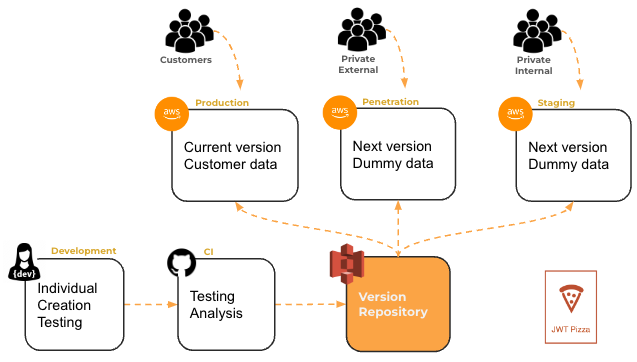

# Deployment environments

🔑 **Key points**

- Deployment environments allow you to isolate development, testing, and production activities to meet specific technical and business requirements.
- Common environments include development, staging, and production.
- Using multiple environments reduces the risk of downtime and security vulnerabilities.

---

To this point, you have been deploying your code directly to your production environment using what is often called a "reboot" or "in-place" strategy. If you look at your GitHub Actions CI workflow for `jwt-pizza`, you will see a step similar to the following:

```yml
- name: Push to AWS S3
  run: |
    aws s3 cp dist s3://pizza.byucsstudent.click --recursive
```

This approach has several flaws. First, it copies the deployment package files directly into the S3 bucket that CloudFront serves to the world. Because it only copies new files, old files that are no longer used by the application are not removed. These legacy files remain publicly accessible, creating both security risks and maintenance overhead.

If you attempt to solve this by deleting the old version before copying the new one, you introduce a "race condition." Customers trying to load the application during that interval will receive 404 errors because the files are missing.

Additionally, if you need to roll back to a previous version due to a bug, you would have to locate a previous Git commit and re-run your entire CI pipeline. This process is slow and unreliable—not a position you want to be in during a critical system failure.

Finally, relying on a single environment means you have no place to verify how the application actually works in a live setting without exposing those changes to your customers. While you have a local environment for development and a CI environment for testing, you lack a "pre-production" space for final validation.

To solve these issues, you need a central repository of versioned "build artifacts" that can be quickly deployed to different environments, each serving a specific purpose.



The diagram above illustrates three potential environments: production, penetration, and staging. Each environment hosts the entire application stack but may use different data, configurations, or software versions. Access controls can also be tailored to each environment to limit who can interact with them.

While every environment follows the same initial flow—where software is tested, analyzed, and cataloged—the deployment targets serve different goals:

- **Development**: This is typically the machine where a software engineer writes code. Teams can formalize these environments using specific toolsets and configurations. Cloud-based development environments like [AWS Cloud9](https://aws.amazon.com/cloud9/), [GitHub Codespaces](https://github.com/features/codespaces), or [Replit](https://replit.com/) provide uniformity across teams, making configurations easily shareable and accessible from anywhere.

- **Production**: This is the live environment accessible to end-users. It must be highly reliable, secure, and performant. Changes to production should be thoroughly vetted and rolled out carefully to minimize downtime and prevent regressions.

- **Staging**: A staging environment is a pre-production area that mirrors the production environment as closely as possible. It is used for final "smoke testing" before a release. This allows you to catch environment-specific issues that might not appear in local development or CI tests, ensuring the deployment process itself works smoothly.

- **Penetration**: This environment is dedicated to security testing, such as vulnerability assessments and ethical hacking. It allows security professionals to simulate attack scenarios without risking customer data or production stability. In this environment, testers are often encouraged to try to crash the application to find weaknesses.

- **Sales**: A sales environment is tailored for demonstrations to potential customers and stakeholders. It allows the sales team to showcase features in a controlled, polished setting using curated sample data. This data can be easily reset after a demo to ensure a consistent experience for the next presentation.

- **Single tenancy**: In some cases, you may create an isolated environment for a specific high-value customer. This is often done to meet strict security requirements or to provide dedicated performance resources.

## Conclusion

Adopting multiple deployment environments improves the reliability, security, and overall quality of your application. It allows you to tailor the infrastructure to specific needs, from safeguarding production with a staging buffer to conducting rigorous security audits in a penetration environment.

By automating your CI/CD pipeline, spinning up new environments becomes a trivial task. This flexibility allows you to explore new business models and ensures you can quickly recover from or prevent system failures.

## ☑ Exercise


```masteryls
{"id":"1a9938e0-b7ba-4313-98e3-04046c3862b6", "title":"Essay", "type":"essay", "gradingCriteria":"- A production system should at least have a staging and production environment" }
What environment do you think you should provide for a production application like JWT Pizza?
```
