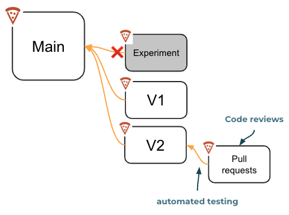
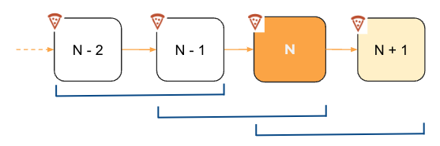
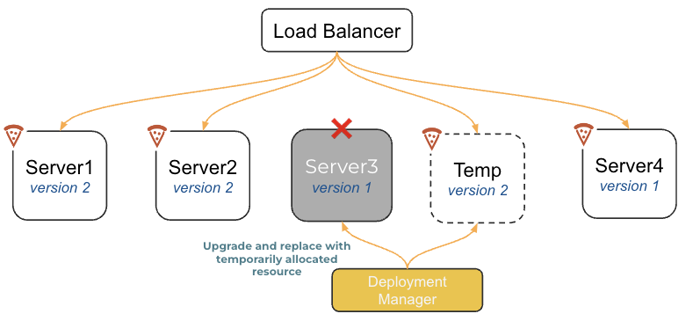
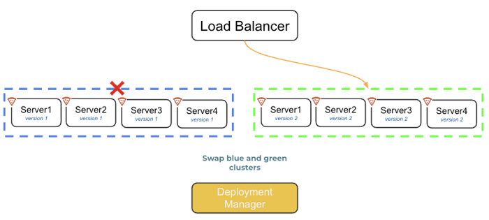
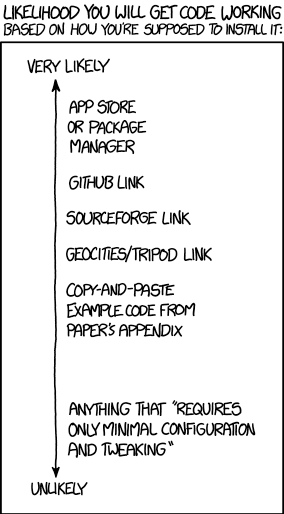

# Deployment strategies

🔑 **Key points**

- There are many tools and strategies that you can use to deploy your code.
- Version compatibility and roll back is a key part of your strategy

---

There are many deployment strategies you can use when deploying your application. Each of the different strategies address a specific system of complexities. All strategies require some concept of a version, and they usually require some level of compatibility between deployed versions.

## Branches

Git branches can serve as a foundational piece of your deployment strategy. It is very common for teams to use either the main branch or a production branch as the sole source for all production releases. New features and fixes are done on separate branches that are named after the feature, or as the anticipated next version number. All testing happens on the feature branch and changes are only merged to the main branch once they have been thoroughly tested.

You can also use branches as the source for different deployment environments. For example, the `main` branch goes to production, the `next` branch goes to staging, and the `experimental` branch goes to the research team environment.

## Rollback

You must also consider the possibility that you need to roll your application back as well as rolling forward. This happens when a bug has slipped through the quality assurance process. When it is necessary to roll back a deployment, it is usually critical to do it quickly. You cannot wait to rebuild an older version from your Git commit chain, or for significant resources to be allocated in order to support the unexpected deployment.

## Version compatibility

An important consideration for deploying a new version is its compatibility with previous and future versions. In an ideal world, all versions of the software would be compatible with all other versions. In reality, that is hard to deliver. Database schemas change, old features are dropped, and new ones added. Parameters for endpoints also change. If you are not careful this can trigger significant failures and even destroy customer or application data.

A common strategy is to keep N-1 compatibility. This means that the new version is always compatible with the previous version. The new version can add new functionality, but it always has code that handles how things were done previously. In the most problematic cases this code usually takes the form of a conditional that creates a shim for the old functionality that makes it appear like the new functionality.

Once you have deployed the new version, the next version can remove the shims because version N+1 does not have to be compatible with version N-1.

The danger with this strategy is that if you discover a problem after you have rolled multiple versions ahead, you will not simply be able to roll back to the stable version since that may introduce data corruption. However, assuming that your release cycles are something around a week apart, the likelihood of multi-version roll back becomes small.

### Forward and backward compatibility

| version | data                   | code                                                                                                                  |
| ------- | ---------------------- | --------------------------------------------------------------------------------------------------------------------- |
| v1      | {name}                 | `use name` ignores email                                                                                          |
| v2      | {name, email:optional} | `use name` require >= v2 users provide email ask < v2 users provide email `use email` or default fallback |
| v3      | {name, email}          | require < v3 users provide email `use name` `use email`                                                       |

## Deployment resources

An important consideration of application deployment is the required resources. Common strategies include:

- **In situ**: Replace the old application using existing resources as each one is temporarily taken offline. This requires no new resources, but it does reduce capacity during the deployment.
- **Rolling**: Allocate a small percentage of new resources, take the same percentage offline and replace it with the new version. Then use the old resources that were just removed to be the next replacement block. The advantage of this approach is that you never decrease in capacity during the deployment.
- **Immutable**: Allocate up entirely new resources, switch, and then throw away the old resources. This doubles the amount of required resources, but it has no impact on capacity and can be immediately reversed.

With the advent of cloud computing, it is so easy and cheap to spin up new resources that the **immutable** strategy is very attractive. This is especially true since it is closely related to strategies for increasing elasticity due to changes in customer demand. It is also easy to roll back as long as you keep the old version's resources around until you are confident that the system is stable.

## Strategies

The following is a list of common deployment strategies. There is no perfect strategy that works for all situations, and you can even combine strategies to handle complex architectures that have multiple levels of deployment concerns.

### Reboot

Drain, stop, delete, replace, and restart each resource. This has the advantage of being very simple and removing all possible dependencies between versions as long as requests are sticky to a specific resource. It also requires a minimal amount of resources since you simply reuse everything that was already deployed. However, it takes time to move through the resources one by one, it is slow to roll back, and it decreases the capacity of the application during deployment.

### Canary

This strategy is called a canary because, like the coal mines of old, a canary is used to see if there is a looming failure awaiting you. You start by exposing the new version to a few users. You can make the requests sticky so that a specific customer only sees one version, or allow all the customers to bounce back and forth in order to determine that the versions are compatible with each other. If all of your observability metrics show that things are going well with the canary, you can increase the number of customers on the new version. When a significant percentage of customers are successfully using the canary, you switch everyone over.

### Rolling

The rolling strategy partitions the resources into equal parts. Each partition is then successively taken offline and replaced with the new version and put back online. As the process continues a greater percentage of the application is running the new version.

### Blue/Green

With the blue/green strategy you allocate two equal sets of resources. The green set represents the new version and the blue represents the old version. You then drain all users off from the blue version and move them to the green version. If there is problem then you simply switch the load back. With this strategy you can allocate an entirely new set of resources every time you deploy, or you can keep the green set around and use it as your staging environment. Once you make the swap then the blue environment is upgraded to the latest code, and it becomes both your new green and staging environment. The advantage of this strategy is that your staging environment has the exact same hardware configuration as your production environment.

### A/B testing

With A/B testing you have two versions running at the same time, but traffic is routed by the load balancer based upon some trigger such as an assigned cookie, URL parameter, geographic location, or IP address range. This is commonly used to determine the success of a new feature. Once the test is over the alternative version is drained and all of its traffic is moved back to the core version. Note that sometimes A/B testing doesn't actually require a different version of the application to be deployed. The switch can simply be a gate within a single deployed version.

### Continuous

Continuous deployment (CD) immediately deploys a version as soon as the automated tests complete. This is in contrast to continuous delivery which creates new versions that are usually deployed as part of a schedule or human trigger. For continuous deployment to be successful your architecture must automatically alert on any anomalies and have the ability to roll back quickly. Otherwise, your customers become your quality assurance team and that usually doesn't go very well for very long.

### Serverless

Serverless deployment takes the idea of elastic deployment of resources to a new level. The system will automatically allocate resources as demand increases and release them as it decreases. Resources may be allocated for each specific request, but usually, in the name of performance, a resource is initially allocated and then kept around for a time in anticipation of future use. The serverless system manager has to handle the deployment of new versions. This is usually done with a pattern that allows current requests to drain off the old version and new requests are allocated with the new version.

## Deployment strategies for JWT Pizza

#### JWT Pizza Service

The JWT Pizza backend uses an **Immutable** strategy that is managed by ECS and the EC2 application load balancer. When a new version is created, EC2 spins up the required number of containers and creates a new load balancer cluster. The old cluster is drained as all the new traffic is moved to the new cluster. Once all the traffic has been moved over and the health of the cluster is deemed to be acceptable, the old cluster is destroyed. If during the deployment, the health of the cluster is unacceptable, then the traffic is returned to the old cluster and the new cluster is destroyed.

#### JWT Pizza

The JWT Pizza frontend currently uses an **In Situ** strategy that is executed by your CI workflow. As soon as the S3 copy command is executed the new version files are available. Because the copy is not atomic, and the resource is never taken out of service, there may be situations where only some application files are present. However, CloudFront does cache files for a period of time and so only customers who experience a cache timeout during the deployment are likely to see a partially deployed application.

For a production system, the situation for the JWT Pizza frontend is not really acceptable. Not only that, but it is difficult to roll back since it requires a new build and deployment of the files. That is something that could take 10 minutes or more, during which the application could be down. For this reason, we will move the frontend deployment to a strategy where the files are deployed atomically and can be quickly rolled back.

## A bit of fun

> _source: [XKCD](https://xkcd.com/1742/)_
