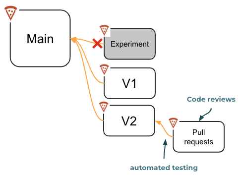
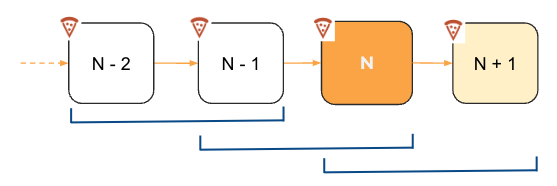
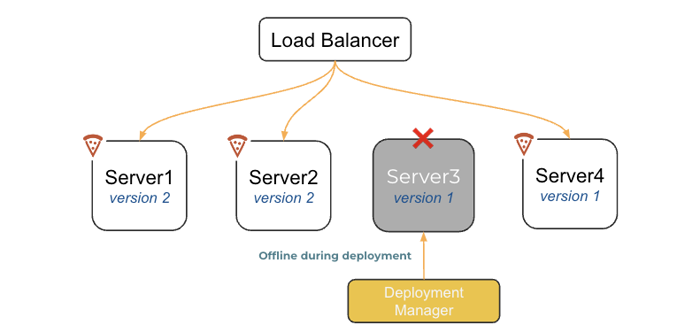
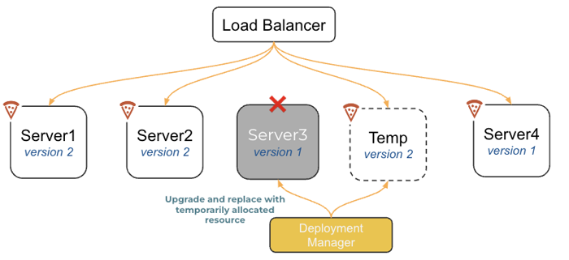
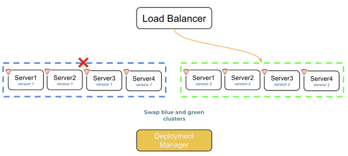
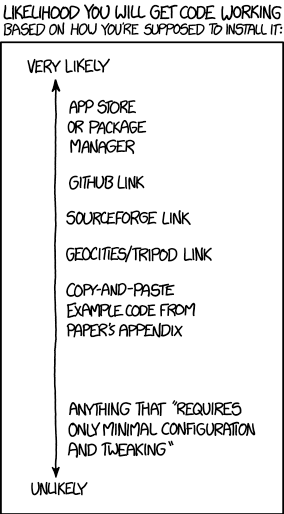

# Deployment strategies

🔑 **Key points**

- There are many tools and strategies available for deploying code.
- Version compatibility and rollback procedures are essential components of a deployment strategy.

---

There are many deployment strategies you can use when releasing an application. Each strategy addresses a specific set of complexities. All strategies require a concept of versioning and usually necessitate some level of compatibility between deployed versions.

## Branches

Git branches serve as a foundational piece of a deployment strategy. It is common for teams to use either a `main` branch or a `production` branch as the sole source for all production releases. New features and fixes are developed on separate branches named after the feature or the anticipated version number. Testing occurs on the feature branch, and changes are merged to the main branch only after thorough verification.



Branches can also serve as the source for different deployment environments. For example:
- The `main` branch deploys to production.
- The `next` branch deploys to staging.
- The `experimental` branch deploys to a research or development environment.

## Rollback

You must consider the need to roll an application back as well as roll it forward. Rollbacks occur when a bug slips through the quality assurance process. When a rollback is necessary, speed is critical. You cannot afford to wait for an older version to be rebuilt from the Git commit chain or for significant resources to be allocated to support an emergency deployment.

## Version compatibility

A critical consideration when deploying a new version is its compatibility with previous and future versions. Ideally, all software versions would be compatible with one another; however, this is difficult to achieve in practice. Database schemas change, old features are deprecated, and new parameters are added to API endpoints. Without careful planning, version mismatches can trigger significant failures or even corrupt customer data.

A common strategy is to maintain **N-1 compatibility**. This means the new version (N) is always compatible with the immediately preceding version (N-1). The new version can introduce new functionality, but it must include code to handle legacy data formats or logic. In complex cases, this often involves creating a "shim" or conditional logic that makes old data appear compatible with the new system.



Once the new version is successfully deployed, the subsequent version (N+1) can remove these shims, as version N+1 only needs to be compatible with version N, not N-1.

The risk of this strategy is that if a problem is discovered after several subsequent deployments, you may not be able to roll back to a known stable version without risking data corruption. However, if release cycles are frequent (e.g., once a week), the likelihood of needing a multi-version rollback is significantly reduced.

### Forward and backward compatibility

| Version | Data                   | Code                                                                                                                  |
| ------- | ---------------------- | --------------------------------------------------------------------------------------------------------------------- |
| v1      | {name}                 | Uses `name`; ignores `email`.                                                                                         |
| v2      | {name, email:optional} | Uses `name`; requires `email` for new users; prompts existing users for `email`; uses `email` with a default fallback. |
| v3      | {name, email}          | Requires `email` for all users; uses `name`; uses `email`.                                                            |

## Deployment resources

The resources required for deployment vary by strategy. Common approaches include:

- **In situ**: Replace the old application using existing resources by taking instances offline one by one. This requires no new hardware but reduces total capacity during the deployment process.
- **Rolling**: Allocate a small percentage of new resources, take an equivalent percentage of old resources offline, and replace them with the new version. The old resources are then reused for the next batch. This ensures that capacity never decreases during deployment.
- **Immutable**: Allocate an entirely new set of resources, switch traffic over, and then decommission the old resources. While this temporarily doubles the required resources, it has no impact on capacity and allows for an immediate rollback.

With the advent of cloud computing, spinning up new resources is easy and cost-effective, making the **immutable** strategy highly attractive. It aligns well with elasticity strategies and simplifies rollbacks—as long as the old resources are kept until the new system is confirmed stable.

## Strategies

The following are common deployment strategies. No single strategy works for every situation; complex architectures often combine multiple strategies to handle different layers of the stack.

### Reboot

This involves draining, stopping, deleting, replacing, and restarting each resource. This is simple and removes dependencies between versions (provided requests are "sticky" to a specific resource). It requires minimal resources because it reuses existing infrastructure. However, it is slow to execute, slow to roll back, and decreases application capacity during the update.



### Canary

Named after the "canary in a coal mine," this strategy tests the waters to see if a failure is imminent. You begin by exposing the new version to a small subset of users. You can use sticky sessions so a specific customer only sees one version, or allow traffic to fluctuate to ensure version compatibility. If observability metrics remain healthy, you gradually increase the percentage of users on the new version until the transition is complete.

### Rolling

The rolling strategy divides resources into equal batches. Each batch is successively taken offline, updated to the new version, and returned to service. As the process continues, an increasing percentage of the application runs the new version until the entire fleet is updated.



### Blue/Green

In a blue/green deployment, you maintain two identical sets of resources. The "green" set represents the new version, and the "blue" set represents the current production version. You route traffic from the blue environment to the green environment. If a problem occurs, you simply switch the load balancer back to the blue environment. This strategy allows the idle environment to serve as a staging area that exactly matches the production hardware configuration.



### A/B testing

In A/B testing, two versions run simultaneously, but traffic is routed based on specific triggers such as cookies, URL parameters, geography, or IP ranges. This is primarily used to measure the success of a new feature. Once the test concludes, traffic is consolidated back to the primary version. Note that A/B testing does not always require different deployments; it can often be managed via "feature gates" or flags within a single version of the application.

### Continuous

**Continuous Deployment (CD)** automatically deploys a version as soon as it passes automated tests. This differs from **Continuous Delivery**, where new versions are staged but require a human trigger or schedule to go live. For CD to be successful, the architecture must include automated alerting for anomalies and the ability to roll back instantly. Otherwise, customers effectively become the quality assurance team, which can quickly damage a brand's reputation.

### Serverless

Serverless deployment takes elasticity to its logical extreme. The system automatically allocates resources as demand increases and releases them as it decreases. While resources can be allocated for every specific request, they are usually kept "warm" for a short period to improve performance. The serverless manager handles versioning by draining old requests from the previous version while directing new requests to the updated version.

## Deployment strategies for JWT Pizza

#### JWT Pizza Service

The JWT Pizza backend uses an **Immutable** strategy managed by Amazon ECS and an EC2 Application Load Balancer. When a new version is created, ECS spins up the required number of containers and creates a new target group. Traffic is drained from the old cluster as it is moved to the new one. Once the new cluster is deemed healthy, the old cluster is destroyed. If the new cluster fails health checks during deployment, traffic is reverted to the old cluster.

#### JWT Pizza Frontend

The JWT Pizza frontend currently uses an **In Situ** strategy executed by a CI workflow. As soon as the S3 copy command runs, the new files are available. Because S3 copies are not atomic and the resource is never taken out of service, users might occasionally encounter a mix of old and new files. While CloudFront caching mitigates this, users experiencing a cache timeout during deployment may see a partially deployed or broken application.

For a production system, this "In Situ" approach is not ideal. Rollbacks are difficult because they require a full rebuild and redeployment, which can take ten minutes or more. To improve this, the frontend deployment will be moved to a strategy where files are deployed atomically, allowing for near-instant rollbacks.

## ☑ Exercise


```masteryls
{"id":"b3ef9f02-00c5-47eb-a531-df38b6e651fa","title":"Blue-Green Traffic Switching","type":"multiple-choice"}
In a blue-green deployment strategy, how is the transition from the current production version to the new version typically executed?

- [ ] By incrementally updating individual nodes within a single cluster until all instances run the new version.
- [x] By reconfiguring a load balancer or router to point traffic from the current environment to an identical idle environment containing the new code.
- [ ] By routing a small percentage of users to the new environment to monitor performance before a full rollout.
- [ ] By taking the current environment offline to perform an in-place upgrade of the application and its dependencies.
```


## A bit of fun



> _source: [XKCD](https://xkcd.com/1742/)_