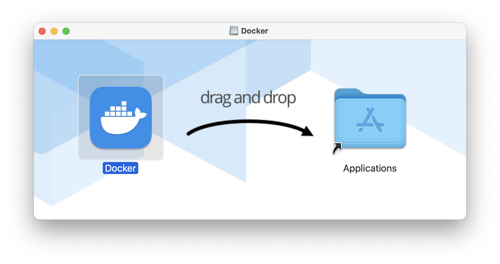

# Docker

## Installation

On windows and Mac you have to install a virtual machine so that you can run Linux and thus have docker.

The easiest way to do this is to install docker desktop from the docker website.

https://docs.docker.com/get-docker/



After installing Docker Desktop there are some simple tutorials that you can run through.

You create an image and then you create a container to host the image. You can start and stop the container.

To get info about the docker runtime use

```sh
docker info

Client:
 Version:    25.0.3
 Context:    desktop-linux
 Debug Mode: false
```

## CLI Reference

https://docs.docker.com/reference/

## DockerHub

Cloud repository for images. I created my account `leesjensen` and a repo `cs239`

I can pull down an image from docker hub to play with.

```sh
docker pull hello-world
```

you can then run hello world with:

```sh
docker container run --name hello hello-world
```
