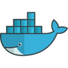
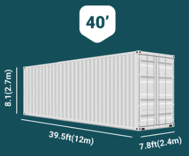
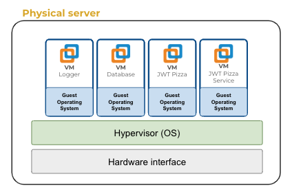
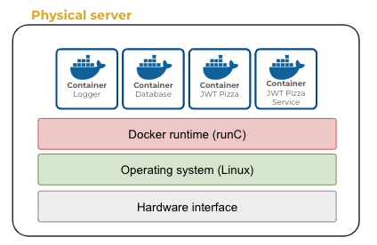
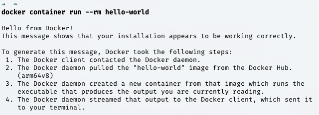

# Docker

🔑 **Key points**

- Containers revolutionized how applications are deployed and managed.
- Containers are more efficient and lightweight than virtual machines.
- Docker provides the tools to build, share, and run containerized applications.

---

📖 **Deeper dive reading**: [What is a Container?](https://www.docker.com/resources/what-container/)

---



As global trade expanded, the shipping industry introduced an idea that revolutionized the world economy. They created an [internationally recognized specification](https://cdn.standards.iteh.ai/samples/76912/7354663676144f8ab1a7b57cb573b0a6/ISO-668-2020.pdf) that defined a shipping container as 7.8ft wide, 7.9ft high, and either 20ft or 40ft long. The impact of this standard was profound. It standardized the dimensions of truck beds, barges, and seagoing cargo ships. Factories changed how they packaged goods, and retailers modified their stores to allow containers to fit into delivery bays. All of this was sparked by the simple standardization of a box.



### History

During the Y Combinator Summer 2010 startup incubator, Kamel Founadi, Solomon Hykes, and Sebastien Pahl set out to change the world of software delivery in the same way containers changed physical shipping. This project became the origin of what is now known as Docker, Inc.

In 2015, the Open Container Initiative (OCI) was established to standardize container formats and runtimes. This was a critical step that ensured global compatibility among software vendors and prevented proprietary lock-in.

Today, the major players in the container space include Docker, Inc., the original proponent of the technology, and Kubernetes, a project originating from Google that brought container orchestration to the enterprise. Major cloud vendors—AWS, Google Cloud, and Microsoft Azure—all provide significant services and native support for containers.

### Docker technology

The core technology for Docker containers is built on existing Linux features, primarily Linux Containers (LXC). 

1. **Namespaces**: Linux `namespaces` isolate a container's view of the operating system. This includes process trees, network interfaces, user IDs, and file systems. 
2. **Cgroups**: The kernel's control groups (`cgroups`) manage and limit the hardware resources available to a container, such as memory and CPU.

Once a container is executing, a **container image** can be captured. This image consists only of the changes added to the parent environment. Using a delta-based file system called **OverlayFS**, Docker makes images much smaller because they do not need to include the entire operating system—only the specific layers required for the application.

A container image is uploaded to a **container registry**, where it can be downloaded and run in any environment that supports the container standard. While this works most efficiently on Linux systems using a `runC` (Docker) or `CRI-O` (Kubernetes) runtime, adaptations exist to make containers work seamlessly on Windows and macOS.

💡 Diving deep into the Linux kernel's support for containers would make a great curiosity project.

## Comparison to Virtual Machines

The technology that Docker disrupted is the **Virtual Machine (VM)**. In a VM environment, a physical server runs a "hypervisor" layer that abstracts the underlying hardware. Each VM runs a full copy of a guest operating system. While this provides strong isolation, it creates significant overhead because each OS consumes CPU, RAM, and storage. VMs also take a long time to boot, which creates a bottleneck when trying to scale applications quickly.



**Containers**, by contrast, run directly on the host operating system's kernel and create isolation using native infrastructure (namespaces and cgroups). Because they share the host kernel and do not need to boot a full OS, a container can spin up in seconds, whereas a virtual machine might take minutes.



## Docker components

Docker is composed of three major categories: software, objects, and registries.

### Software

- **Docker Daemon (`dockerd`)**: A background service that manages Docker containers and handles objects like images and networks.
- **Docker CLI (`docker`)**: The command-line interface used by developers to interact with the Docker daemon.

### Objects

- **Docker Container**: A lightweight, isolated, and executable instance of an application.
- **Docker Image**: A read-only template used to create containers. Images make applications portable across different environments.
- **Docker Service**: Allows containers to scale across multiple Docker daemons. This facilitates communication between containers to provide high-level application functionality, often managed via "Swarm mode."

### Registries

A Docker registry is a repository for Docker images. You "push" images to a registry to store them and "pull" them down to run them elsewhere. 
- **Docker Hub**: The default public registry provided by Docker, Inc.
- **Third-party Registries**: Major vendors provide private registries, such as AWS (ECR), Google (GCR), Microsoft (ACR), and GitHub Packages.

## Installation

To set up Docker in your development environment, install **Docker Desktop** using the instructions on the [Docker website](https://docs.docker.com/get-docker/). It is available for Mac, Windows, and Linux. This package includes the Docker Desktop application, the Docker runtime, and the Docker CLI.

After installation, Docker Desktop provides several built-in tutorials. Spending time experimenting with these is a great way to get comfortable with the environment.

## Docker practice

Install Docker on your machine, then pull the `hello-world` image and run it.

The `pull` command downloads the container image from Docker Hub:

```sh
docker pull hello-world
```

You can then run the container using the `run` command. The `--rm` flag tells Docker to automatically remove the container instance once it stops running:

```sh
docker container run --rm hello-world
```

**Expected output:**
```text
Hello from Docker!
This message shows that your installation appears to be working correctly.
...
```

While the output is simple, consider the "magic" involved: The CLI instructed the daemon to load the image into an isolated environment, restricted its resource consumption, and prevented it from accessing the host's global file system or processes. It then started the root process, printed the message, and exited—all in less than a second.

This workflow allows you to containerize **any** application. Once you create an image and push it to a registry, you can pull that image to any container-compatible environment and have the exact same application running in seconds.

Your terminal should look similar to the following:

