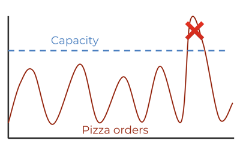

# Elasticity

🔑 **Key points**

- Elasticity is vital in order to prevent failure and reduce costs
- All AWS services are elastic

---

An application is considered elastic if it can increase and decrease in capacity according to demand. This is critical for two reasons. First, it **prevents failing** when there are not enough resources to satisfy demand, and second, **reduces cost** when the system is over provisioned.

## An example

It is very common for an application to have periods of high and low demand. Consider the JWT Pizza application. People want pizza at lunch and dinner time. Then from late evening until the next lunchtime there is very little demand for the application. Things get really crazy during the Superbowl when everyone wants a pizza and demand goes through the roof. The next day everyone is looking to eat salad and recover from their indulgence and so there are very few pizza orders.

This creates a significant problem for the management of the application. If you run your own data center then you have to purchase servers based on estimates of what your peak demand will be. Usually there is a buffer of maybe 30%. That means that most of the time you have as much as 50% of the servers sitting idle, during off hours you would have 80% idle, and when the Superbowl happens, your customers will experience significant latency in the best case, or complete system failure in the worst case.

Neither one of these scenarios are good for the business and this is why the idea of leasing resources by the hour in a cloud hosting environment becomes so attractive. The cloud provider can amortize the use of the servers across a diverse population of application types and geographical locations. What is crunch time for one application will be down time for another application. You may need to pay a small premium for an hourly lease, but you benefit from being able to scale up your application when needed and reduce the servers when the demand drops. Overall there are significant cost savings and no more outages just when business is getting good.

## AWS Elasticity

Almost every AWS service is built with elasticity in mind. This is important because all of your services need to scale together. If everything scales except your network bandwidth then your application is going down. The same goes for S3 requests or RDS queries. A single bottleneck is all it takes for the whole system to fail. The following table shows how each of the services we use for JWT Pizza provides elasticity.

| Service    | Automatic | Pricing               | Elasticity                                                                    |
| ---------- | :-------: | --------------------- | ----------------------------------------------------------------------------- |
| S3         |    yes    | per GB & request      | Automatic storage allocation.                                                 |
| RDS MySQL  |    no     | instance size         | Manual instance size adjustments. These usually take a few minutes to deploy. |
| Fargate    |    yes    | instance size & count | Automatic deployment and reduction to satisfy desired parameters.             |
| ALB        |    yes    | per GB & connection   | Automatic bandwidth management.                                               |
| CloudFront |    yes    | per GB & request      | Automatic distribution and bandwidth management.                              |

This is all good news for small DevOps teams that are budget or size constrained. Once an architecture is defined and deployed, the automatic elasticity of the system mostly takes care of itself. What would have taken a team of a dozen engineers to deploy and manage can now be done by a single part-time DevOps engineer.
