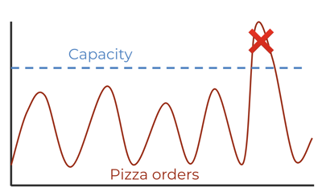

# Elasticity

🔑 **Key points**

- Elasticity is vital for preventing system failure and reducing operational costs.
- Most AWS services are designed with elasticity as a core feature.

---

An application is considered **elastic** if it can increase and decrease its resource capacity automatically to match fluctuating demand. This is critical for two primary reasons:

1.  **Prevents failure:** It ensures there are enough resources to satisfy demand during traffic spikes.
2.  **Reduces cost:** It eliminates waste by scaling down resources when the system is over-provisioned.

## An example

It is common for applications to experience predictable periods of high and low demand. Consider the **JWT Pizza** application. Demand typically peaks during lunch and dinner hours. From late evening until the following day's lunch hour, there is very little activity. Demand can also spike dramatically during major events, such as the Super Bowl, when pizza orders go through the roof. Conversely, the day after a big event, orders often plummet as customers opt for lighter meals.



In a traditional on-premises data center, this volatility creates a significant management problem. You must purchase and maintain enough servers to handle your estimated **peak demand**, usually with an additional 30% buffer for safety. 

This leads to two negative outcomes:
- **During off-hours:** Up to 80% of your hardware sits idle, wasting money.
- **During unexpected peaks:** If demand exceeds your estimates (like an unusually busy Super Bowl), customers will experience significant latency or total system failure.

Cloud hosting solves this by allowing you to lease resources by the hour. Cloud providers can amortize the cost of their hardware across a diverse global population of users; peak usage for one application often coincides with downtime for another. While you might pay a small premium for an hourly lease, you benefit from the ability to scale up instantly when needed and scale down when demand drops. This results in significant cost savings and ensures your application remains available exactly when business is at its best.

## AWS Elasticity

Most AWS services are built with elasticity in mind. This is important because an application is only as elastic as its weakest link. If your compute layer scales but your database or network bandwidth does not, the system will still fail. A single bottleneck is all it takes to cause an outage. 

The following table shows how the services used by JWT Pizza provide elasticity:

| Service    | Automatic | Pricing               | Elasticity                                                                    |
| ---------- | :-------: | --------------------- | ----------------------------------------------------------------------------- |
| **S3**         |    Yes    | Per GB & request      | Automatic storage and request capacity allocation.                             |
| **RDS MySQL**  |    No     | Instance size         | Manual instance size adjustments or read replicas. Usually takes minutes.     |
| **Fargate**    |    Yes    | Instance size & count | Automatically scales the number of containers to satisfy desired parameters.   |
| **ALB**        |    Yes    | Per GB & connection   | Automatic bandwidth and throughput management.                                |
| **CloudFront** |    Yes    | Per GB & request      | Automatic global distribution and bandwidth management.                       |

This built-in elasticity is a force multiplier for small DevOps teams. Once an architecture is correctly defined and deployed, the system's elasticity handles fluctuations automatically. Infrastructure management that once required a large team of engineers can now be handled by a single DevOps professional.


```masteryls
{"id":"5c59a5f4-f33b-4ace-bcd9-dceef8b9b928", "title":"Elasticity demo", "type":"web-page", "height":1200, "file":"elasticityDemo.html"}
```


## ☑ Exercise


```masteryls
{"id":"72e16838-fab8-457e-a412-1114a28d58d8","title":"Limitations of Elasticity","type":"multiple-choice"}
In which of the following scenarios would implementing an automated elasticity strategy be **least** beneficial or potentially counterproductive?

- [ ] A high-growth startup that experiences unpredictable viral spikes in traffic and needs to maintain high availability.
- [ ] A data processing service that handles large batches of information at irregular intervals throughout the week.
- [x] A legacy application with a steady, predictable workload that requires significant manual intervention to configure new instances.
- [ ] An e-commerce platform that needs to scale out resources rapidly during seasonal sales events like Black Friday.
```
