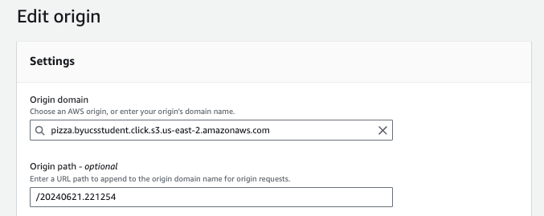

# Environments: JWT Pizza

Now that you know all about versions, releases, environments, and different deployment strategies, it is time for you to enhance the JWT Pizza frontend deployment process. Here are the steps you need to take.

1. **Store each production release candidate on S3**. This makes it so that you can easily host different versions in different environments and rollback to a previous version in case of a failure.
1. **Create a **production** environment**: Officially make your existing CloudFront distribution into your CloudFront production environment.
1. **Create a **staging** environment**: Copy the work done to create the production environment in order to create a staging environment.
1. **Automatically deploying to staging**: Always push a new build directly to the staging environment so that we can see the latest changes.
1. **Manually deploying to production**: We could implement a continuous deployment strategy by always deploying to production, but we want to play it safe for now and create a manual deployment process.

## Storing release candidates on S3

Currently your CI workflow for JWT Pizza overwrites the current files in the S3 bucket that your production Since we will have multiple environments we need more control over what version is deployed in each environment. To accomplish this you need to modify your JWT Pizza `.github/workflows/ci.yml` GitHub Action workflow file to copy to a **version** subdirectory of your S3 deployment bucket.

First off, make sure you pass the version ID from the **build** job to the **deploy** job, and then append the version ID as to the bucket path.

```yml
deploy:
  needs: build
  permissions:
    id-token: write
  runs-on: ubuntu-latest
  env:
    # Set the version to the location defined in the build job
    version: ${{needs.build.outputs.version}}

  # ...

  steps:
    # ...

    - name: Push to AWS S3
      # Append the version to the path
      run: |
        aws s3 cp dist s3://pizza.byucsstudent.click/$version --recursive
```

When you commit and push this change it should copy the version files to the version directory. Examine your S3 bucket to make sure this is happening.

## Create a production environment

You already have a production environment both in GitHub and CloudFront. You just need to officially mark your CloudFront distribution to represent production. To do this you need to make two changes to your CloudFront distribution.

1. Rename the distribution to be `production`. To rename the distribution, take these steps:
   1. Open up the CloudFront service in the AWS browser console.
   1. Click on your distribution and then press the Settings `Edit` button.
   1. Change the description, found at the bottom of the settings, to be **JWT Pizza Production**.
   1. Save the changes.
1. Set the production distribution origin path to point to the s3 version path that you created in the previous step. To change the origin path take these steps:

   1. Open up the CloudFront service in the AWS browser console.
   1. Click on your distribution and then select the `Origins` tab.
   1. Select the origin that was created when you setup CloudFront and press the `Edit` button.
   1. Set `Origin path` to be the version number that you created in the previous step. This should look something like the following. Make sure you include the forward slash prefix.

      

1. Press the `Save changes` button.
1. Wait for the distribution to deploy.
1. Create a cache invalidation for the distribution so that it will immediately show the new version when viewing JWT Pizza in the browser. You can do this on the `Invalidations` tab of the distribution view.
   1. Press the `Create invalidation` button.
   1. Enter `/*` for the object paths and press `Create invalidation`.

After CloudFront completes deploying your production environment based upon the version directory, you should be able to open up your browser and observe that it is the correct version.

## Create a staging environment

To create a new staging environment you can repeat the process you went through to create your CloudFront production environment.

1. Create a new CloudFront distribution using the [same instructions](../deliverable5CdnDeploy/deliverable5CdnDeploy.md) that you used to originally set up CloudFront, but with the following differences.
   1. Name it stage-pizza.YOURDOMAINNAME.
   1. Set the origin path to be the same version that you used for the production environment.
   1. Create Route 53 CNAME record that points stage-pizza.YOURDOMAINNAME to your staging CloudFront distribution..
   1. Verify that you can see the staging environment using the staging URL from your browser.

Now that both your staging and your production environments are using a version subdirectory in your S3 bucket, you can delete the application files out of the S3 bucket root directory.

## Automatically deploying to staging

You could always manually deploy any version you would like to either your production or staging environment by simply changing the distribution's origin path to the desired S3 path, wait for the distribution to deploy, and invalidate the cache.

That actually works pretty well, as it will switch to any version within just a few moments. However, what you really want is for staging to always get updated whenever new code is committed to your fork of `jwt-pizza`.

### Make staging your CI workflow target

Currently your CI workflow is using the GitHub production environment when executing your workflow. Instead you want to use a staging environment. Go ahead a create a GitHub staging environment just [like you did for your production environment](../gitHubEnvironments/gitHubEnvironments.md) with the following differences:

1. Name it **staging**
1. Do not include any protection rules because we want staging changes to always be available internally as soon as a change is made.
1. Set the secret for the `DISTRIBUTION_ID` to be the CloudFront staging distribution ID that you just created.


Now change your `.github/workflows/ci.yml` file to use the staging environment instead of the production environment.

```yml
environment:
  name: staging
  url: https://stage-pizza.byucsstudent.click
```

### Modify the CloudFront origin path

You are now ready to automated the changing of CloudFront origin path whenever a new candidate release build is created. To make this happen you need add a new step to the CI workflow, `.github/workflows/ci.yml` and add the rights to your AWS IAM CI Role that will allow you to automatically update the distributions

#### Modify IAM rights

Add the IAM permissions to your IAM `github-ci` role. Open you the AWS browser console and navigate to the IAM service. Select the the CI role and modify the permissions policy to include all the following CloudFront rights and also act on any distribution resource.

```json
		{
			"Sid": "InvalidateCloudFront",
			"Effect": "Allow",
			"Action": [
				"cloudfront:CreateInvalidation",
				"cloudfront:UpdateDistribution",
				"cloudfront:GetDistribution",
        "cloudfront:GetDistributionConfig"
			],
			"Resource": [
				"arn:aws:cloudfront::YOURAWSACCOUNTID:distribution/*"
			]
		},
```

Also modify the `Trust relationships` so that it allows access for the **staging** environment on your `jwt-pizza` repository.

```json
{
  "Version": "2012-10-17",
  "Statement": [
    {
      "Effect": "Allow",
      "Principal": {
        "Federated": "arn:aws:iam::YOURAWSACCOUNTID:oidc-provider/token.actions.githubusercontent.com"
      },
      "Action": "sts:AssumeRoleWithWebIdentity",
      "Condition": {
        "StringEquals": {
          "token.actions.githubusercontent.com:aud": "sts.amazonaws.com",
          "token.actions.githubusercontent.com:sub": [
            "repo:YOURGITHUBACCOUNTNAME/jwt-pizza:environment:production",
            "repo:YOURGITHUBACCOUNTNAME/jwt-pizza:environment:staging",
            "repo:YOURGITHUBACCOUNTNAME/jwt-pizza:ref:refs/heads/main",
            "repo:YOURGITHUBACCOUNTNAME/jwt-pizza-service:ref:refs/heads/main"
          ]
        }
      }
    }
  ]
}
```

#### Modify CI workflow

Now you can modify the CI workflow to automatically set the origin path whenever a new build is created. In your `.github/workflows/ci.yml` file add the following step to the end of the `deploy` job.

```yml
- name: Update staging version
  run: |
    # Get the current distribution and update it to use the new version
    aws cloudfront get-distribution-config --id ${{ secrets.DISTRIBUTION_ID }} > original.json
    etag=$(jq -r '.ETag' original.json)
    jq '.DistributionConfig' original.json > request.json
    jq --arg version "/$version" '.Origins.Items[0].OriginPath = $version' request.json > finalRequest.json
    aws cloudfront update-distribution --id ${{ secrets.DISTRIBUTION_ID }} --if-match $etag --distribution-config file://finalRequest.json

    # Wait for the distribution to deploy and then invalidate the cache
    while [ "$(aws cloudfront get-distribution --id ${{ secrets.DISTRIBUTION_ID }} --query 'Distribution.Status' --output text)" != "Deployed" ]; do echo "Distribution is still updating..."; sleep 5; done
    aws cloudfront create-invalidation --distribution-id ${{ secrets.DISTRIBUTION_ID }} --paths "/*"
```

This runs some complex commands that you need to take the time to understand. Let's look at each one individually.

1. Copies the current CloudFront distribution configuration for your staging environment to the `original.json` file.
   ```sh
       aws cloudfront get-distribution-config --id ${{ secrets.DISTRIBUTION_ID }} > original.json
   ```
1. Pull the caching identifier, etag, out of the response because it is required to be provided when updating the configuration.

   ```sh
       etag=$(jq -r '.ETag' original.json)
   ```

1. Remove the extra response fields to just include the actual configuration in the update request.

   ```sh
       jq '.DistributionConfig' original.json > request.json
   ```

1. Modify the origin path to be the version ID for the build that just completed.

   ```sh
       jq --arg version "/$version" '.Origins.Items[0].OriginPath = $version' request.json > finalRequest.json
   ```

1. Make the request to update the CloudFront distribution.

   ```sh
       aws cloudfront update-distribution --id ${{ secrets.DISTRIBUTION_ID }} --if-match $etag --distribution-config file://finalRequest.json
   ```

1. Wait until the change to the distribution fully deploys.

   ```sh
       while [ "$(aws cloudfront get-distribution --id ${{ secrets.DISTRIBUTION_ID }} --query 'Distribution.Status' --output text)" != "Deployed" ]; do echo "Distribution is still updating..."; sleep 5; done
   ```

1. Invalidate the distribution cache so that all the customers will see the new version and not the old cached version.
   ```sh
       aws cloudfront create-invalidation --distribution-id ${{ secrets.DISTRIBUTION_ID }} --paths "/*"
   ```

❓These commands are great examples of the amazing things you can do with the command shell. If you don't feel comfortable with the command shell then perhaps that would be a great curiosity project for you.

### Final CI workflow

When you are done with all of these changes, you JWT Pizza CI workflow should look similar to the following. At this point you should be very familiar with each step in this workflow. If you don't feel confident with anything then take some time to dig into them deeper and ask for some help if necessary.

```yml
name: CI Pipeline
on:
  push:
    branches:
      - main

jobs:
  build:
    name: Build frontend
    runs-on: ubuntu-latest
    outputs:
      version: ${{ steps.set_version.outputs.version }}
    steps:
      - name: Checkout repo
        uses: actions/checkout@v4

      - name: set version
        id: set_version
        run: |
          echo "version=$(date +'%Y%m%d.%H%M%S')" >> "$GITHUB_OUTPUT"

      - name: Setup Node
        uses: actions/setup-node@v4
        with:
          node-version: '20.x'

      - name: Build
        run: |
          printf '{"version": "%s" }' ${{steps.set_version.outputs.version}} > public/version.json
          npm ci && npm run build

      - name: Run tests
        run: |
          npx playwright install --with-deps chromium
          npm run test:coverage

      - name: Update coverage
        run: |
          coverage_pct=$(grep -o '"pct":[0-9.]*' coverage/coverage-summary.json | head -n 1 | cut -d ':' -f 2)
          color=$(echo "$coverage_pct < 80" | bc -l | awk '{if ($1) print "yellow"; else print "green"}')
          sed -i "s/^Coverage: .*/Coverage: $coverage_pct %/" README.md
          curl https://img.shields.io/badge/Coverage-$coverage_pct%25-$color -o coverageBadge.svg
          git config user.name github-actions
          git config user.email github-actions@github.com
          git add .
          git commit -m "generated"
          git push

      - name: Update pages artifact
        uses: actions/upload-artifact@v4
        with:
          name: package
          path: dist/
  deploy:
    needs: build
    permissions:
      id-token: write
    runs-on: ubuntu-latest
    env:
      version: ${{needs.build.outputs.version}}
    environment:
      name: staging
      url: https://staging-pizza.byucsstudent.click
    steps:
      - name: Create OIDC token to AWS
        uses: aws-actions/configure-aws-credentials@v4
        with:
          audience: sts.amazonaws.com
          aws-region: us-east-1
          role-to-assume: arn:aws:iam::${{ secrets.AWS_ACCOUNT }}:role/${{ secrets.CI_IAM_ROLE }}

      - name: Download pages artifact
        uses: actions/download-artifact@v4
        with:
          name: package
          path: dist/

      - name: Push to AWS S3
        run: |
          aws s3 cp dist s3://pizza.byucsstudent.click/$version --recursive

      - name: Update the cloudfront distribution
        run: |
          # Get the current distribution and update it to use the new version
          aws cloudfront get-distribution-config --id ${{ secrets.DISTRIBUTION_ID }} > original.json
          etag=$(jq -r '.ETag' original.json)
          jq '.DistributionConfig' original.json > request.json
          jq --arg version "/$version" '.Origins.Items[0].OriginPath = $version' request.json > finalRequest.json
          aws cloudfront update-distribution --id ${{ secrets.DISTRIBUTION_ID }} --if-match $etag --distribution-config file://finalRequest.json

          # Wait for the distribution to deploy and then invalidate the cache
          while [ "$(aws cloudfront get-distribution --id ${{ secrets.DISTRIBUTION_ID }} --query 'Distribution.Status' --output text)" != "Deployed" ]; do echo "Distribution is still updating..."; sleep 5; done
          aws cloudfront create-invalidation --distribution-id ${{ secrets.DISTRIBUTION_ID }} --paths "/*"

  release:
    needs:
      - build
      - deploy
    runs-on: ubuntu-latest
    env:
      version: ${{needs.build.outputs.version}}
    steps:
      - name: Create Release
        uses: ncipollo/release-action@v1
        with:
          tag: version-${{ env.version }}
          name: Version ${{ env.version }}
          body: |
            ## 🚀 Changes

            ${{ github.event.head_commit.message }}

            **commit**: ${{ github.sha }}
```

## Manually deploying to production
