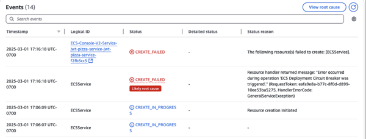
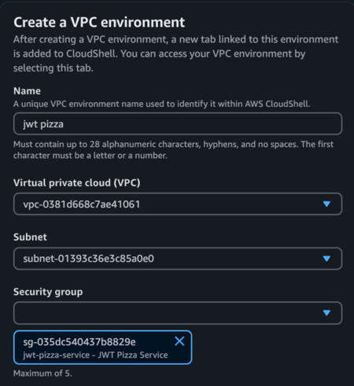

# CS 329 Deliverable FAQs

This document is for all frequently asked questions and issues for each deliverable.

## Deliverable 3

### Some (or all) of my endpoints return a 500 status code when running tests locally / My tests work in debug mode but not when I run them outside debug mode.

In order to test your tests properly while working in your development enviornment, your JWT Pizza Service must be running at the same time. To accomplish this, in the terminal section of VS code, click the plus button on the right hand side of the screen to open up another terminal (or open a new window of gitbash for windows users or terminal for MacOS and Linux users). In the new terminal navigate to JWT Pizza Service and start your service. Your tests should now be returning non 500 level status codes.

### My tests all pass locally but fail when I push to github

The most likely cause of this issue is that your tests are relying on data already stored in the database. When your CI/CD pipeline runs, Github will spin up a brand new database with no data. Make sure your tests do not rely on other data other tests generate or data already stored in the database.

### I need a franchisee or admin user

[course instruction](../unitTestingJwtPizzaService/unitTestingJwtPizzaService.md#creating-an-admin-user)

### My pipeline fails in github because of linting

[course instruction](../unitTestingJwtPizzaService/unitTestingJwtPizzaService.md#linting)

## Deliverable 6

### Circuit breaker error when trying to deploy container

If you get an error that says **circuit breaker was triggered**, it means that ECS tried to deploy your task multiple times and it failed each time. That can mean that the container is invalid, that your service is not starting, that your didn't set up your security group correctly, or that the load balancer health check is failing.



To diagnose the problem you need to look at the ECS task log and also the EC2 Load Balancer target group while the deployment is executing. This should show you what the error is before the circuit breaker finally triggers and tears everything down.

To view the Task logs, go to the ECS cluster, view the service, and then the task. Select the `logs` tab.


### Using CloudShell to validate the database is running correctly

When deploying the backend using ECS it is sometimes difficult to determine where it is failing. If the task logs show that the Pizza Service container cannot talk to the database then it could be a rights problem, the database may not have started correctly, you might have the wrong credentials, or you might have provided the wrong credentials to the service.

One helpful thing to do is to connect to the database using the MySQL client using the AWS CloudShell service. To connect to your database using the CloudShell service, your first open the AWS browser console and select the CloudShell service. This will open a command console within the browser. You then need to specify that you want it to run in a VPC environment (check the menu options on the left). This will prompt you for the information to launch the shell in. You want it to have the same VPC, Subnets, and Security group that your pizza service has.



You can then use the `mysql` client to connect to the database.

```sh
~ $ mysql -u admin -ptoomanysecrets -h jwt-pizza-service-db.c3mqxxxxyyz.us-east-1.rds.amazonaws.com
Welcome to the MariaDB monitor.  Commands end with ; or \g.
Your MySQL connection id is 3334
Server version: 8.0.40 Source distribution

MySQL [(none)]> use pizza
Database changed

MySQL [pizza]> show tables;
+-----------------+
| Tables_in_pizza |
+-----------------+
| auth            |
| dinerOrder      |
| franchise       |
| menu            |
| orderItem       |
| store           |
| user            |
| userRole        |
+-----------------+
8 rows in set (0.002 sec)
```

If you can do this, then you know your database is working, your username and password are correct, and that your security group is good. If you don't see the pizza database that means your service has never connected to the database. At this point, most likely, you have put the wrong password, username, or hostname in your GitHub secrets.
