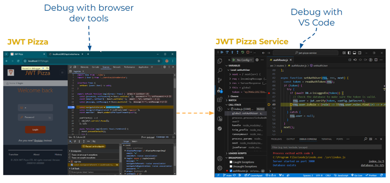
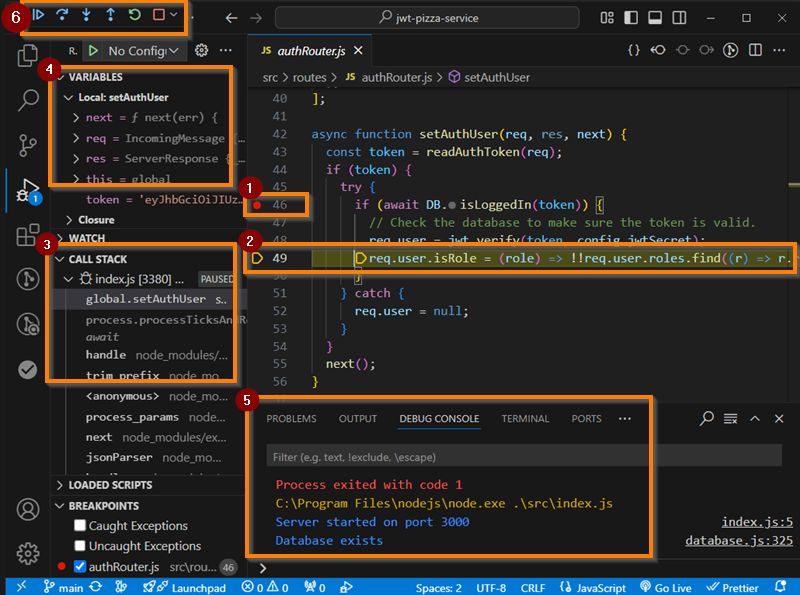
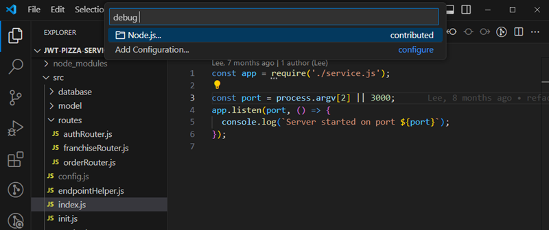
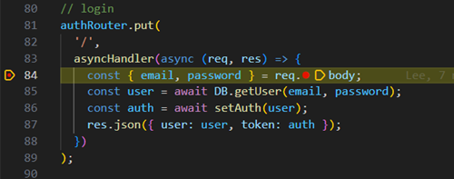
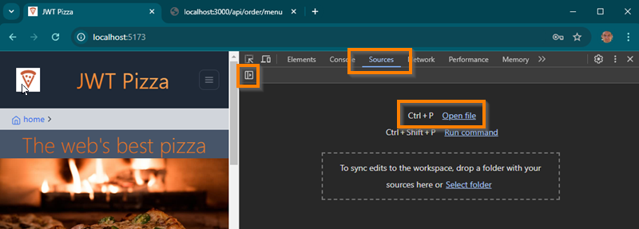
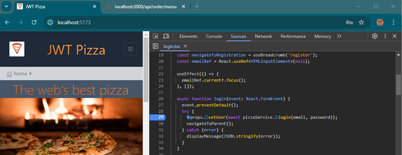
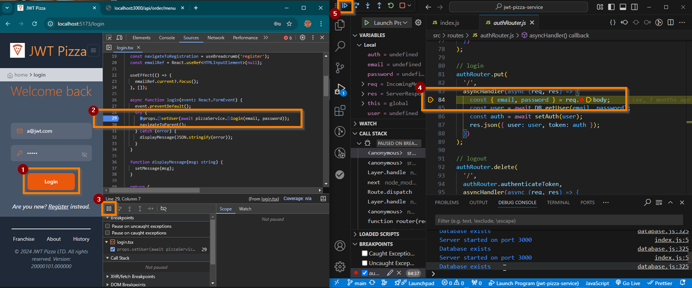

# Full stack debugging

Knowing how to properly debug a full stack application is a critical skill for QA and DevOps engineers. In order to be successful you need to start with the proper mental model and clearly distinguish that you are debugging two separate application using two different debugging tools at the same time. You will use the browser's dev tools to debug the frontend application and VS Code's debugger to debug the backend that is running with Node.js.



As the user interacts with the frontend interface the React application running in the browser will make HTTP fetch requests to the backend service and then send a response that the frontend will process and display to the user. That front to back execution flow will require you to keep both debuggers running at the same time and carefully understand what code is currently executing.

## Getting started and debugging tools

Most debuggers have a standard set of tools that allow you to examine the source code, view where the current execution point is, examine the current value of variables, and step into, out of, or over code.

| Image ID | Tool                    | Purpose                                                              |
| :------: | ----------------------- | -------------------------------------------------------------------- |
|          | Source                  | Select and display the application code                              |
|    1     | Breakpoint              | Stop execution when reaching a given line of code                    |
|    2     | Current execution point | The line of code that is currently executing                         |
|    3     | Call stack              | The names of the functions that called the current function          |
|    4     | Variables               | The values of the variables in the current execution state           |
|    5     | Console output          | Application textual output                                           |
|    6     | Execution controls      | Controls for starting stopping, stepping into, out of, or over code. |

So let's set up both debuggers and debug through a login request. You should have already deployed JWT Pizza to your development environment at this point and can get them running by starting using `node index.js` to start up the backend and Vite's HTTP debugging service by executing `npm run dev`. In order to debug the running code you will need to do a little bit more configuration, but the frontend code is still running in the browser and the backend code is still running under Node.

## Backend debugging

The following image shows what VS Code look like when it is debugging a Node backend program. The different parts of the debugger are highlighted with numbers that refer to the debugging tool image IDs given in the table above.



In order to debug the backend code, open the `jwt-pizza-service` project using VS Code. Then open the `src/index.js` and press F5. This will prompt you to immediately start debugging using node.js, or to create a launch configuration. If you create a launch configuration, then VS Code will remember which JavaScript to to execute when you press F5 in the future.



You can file the launch configuration for the project in the `.vscode/launch.json` file. The following example takes the default configuration and adds a `runtimeArgs` parameter which tells Node to restart whenever any of the source code changes. This makes editing the code while you are debugging a little bit easier and is highly encouraged.

```json
{
  "version": "0.2.0",
  "configurations": [
    {
      "type": "node",
      "request": "launch",
      "name": "Launch Program",
      "skipFiles": ["<node_internals>/**"],
      "program": "${workspaceFolder}\\src\\index.js",
      "runtimeArgs": ["--watch"]
    }
  ]
}
```

You can go ahead and start debugging the backend by pressing F5 if you haven't already. This should print out to the console output that the the server has started on a give port and that the database is working. If it doesn't then you haven't correctly configured your development deployment and need to go back and review that instruction.

Open up the `authRouter.js` file and right click on the far left side of the line that handles the login request. This should create a breakpoint represented by a yellow pointer icon.



Then run the following curl commands to attempt a login.

```sh
host=http://localhost:3000
curl -s -X PUT $host/api/auth -d '{"email":"a@jwt.com", "password":"admin"}' -H 'Content-Type: application/json'
```

This should trigger your login breakpoint and halt the execution of the program until you use the execution control buttons to let it continue. Take some time to look at the call stack, inspect variables, and then step into the `DB.getUser` function and discover everything you can about how the code works.

## Frontend debugging

The following image shows what the Chrome browser dev tools look like when it is debugging a React frontend program. The different parts of the debugger are highlighted with numbers that refer to the debugging tool image IDs given in the table above.


In order to start debugging the frontend code you need to bundle the React application into files that the browser can execute, serve up the files with an HTTP server, and then open a browser in order to run the frontend code. You can do all of this by simply executing `npm run dev` from a console window while in the root directory of the `jwt-pizza` code.

````sh
cd jwt-pizza
npm run dev

> pizzashop@1.0.0 dev
> vite

  VITE v5.2.8  ready in 355 ms

  ➜  Local:   http://localhost:5173/
  ➜  Network: use --host to expose
  ➜  press h + enter to show help```
````

This will display that the debugging HTTP server is listening on port 5173. If you press `o-<enter>` Vite will automatically open your browser and display the JWT Pizza interface. You are now ready to start debugging.

Assuming that you are using Google Chrome as your browser you can press F12 to open the dev tools. You can also access the application menu and choose the option to open the Developer Tools if F12 doesn't work for your environment. This will reveal the dev tools. Across the top will be the different tools that you can use. You will want to select `Sources`.



You can open open a source file by using the file explorer icon on the far left, or by using CMD+P (Mac) or Ctrl+P (Windows) to specify the file you want to debug. Specify `login.tsx`. This should open the file. Scroll down to the `login` function and add a breakpoint on the line that calls the pizza service login endpoint and then sets the user.



Then go ahead and login using the JWT Pizza application. You should be able to use `a@jwt.com` along with the password `admin`. This will trigger your breakpoint. Use the **step over** execution control to step over the call to the service. If you still have your breakpoint set in the backend code then it will trigger and the frontend will not continue until you let the backend code run.

# Keeping things clear

Debugging multiple programs that are talking over a network connection in two different debugging tools can get really complicated if you are not careful to organize things in a way that you can clearly see what is going on.

If you put your frontend client browser, along with its debugger on the left side of your screen, and your backend VS Code debugger on the right side of the screen you will more easily be able to see the flow of things and keep track of what code is currently executing and what code is blocked waiting for a response. This approach is demonstrated in the image below.



After you start up the two debuggers and set breakpoint on both the front and backend login functions, here are the different phases of the debugging session.

1. A user presses on the login button.
1. The `login` function break point is triggered and you step over the request to call the services login endpoint.
1. The frontend is halted until the service call returns.
1. Execution switches to the backend as the service's login breakpoint is hit.
1. Execution only continues once the `Run` button is pressed on VS Code's execution controls. This returns execution back to the frontend where the execution point moves to the next function.

Hopefully this gives you a good introduction to debugging a full stack application. In order to really get comfortable with this fundamental skill you will need to spend time doing it. Luckily this course will provide you lots of opportunities to do it.

New software engineers attempt to avoid leaning this critical skill by simply guessing why their code is not working and instead just making random changes. Slightly more experienced engineers will add lots of console log statements to try and figure out what is going on. While that approach is better it is still inferior to taking the time to learn how to debug using the tools available to you. Save yourself the frustration and invest in debugging skills. It will pay off significantly over your career.
