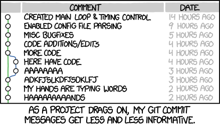

# GitHub Commit History

🔑 **Key points**

- Format your commit messages so the AutoGrader can find your commits.
- Commit often and before the deadline.
- Failure to clearly document your code authorship may result in failing the class.

---

## Commit often

Make sure that you have a significant number of meaningful commits. Committing your code often is an important practice for you to develop. It protects you from losing your work, allows access from anywhere, makes it possible to quickly share changes, reduces conflicts with your peers, and enables you to efficiently explore different possibilities. This also enables others to review the progression of your development efforts in order to prove the originality of your work.

A typical git history for the development of a single feature will look something like the following:

1. init(featurename) added placeholder code
1. test(featurename) added test
1. impl(featurename) basic algorithm and test
1. refactor(featurename) clean up algorithm

The unit of code covered by the feature often times is something along the lines of a single endpoint, database query, or algorithmic calculation. Usually this is only a few dozen lines of code.

Remember to make meaningful commit messages that describe the **what** and **why** of the changes made. Here is a [good post](https://www.freecodecamp.org/news/how-to-write-better-git-commit-messages/) on how to make meaningful commit messages.

> [!NOTE]
>
> If you do not have a commit history that clearly demonstrates your authorship of the code, you may fail the class.

## Complete work early

Your commit history should show that you completed the work well before the deadline. Some deliverables can be completed in a few hours, but waiting until the deadline to start working on a project is not a habit that your employer will appreciate. Start early and commit as you go. Any significant change (writing a test, adding a step to a workflow, changing a config file, etc.) should be committed.

## A bit of fun

> _source: [XKCD](https://xkcd.com/1296/)_
