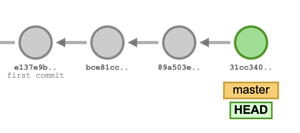
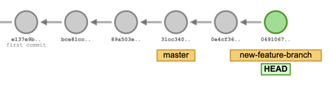
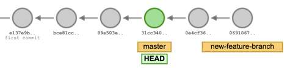
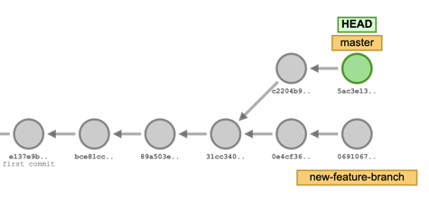
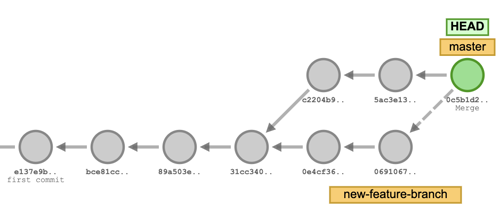
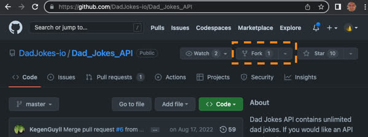
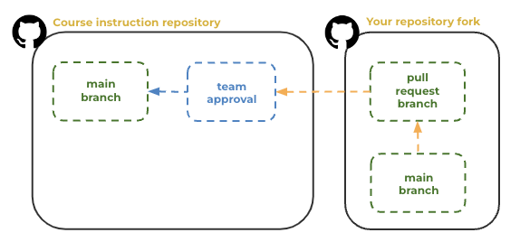
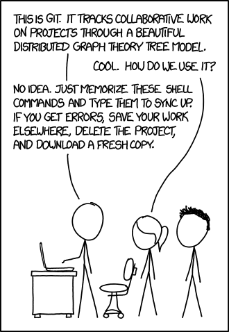

# GitHub


🔑 **Key points**

- GitHub is a foundational resource for DevOps.
- Branching and forks enable collaboration and exploration.
- Successful software engineers commit atomically and frequently.

---

📖 **Deeper dive reading**:

- [Git Guide](https://github.com/git-guides)
- [Introduction to GitHub](https://github.com/skills/introduction-to-github)
- [GitHub Hello World](https://docs.github.com/en/get-started/start-your-journey/hello-world)
- [Git Cheat Sheet](https://training.github.com/downloads/github-git-cheat-sheet/)
- [GitHub Pull Requests](https://docs.github.com/en/pull-requests/collaborating-with-pull-requests/proposing-changes-to-your-work-with-pull-requests/about-pull-requests)
- [GitHub pulls from forks](https://docs.github.com/en/pull-requests/collaborating-with-pull-requests/proposing-changes-to-your-work-with-pull-requests/creating-a-pull-request-from-a-fork)

---

You should already be familiar with the basics of Git and GitHub. If you do not feel comfortable using Git or GitHub then you should spend sometime learning about and experimenting with the functionality that they provide.

For this course we will be using GitHub for the following purposes:

1. Hosting all the course instruction
1. Forking the application code
1. Deploying to GitHub pages
1. Deploying using GitHub actions
1. Keeping notes about what you have learned and things you want to remember

## Creating a GitHub account

If you do not already have a GitHub account then go and [create one now](https://github.com). GitHub provides a free version of their services that will more than cover your usage in this class. Chances are that once you start using GitHub you will use this account for many years to come, both for personal and professional projects.

## Branches

A Git branch allows a developer to take the work that is being done on the main path of code and create a parallel path. Branches are often used to explore possible features, correct bugs, refactor code, or conduct long term development projects without interfering with the stability of the main codebase.

Branches are also used to conduct code reviews for possible enhancements to the main branch. That way external or internal teams can propose changes that are not integrated until the quality and applicability of the proposal has been validated.

Though not quite as common, branches can also be used to associate alternative code bases that are not derived from the main branch's code, but are functionally related. For example, a documentation branch or code for persisted usability metrics.

Understanding how Git branches work is a critical skill for DevOps engineers. Mainly it is used to control proposed changes, automating deployment, and forking code in order to augment it with additional functionality.

### Branching commands

In order to understand how branching works, it helps to remember that the **main**, or master, branch is simply a branch that started with a commit that has no parent. A commit is represented by an SHA hash code that serves as the unique ID for the commit and is created from the changes the commit represents. As additional commits are made to the main branch, they create a linear chain where each commit contains only the changes that the commit contributes to the chain.



You can obtain the current state of the repository code by starting at the root commit and replaying the changes until you reach the last node in the branch. The last node has a special reference, or pointer, that designates it as the end of a branch. That special reference is the branch name. There is also a `HEAD` reference that indicates the commit that you are currently working on. The above diagram shows the main branch with four different commits. You can see that the **master** branch and **HEAD** reference are both pointing to the last node in the commit chain.

You create a new branch starting where the HEAD reference is currently located by using the `git checkout` command and specifying the `-b` (branch) parameter. This will simply create a new reference that represents the named branch.

```sh
git checkout -b new-feature-branch
```

The following image shows that you have two branches, **master** and **new-feature-branch**, with **HEAD** also pointing to the same commit.


However, if you now create a couple new commits, the **new-feature-branch** and **HEAD** references will move to the new commits, and leave the **master** branch reference behind.



If we change back to the master branch using the `git checkout` command we will move our HEAD reference back to that branch.

```sh
git checkout master
```



Now we can add a couple more commits, and they will **branch** of from the **new-feature-branch** making a distinct departure from all the changes on that branch.



You can merge two branches together again using the `git merge` command. To create a merge you check out the branch that you want to merge into and request that the other branch is merged into it.

```sh
git merge new-feature-branch
```



Now all the changes that were created on the **new-feature-branch** are also included in the **master** branch. If there is a conflicting change in either branch then an additional commit is created that resolves the conflict.

As simple as this process of committing, branching, and merging may appear, hopefully you can see the possibilities that this functionality provides. Proper source code version control is a foundational piece of modern software engineering. It is well worth the time to dig deep into this functional. 💡 Perhaps consider digging into the internals of how Git works as your curiosity project.

### Visualizing branches

You can recreate the scenario that is described above with the [git-school.github.io](https://git-school.github.io/visualizing-git/) visualization tool. Take some time executing branch, commit, and merge commands until you get the model completely in your head.


## Forks

A GitHub fork provides the ability to create a copy of a GitHub repository. Usually you [fork a repo](https://docs.github.com/en/get-started/quickstart/fork-a-repo) to get a copy of an open source code base that you want to experiment with, or contribute to. One such example could be the repository containing these instructions. A fork is similar to cloning a repository to your development environment, but it clones to GitHub instead. You can then pull the fork down to your development environment to work on it. The fork maintains a link to the upstream (original) repository that allows you to easily pull down updates and merge them with your fork. A fork also allows you to create a pull request in order to push suggested changes to the original repository.

If you have never forked a repository before you should go find an open source project that interests you. For example, here is the [Dad Jokes API](https://github.com/DadJokes-io/Dad_Jokes_API). This simple web service provides an endpoint to get a joke. Consider forking this repository in order to experiment with how it works.



It would be awesome if we can increase the fork count for `Dad Jokes API` into the hundreds. Also make sure you push the `Star` button to show that you like the repo. Let's blow KegenGuyll's mind!

## Collaboration

GitHub supports the concept of allowing other GitHub users to collaborate in your repository. A collaborator can view private repositories, push commits, resolve issues, and execute Action workflows.

In order for the AutoGrader to grade the work you do in your forks of the application code, you will need to invite the TAs for this class to be collaborators on your repositories. This will allow them to run your deployment workflows and see the results. To invite collaboration, navigate within your repository to `Settings -> Collaborators -> Add People` and search for `byucs329ta`.


## Taking notes

Keeping notes of what you have learned and things that you want to remember is an essential step for accelerating your web programming skills. GitHub supports the inclusion of a file with the special name `README.md` in the root of your repository. The `README.md` file is displayed in GitHub when you view your repository. This file uses `Markdown` syntax. If you have not used Markdown before, then take some time to [learn how to use it](https://docs.github.com/en/get-started/writing-on-github/getting-started-with-writing-and-formatting-on-github/basic-writing-and-formatting-syntax).

Later in the course you will fork the application team's repositories. You should consider adding another Markdown file named `notes.md` to these repositories so that you can track what you have learned in the course.

## Pull requests

GitHub allows you to create a fork of any repository on GitHub. You just push the `Fork` button from the repository's GitHub page. You can then make modifications to the repository fork and push the changes as a _pull request_. This notifies the original repository's owner that a request is being made to enhance the original repository. The owner can review your changes and if appropriate commit the changes into the original. This is how open source communities manage development from a volunteer group of global developers.



## Contributing to the course instruction

In this class, if you notice something in the instruction that needs to be enhanced, feel free to fork the [instruction repo](https://github.com/devops329/devops), and make a pull request. This will give you experience with forking and improve the instruction for others at the same time, plus your name will be included as a contributor. How cool is that!

## A bit of fun



> _source: [XKCD](https://xkcd.com/1597/)_
