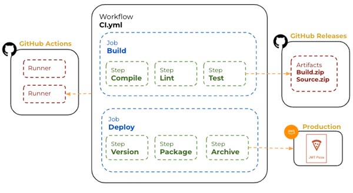
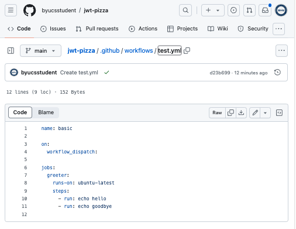
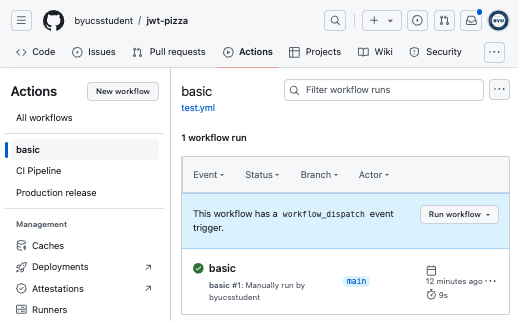
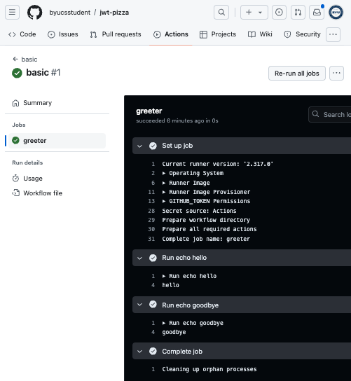
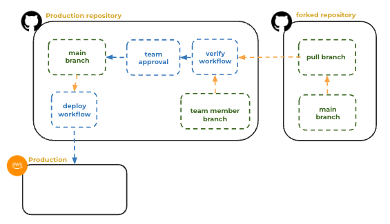
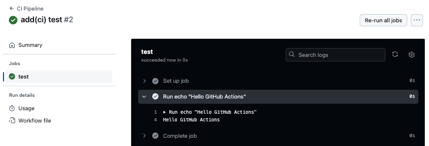

# GitHub Actions

🔑 **Key points**

- GitHub Actions is a powerful CI tool.
- Actions involve workflows, jobs, and steps.

---

📖 **Deeper dive reading**:

- [Quick Start](https://docs.github.com/en/actions/quickstart)
- [GitHub Token](https://dev.to/github/the-githubtoken-in-github-actions-how-it-works-change-permissions-customizations-3cgp)
- [Actions Tutorial](https://docs.github.com/en/actions/using-workflows/workflow-syntax-for-github-actions)
- [Secrets](https://docs.github.com/en/actions/security-guides/using-secrets-in-github-actions)

---

For this course we are using GitHub Actions as the execution engine for the JWT Pizza CI pipelines. GitHub Actions represent a CI pipeline with a YAML formatted **workflow** file. Workflows are stored in a repositories `.github/workflows` directory. Any `.yml` files located in that directory will automatically be loaded and executed. A repository can have multiple workflows, each of which can perform a different set of tasks. For example, you can have one workflow to build and test pull requests and another workflow to deploy your application every time a release is created.

The workflow is composed of one or more **jobs** which are in turn, comprised of one or more **steps**. A step will execute an individual task such as building the code, running tests, or copying files. When workflows triggers based upon some event such as a push, issue creation, or timer, a **runner** loads and executes the workflow. It is common for there to be some sort of output for a workflow such as a release artifact or a binary that is pushed into production.



## A simple example

In the following example, the name of the workflow is **basic**, and it is triggered by a **workflow_dispatch**, meaning when someone presses a button or makes an api call to trigger the workflow. This runs the **greeter** job in a container running the latest version of ubuntu. The job executes two steps. One echos _hello_ and one echos _goodbye_ to the console.

```yml
name: basic

on:
  workflow_dispatch:

jobs:
  greeter:
    runs-on: ubuntu-latest
    steps:
      - run: echo hello
      - run: echo goodbye
```

You can create and trigger this workflow by opening GitHub in your browser and opening your `jwt-pizza` repository. Add a new file to your repository code that is named `.github/workflows/test.yml`. Paste the above workflow into the contents of the file and then commit the change.



Navigate to the `Actions` tab on the repository's main menu, select the `basic` workflow and press the `Run workflow` button.



Once the workflow has completed you can inspect the results.



## Triggers

In the simple example given above, you executed the workflow using a manual trigger (workflow_dispatch). Generally you want a CI pipeline to be completely automated. GitHub supports a long list of possible [triggers](https://docs.github.com/en/actions/using-workflows/events-that-trigger-workflows). Here is a list of some of the more common ones.

| Trigger             | Description                                                                                 |
| ------------------- | ------------------------------------------------------------------------------------------- |
| create              | A branch or tag is created                                                                  |
| fork                | A fork is created                                                                           |
| issues              | An issue is created, edited, closed or deleted                                              |
| pull_request        | A pull request is created                                                                   |
| push                | A push is executed                                                                          |
| release             | A release is created                                                                        |
| repository_dispatch | A GitHub API webhook is called. This lets you automate the workflow from an external system |
| schedule            | Based on a cron job                                                                         |
| watch               | A GitHub user action such a when a user stars your repository                               |
| workflow_dispatch   | A manual button press                                                                       |
| workflow_run        | Another workflow started or completed                                                       |

## Workflow pieces

Now that we have a general idea of how GitHub Actions work and what can trigger a workflow, let's take a step back and examine the parts of a workflow in detail.

### Jobs

A job consists of steps in a workflow executed on the same runner. Each step can be a shell script or an action, executed sequentially and interdependently, allowing data sharing between steps. For example, a build step can be followed by a test step.

Jobs can be configured with dependencies on other jobs, though by default, they run in parallel. When a job depends on another, it waits for the dependent job to complete. For instance, multiple build jobs for different architectures can run in parallel, followed by a packaging job that depends on the successful completion of all build jobs.

Workflow jobs run concurrently, but they can be dependent on each other by specifying what a job **needs** before it can execute. In the following example, the workflow defines `build`, `analyze`, and `deploy` jobs. The `analyze` job requires the `build` job to complete before it runs. The `deploy` job requires both the build and analyze to complete.

```yml
jobs:
  build:
    steps:
      - run: npm build
  analyze:
    needs: build
    steps:
      - run: npm run analyze
  deploy:
    needs: [build, analyze]
    steps:
      - run: aws s3 cp dist s3://bucket
```

### Steps

Steps can either be a simple shell command with the **run** clause, or an **action** with the **uses** clause. An action is a simple docker container that can receive input from the step and generate outputs. GitHub provides many standard actions and there are also community provided actions.

A basic GitHub Actions workflow that builds a Node.js project and runs the tests could have the following steps for 1) checking out the code, 2) installing Node.js, and 3) installing the packages and running the tests.

```yml
name: Test

on:
  push:
    branches:
      - main

jobs:
  test:
    runs-on: ubuntu-latest
    steps:
      - name: Checkout repo
        uses: actions/checkout@v4

      - name: Setup Node
        uses: actions/setup-node@v4
        with:
          node-version: '22.x'

      - name: Test
        run: |
          npm ci
          npm test
```

## An example: Pull request deployment

In order to help you see the value the comes from GitHub Actions, let's consider a real world example. You have created a popular open source repository. You already created a `deploy` workflow that triggers whenever a change is made to the main branch of your repo. The `deploy` workflow builds your code and hosts the resulting binary on AWS.



Now you want to allow external contributors to fork your repository and create pull results for new features or bug fixes. When an external contributor creates a pull request, the `verify` workflow is triggered, and the code is automatically analyzed to make sure the changes honor all the linting and security policies. If successful, the `approval` workflow is triggered and a team member is notified to conduct a code review. If the reviewer approves the changes, then she confirms her approval, and the workflow commits the changes to the main branch. The commit triggers the original `deploy` workflow and a production release is created.

Note that you can use this same pattern with forks instead of branches. Branches are generally used for internal reviews, while forks are used with open source project external contributors.

## ☑ Exercise

Create a GitHub Action CI pipeline in your fork of the `jwt-pizza` repository by doing the following:

1. Create a file named `.github/workflows/ci.yml`. This file is the automation script that GitHub actions will execute whenever you make a commit to the `main` branch.
1. Insert the following into the newly created file

   ```yml
   name: CI Pipeline

   on:
     push:
       branches:
         - main
   jobs:
     test:
       runs-on: ubuntu-latest
       steps:
         - run: echo "Hello GitHub Actions"
   ```

1. Commit and push. Because this workflow is triggered by a **push** on the **main** branch it will begin executing on every push, including the one that adds this workflow.
1. Open The Actions tab of your fork of `jwt-pizza` on GitHub.
1. Click on the **CI Pipeline** and the latest workflow run.
1. Click on the **test** job and expand the **Run** step. This should the workflow and display **Hello GitHub Actions** in the workflow output.

Once you are done, it should look something like this:


