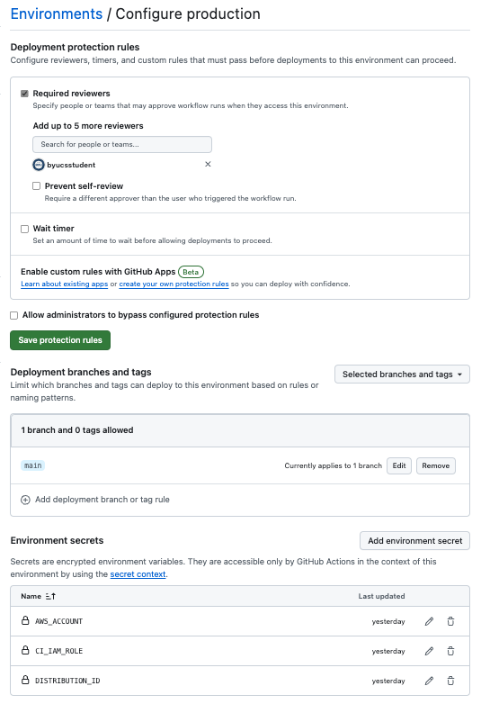
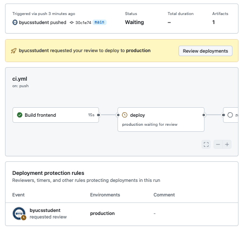
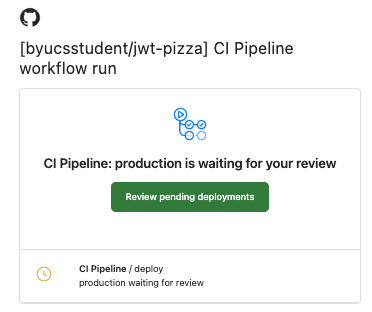
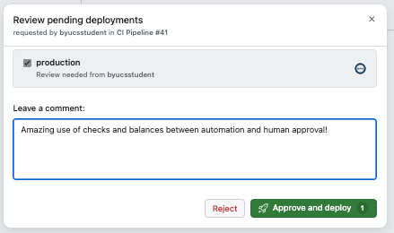
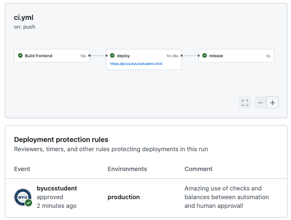

# GitHub Environments

GitHub supports the concept of `environments` that allow you to isolate your secrets and enforce protection rules. Protection rules can require a manual approval, delay a job, or restrict the environment to certain branches.

## Creating an environment

You create an environment by going to a GitHub repository's settings and setting the **Environments** view from the left hand navigation. Then press the `New environment` button and give it the name `production`. Once you have created the environment you can specify if it must be reviewed before a GitHub Action workflow can execute, that it can only execute from a given branch of the code, and also what secrets should be used with the CI pipeline.

This makes it so you can have a human gate in your deployment pipeline as well as secrets that are different for your production environment, where customer data is kept, as opposed to your staging environment that can be more lax in security.

The following images shows the production that requires the user `byucsstudent` to review the code before a workflow can execute, the code must be deployed from the `main` branch, and there are several secrets that are specific to the production environment. Specifically, there is a different CloudFront distribution ID for production the environment. That helps to decrease the risk of deploying an non-production release to your production environment.



Make yourself the reviewer and add the same [secrets](../awsS3Deployment/awsS3Deployment.md) that you created perviously in order to general deploy the `jwt-pizza` to deploy to AWS.

## Configuring access

In order for your CI workflow to still have access using the AWS IAM CI rule that you created previously you must now modify it so that it is accessible when your workflow runs under this environment. In the AWS Console, open up the IAM dashboard, and modify the `Trust relationship` for the `github-ci` role that you created previously. In the `Condition` object modify it so that it allows access for the **production** environment on your `jwt-pizza` repository.

```json
{
  "Version": "2012-10-17",
  "Statement": [
    {
      "Effect": "Allow",
      "Principal": {
        "Federated": "arn:aws:iam::YOURAWSACCOUNTID:oidc-provider/token.actions.githubusercontent.com"
      },
      "Action": "sts:AssumeRoleWithWebIdentity",
      "Condition": {
        "StringEquals": {
          "token.actions.githubusercontent.com:aud": "sts.amazonaws.com",
          "token.actions.githubusercontent.com:sub": [
            "repo:YOURGITHUBACCOUNTNAME/jwt-pizza:environment:production",
            "repo:YOURGITHUBACCOUNTNAME/jwt-pizza:ref:refs/heads/main",
            "repo:YOURGITHUBACCOUNTNAME/jwt-pizza-service:ref:refs/heads/main"
          ]
        }
      }
    }
  ]
}
```

## Modify the CI workflow

You can now modify your GitHub Action workflow for `jwt-pizza` to execute under the production environment that you just created. Edit the `.github/workflows/ci.yml` file to include a reference to the **production** environment.

```yml
deploy:
  needs: build
  permissions:
    id-token: write
  runs-on: ubuntu-latest
  environment:
    name: production
    url: https://pizza.byucsstudent.click
```

You can also include a **url** property that will display whenever the workflow executes. Make sure you set the URL to represent your JWT Pizza hostname.

## ☑ Assignment

Once you have completed the changes outlined above, go ahead and deploy the CI workflow change to your fork of the `jwt-pizza` code. This should trigger the review rule for the production environment. If you look at the GitHub Action dashboard you will see that the execution blocked waiting for the review.



You should also receive an email to the address associated with your GitHub account.



After you review all the changes included in the deployment you can press the `Review deployments` button and complete the approval process.



Pressing the approval button will allow the workflow to continue.

Once you are done, take a snapshot of the GitHub action workflow summary. Make sure you include the environment URL as well as the approval. This should look something like the following.



Go over to Canvas and submit the screenshot to the assignment.
