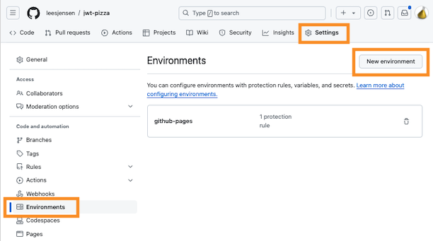
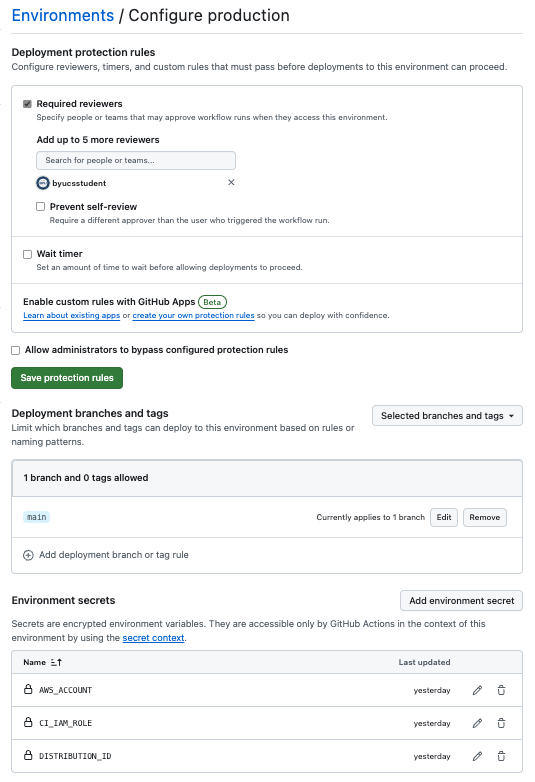

# GitHub Environments

🔑 **Key points**

- GitHub environments allow you to isolate secrets and define protection rules for specific deployment stages.
- Using environments enables manual approval gates and branch restrictions for your workflows.
- Update your CI workflow to target a specific environment for better security and visibility.

---

GitHub supports the concept of **environments**, which allow you to isolate your secrets and enforce protection rules. Protection rules can require manual approval, delay a job, or restrict the environment to specific branches.

> [!NOTE]
>
> You can use GitHub environments for your JWT Pizza deployment if you choose, but it is not required for the completion of the project.

## Creating an environment

To create a GitHub environment, navigate to your `jwt-pizza` repository settings in GitHub and select **Environments** from the left-hand navigation menu. Then, click the **New environment** button.



For this example, create an environment named `production`. Once created, you can configure several safeguards:

- **Required reviewers:** Require a human to approve a deployment before a GitHub Actions workflow executes.
- **Deployment branches:** Restrict deployments so they can only execute from a specific branch (e.g., `main`).
- **Environment secrets:** Define secrets that are only available to jobs running in this specific environment.

Environments allow you to establish a human "gate" in your deployment pipeline. They also allow you to use different secrets for production (where customer data is kept) than you use for a staging environment, which might have more relaxed security.

The following image shows a production environment configured with these rules:

- The user `byucsstudent` must review the code before a workflow executes. (For your setup, set this to your own GitHub username.)
- The code must be deployed from the `main` branch.
- Several secrets are specific to the production environment, such as a unique CloudFront distribution ID. This reduces the risk of accidentally deploying a non-production release to your production site.



### Adding environment secrets

Set yourself as the reviewer and add the same [secrets](../awsS3Deployment/awsS3Deployment.md) you created previously for your general AWS deployment. By adding them here, they will be scoped specifically to the `production` environment.

| Secret          | Description                                                 | Example              |
| --------------- | ----------------------------------------------------------- | -------------------- |
| AWS_ACCOUNT     | Your AWS account ID number                                  | 123456789012         |
| CI_IAM_ROLE     | The IAM role name with rights to deploy your application    | github-ci            |
| APP_BUCKET      | The S3 bucket hosting your static deployment files          | pizza.ilovebyu.click |
| DISTRIBUTION_ID | The CloudFront Distribution ID for your frontend deployment | F3GRFXFEBQ8EEU       |

## Configuring access in AWS

For your CI workflow to access AWS using the IAM role you created previously, you must modify the role's **Trust relationship** to allow access when the workflow runs under this new environment. 

1. Open the **IAM dashboard** in the AWS Console.
2. Locate and edit the `github-ci` role.
3. Update the `Condition` object in the **Trust relationship** to include the `environment:production` string in the `sub` (subject) claim.

```json
{
  "Version": "2012-10-17",
  "Statement": [
    {
      "Effect": "Allow",
      "Principal": {
        "Federated": "arn:aws:iam::YOURAWSACCOUNTID:oidc-provider/token.actions.githubusercontent.com"
      },
      "Action": "sts:AssumeRoleWithWebIdentity",
      "Condition": {
        "StringEquals": {
          "token.actions.githubusercontent.com:aud": "sts.amazonaws.com",
          "token.actions.githubusercontent.com:sub": [
            "repo:YOURGITHUBACCOUNTNAME/jwt-pizza:environment:production",
            "repo:YOURGITHUBACCOUNTNAME/jwt-pizza:ref:refs/heads/main",
            "repo:YOURGITHUBACCOUNTNAME/jwt-pizza-service:ref:refs/heads/main"
          ]
        }
      }
    }
  ]
}
```

## Modifying the CI workflow

Finally, update your GitHub Actions workflow for `jwt-pizza` to execute within the context of the production environment. Edit the `.github/workflows/ci.yml` file to include the `environment` property in your deploy job.

```yml
deploy:
  needs: build
  permissions:
    id-token: write
  runs-on: ubuntu-latest
  env:
    version: ${{ needs.build.outputs.version }}
  environment:
    name: production
    url: https://pizza.yourdomain.click
```

The `url` property is optional but highly recommended; it creates a link on the GitHub Actions run page and the repository homepage, making it easy to jump directly to your deployed application. Update the URL to match your actual JWT Pizza hostname.