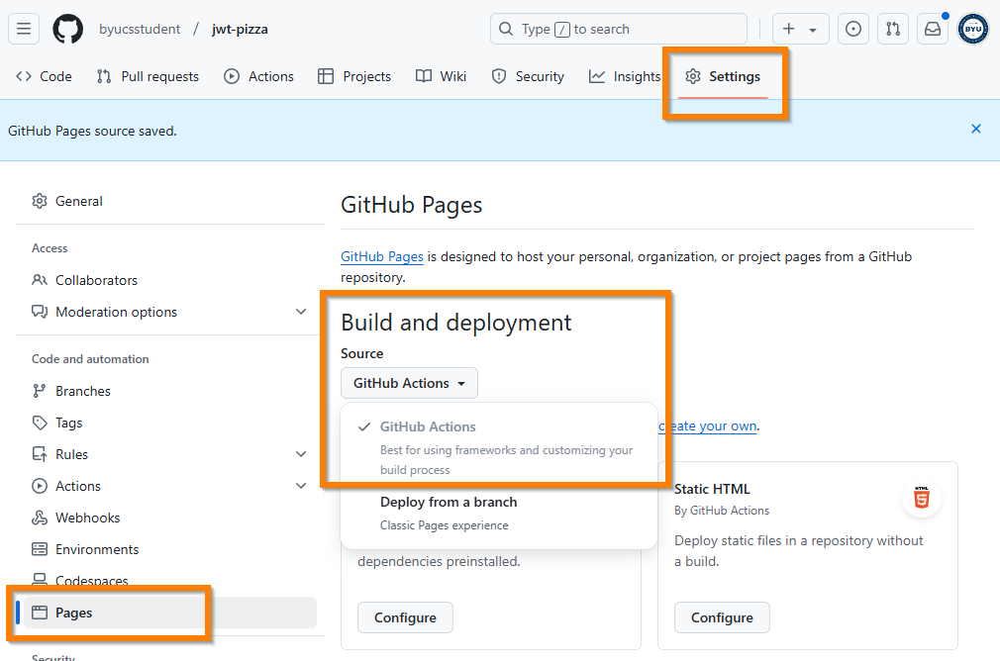
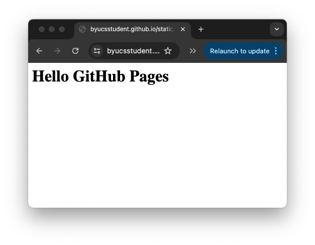
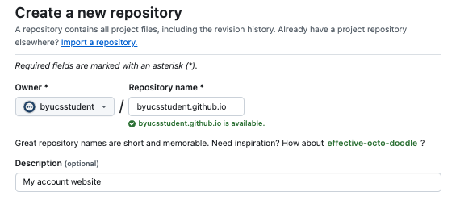

# GitHub Pages

🔑 **Key points**

- GitHub pages allow you to do an easy static deployment.

---

📖 **Deeper dive reading**: [GitHub Pages Quickstart](https://docs.github.com/en/pages/quickstart)

---

Now that you know how a static deployment works, you can take the next step of selecting a tool that supports the static deployment model.

One easy way to do this is to use a service from `GitHub` called `GitHub Pages`. At a basic level, GitHub Pages is a simple HTTP file server that publishes a set of files under a GitHub URL. We will demonstrate how to do this by creating a static deployment in your `jwt-pizza` repository that displays a simple **Hello GitHub** frontend deployment. Here are the steps to make the automation magic happen.

1. Open your fork of `jwt-pizza` repository on GitHub.com.
1. Navigate to the repository's `Settings/Pages` view
1. Set the GitHub Pages option for the _Build and deployment/Source_ to `GitHub Actions`. This causes GitHub to add a deployment environment called `github-pages`. This environment is used to specify deployment rules and secrets that are specific to GitHub Action deployments. You will reference this environment in your CI pipeline.

   

1. Modify the `.github/workflows/ci.yml` you created in the previous exercise to contain the following.

   ```yml
   name: CI Pipeline

   on:
     push:
       branches:
         - main
     workflow_dispatch:
   jobs:
     build:
       name: Build
       runs-on: ubuntu-latest
       steps:
         - name: create static deployment file
           run: |
             mkdir dist
             echo "<h1>Hello GitHub Pages</h1>" >> dist/index.html

         - name: Update pages artifact
           uses: actions/upload-pages-artifact@v3
           with:
             path: dist/
     deploy:
       needs: build
       permissions:
         pages: write
         id-token: write
       environment:
         name: github-pages
         url: ${{ steps.deployment.outputs.page_url }}
       runs-on: ubuntu-latest
       steps:
         - name: Deploy to GitHub Pages
           id: deployment
           uses: actions/deploy-pages@v4
   ```

   This CI pipeline will execute a **Build** job that creates a simple `index.html` file and then use the **upload-pages-artifact** action to create an artifact that can be deploy to GitHub Pages. The **Deploy** job then deploys the artifact to the github-pages environment that using the **deploy-pages** action.

1. Commit and push. This will trigger the CI pipeline and once it has completed you should be able to view the static deployment by using the URL that GitHub Pages automatically creates for you. This will follow the pattern:

   ```txt
   https://YOURGITHUBACCOUNTNAME.github.io/jwt-pizza/
   ```

   

In future instruction you will use GitHub Pages to deploy the JWT Pizza frontend code.

## Bonus: GitHub Pages at the account level

In addition to hosting a static deployment for a **repository** you can also do this for your **entire GitHub account**. However, in this case, instead of using a special branch, you create a special repository that follows the pattern: `youraccountnamehere.github.io`. In the example below, we created an account level static deployment for the account named `byucsstudent` by creating the `byucsstudent.github.io` repository and populating it with a simple [index.html](gitHubPagesExample/index.html) file.



## ☑ Exercise

Deploy a simple static deployment by following the instructions listed above. This includes the following major steps.

1. Modify your `jwt-pizza` repository settings to enable GitHub Pages.
1. Create a simple static deployment by modifying your `ci.yml` workflow.

when you are done you should be able to view your simple Hello GitHub Pages website using a URL similar to the following:

```
https://YOURGITHUBACCOUNTNAME.github.io/jwt-pizza/
```
