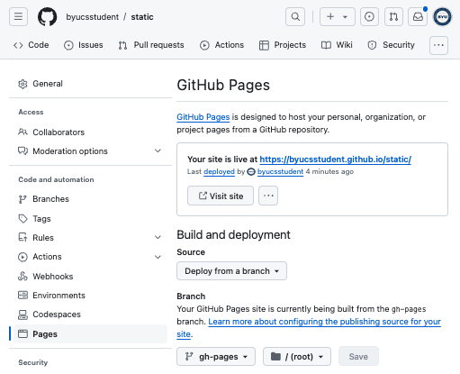

# GitHub Pages

🔑 **Key points**

- GitHub pages allow you to do an easy static deployment.

---

📖 **Deeper dive reading**: [GitHub Pages Quickstart](https://docs.github.com/en/pages/quickstart)

---

Now that you know how static deployment works, you can take the next step of selecting a tool that supports the static deployment model.

One easy way to do this is to use a service from `GitHub` called `GitHub Pages`. At a basic level, GitHub Pages is a simple HTTP file server that publishes a set of files under a GitHub URL. To use GitHub pages you do the following:

1. Create a repository to test out GitHub pages with. Name the repository `static`. Make it public, and give it a README.md file so that it populates the repo with some initial content.

   

1. Using your command console, clone the repository locally.
1. Create a branch on your GitHub repository. This branch is commonly called `gh-pages`.

   ```sh
   cd static && git checkout -b gh-pages
   ```

1. Create an `index.html` file containing the following.
   ```html
   <h1>Hello GitHub Pages</h1>
   ```
1. Commit the change to the branch.

   ```sh
   git add . && git commit -am "add(homepage)"
   ```

1. Push your static deployment files to the branch. The following will set the upstream for the branch and create the branch on GitHub.
   ```sh
   git push --set-upstream origin gh-pages
   ```
1. Verify that the repository settings indicate that GitHub Pages is loading the `gh-pages` branch as a static deployment. You do this by accessing the `static` repository's settings page and selecting `Pages`. It should show that it is deploying from a branch named `gh-pages`.



Once you have completed these steps you can access your static deployment from anywhere in the world using a URL like: `youraccountname.github.io/static`.


You can go ahead and experiment with this now if you would like. In future instruction you will use GitHub Pages to deploy the JWT Pizza frontend code.

## GitHub Pages at the account level

In addition to hosting a static deployment for a **repository** you can also do this for your **entire GitHub account**. However, in this case, instead of using a special branch, you create a special repository that follows the pattern: `youraccountnamehere.github.io`. In the example below, we created an account level static deployment for the account named `byucsstudent` by creating the `byucsstudent.github.io` repository and populating it with a simple [index.html](gitHubPagesExample/index.html) file.


## ☑ Exercise

Create a GitHub Pages deployment in your GitHub account for a repository named `static`:

1. Create a repository that follows the pattern: `youraccountnamehere.github.io/static`.
1. Adding an `index.html` to the root of the repository.

Feel free to make the page as simple or as pretty as you would like. When you are done, it should look something like this:

```
https://byucsstudent.github.io/static
```


