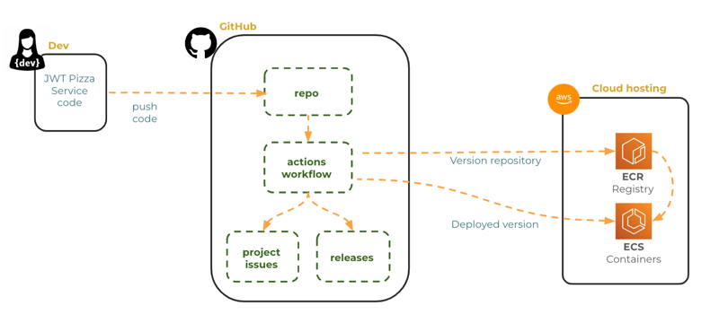
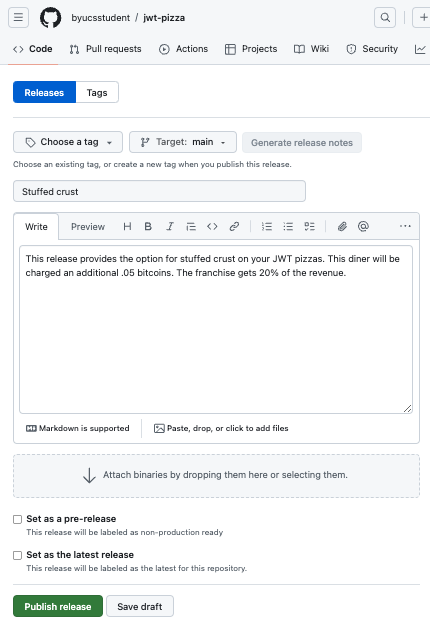
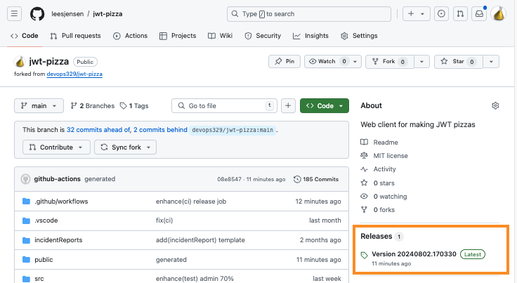
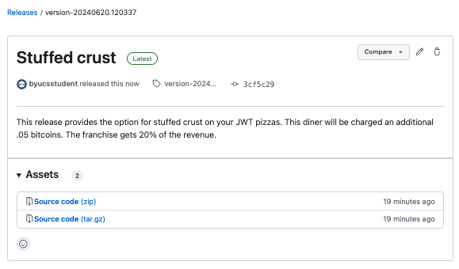
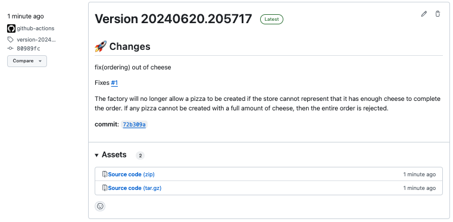

# GitHub Releases

🔑 **Key points**

- GitHub provides built-in support for managing project releases.
- Integrating GitHub releases into your CI pipeline improves visibility and automation.

---

📖 **Deeper dive reading**: [Managing GitHub Releases](https://docs.github.com/en/repositories/releasing-projects-on-github/managing-releases-in-a-repository)

GitHub allows you to associate a release with a specific version tag and commit. By combining GitHub's release tracking with automated deployments, you can create a fully automated CI pipeline that manages your entire release process through a GitHub Actions workflow.



You can create a release manually by navigating to your repository's main page and clicking the **Releases** heading in the right-hand sidebar. From there, click the **Draft a new release** button.

Enter your version number into the **Choose a tag** dropdown. This will automatically create a Git tag with this name and apply it to the latest commit. You can also select an existing Git tag if you have already created one.

Next, give your release a title and provide a description using Markdown. Click the **Publish release** button to finalize it.



This creates the release and associates it with the source code at that specific commit. You can access the newly created release from the repository's main page.



Clicking on the release displays its details, including the changelog and any associated assets.



This is an effective way to visualize exactly when a specific commit was deployed as a production release.

## Automating releases

Manual steps are prone to human error and inconsistency. To improve our DevOps workflow, we will update the `jwt-pizza` CI pipeline to create the GitHub Release automatically instead of relying on a manual process.

To do this, create a new workflow job named **release** that triggers only after both the **build** and **deploy** jobs complete successfully. This job uses the third-party `ncipollo/release-action` to call the GitHub API and automatically create the tag and release. It uses information from the execution trigger and the version ID generated in the **build** job. You can reference the version variable from the build job using the `needs.build.outputs.version` property.

> [!NOTE]
>
> Using third-party actions can be a security risk. We mitigate this risk by reviewing the action's code and specifying the exact commit SHA instead of a version tag. This ensures that the code we reviewed cannot be changed by the action's author without our knowledge.

Add the following job to your `ci.yml` pipeline:

```yml
release:
  needs:
    - build
    - deploy
  runs-on: ubuntu-latest
  steps:
    - name: Create Release
      uses: ncipollo/release-action@2c591bcc8ecdcd2db72b97d6147f871fcd833ba5
      env:
        version: ${{needs.build.outputs.version}}
      with:
        tag: version-${{ env.version }}
        name: Version ${{ env.version }}
        makeLatest: true
        body: |
          ## 🚀 Changes

          ${{ github.event.head_commit.message }}

          **commit**: ${{ github.sha }}
```

Once this job is added to your pipeline, GitHub will automatically create a new release every time you push a change to your fork of the `jwt-pizza` repository.

## ☑ Exercise

Complete the following:

1. Review your GitHub Actions workflow for `jwt-pizza` to understand how it generates and outputs a version number.
2. Modify your GitHub Actions workflow for `jwt-pizza` to include the `release` job so that it automatically creates a tag and release for every production deployment.

Once completed, your repository's release history should look similar to this:




```masteryls
{"id":"f1f444dc-fdad-4ce1-98a1-68fae0fe06ed", "title":"GitHub releases", "type":"file-submission"  }
Submit a screenshot of your released version as displayed in GitHub.
```
