# Grafana Alerts

🔑 **Key points**

- Grafana provides a robust alerting infrastructure.
- This infrastructure includes metrics, triggers, and contacts.
- This guide covers how to create, configure, and trigger alerts.

---

Grafana generates alerts based on metric thresholds defined within a visualization. These alerts can trigger a wide variety of notification types, including emails, Discord posts, PagerDuty incidents, AWS Simple Notification Service (SNS) messages, or generic HTTP webhooks. Grafana also provides a sophisticated incident management system named **OnCall**, which facilitates team management, rotation schedules, and complex escalation policies.

## Simple Grafana alerts

To understand Grafana's alerting capabilities, let's first examine the basic alerting system. This involves two primary steps: defining a **contact point** and associating that contact point with an **alert rule**. When the alert triggers, it sends a notification to the configured destination.

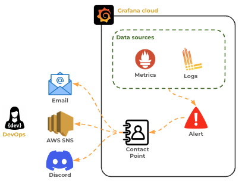

### Creating an email contact point

1. Open your Grafana Cloud dashboard and navigate to **Alerts & IRM > Alerting > Contact points**.
2. This page displays all currently defined contact points. If none have been created, `grafana-default-email` will be the only entry.
3. Click the **Create contact point** button.
4. Provide a name, such as **JWT Pizza Email**.
5. Set the **Integration** to **Email**.
6. Enter an email address you can access. For testing, you might use a disposable service like _Mailinator_.

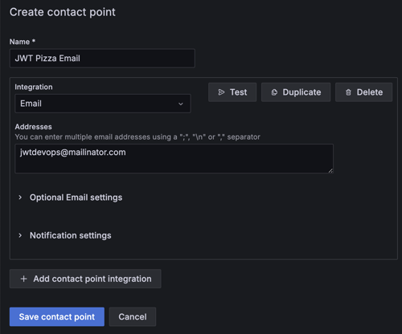

7. Click the **Test** button and check your inbox for a notification message. You can use the optional email settings to customize the message format and content.

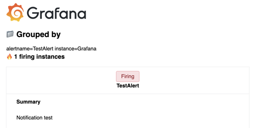

8. Click **Save contact point**.

### Creating an email alert

With a contact point established, you can now attach it to an alert rule. You can create rules via the **Alerting > Alert rules** menu or directly from a visualization.

1. Open your **Pizza Dashboard** and locate the visualization for "Active Users."
2. Click the panel title and select **Edit**.
3. Select the **Alert** tab and click **Create alert rule from this panel**.

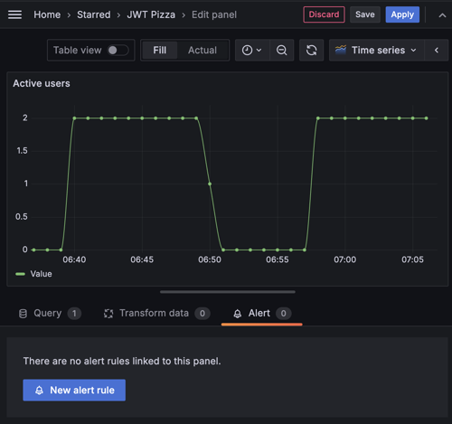

The alert dialog will open with the PromQL query automatically populated based on the visualization's data source.

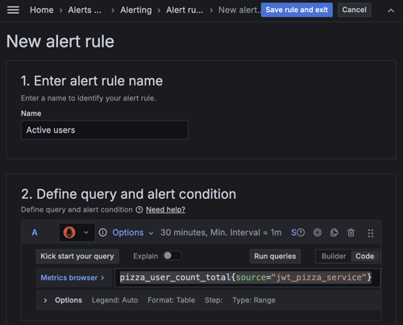

4. **Define the condition**: As you scroll down, you will see the data reduction settings. By default, it usually selects the `last` value. Other options include `average` or `sum`.
5. **Set the threshold**: Set the threshold to trigger when the value is **above 1**.

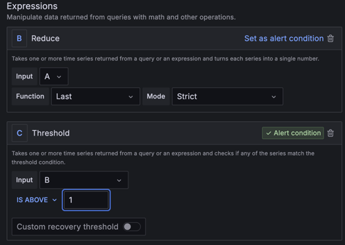

6. Click **Preview** to see if the rule would currently be in a **Firing** state.
7. **Set evaluation behavior**:
   - Set the **Folder** to the default **GrafanaCloud** folder.
   - Create a new **Evaluation group** named **jwt-pizza**.
   - Set the **Pending period** to **1m** (this requires the condition to be met for one minute before the alert fires).

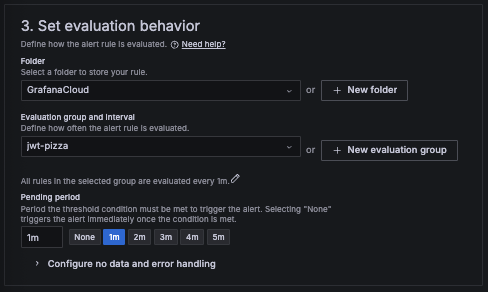

8. **Configure notifications**: In the **Contact point** section, select the **JWT Pizza Email** contact point created earlier.

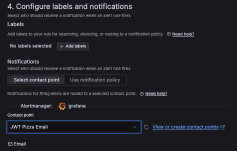

9. Click **Save rule and exit**.

You will return to the dashboard. The alert state will initially show as **Normal**, transitioning to **Pending** and then **Firing** if the threshold is exceeded.

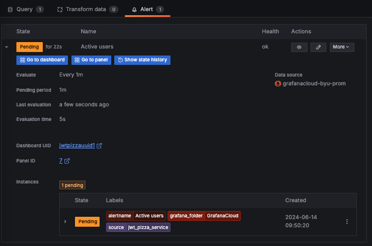

### Responding to the alert

When the alert triggers, check your email for the notification.

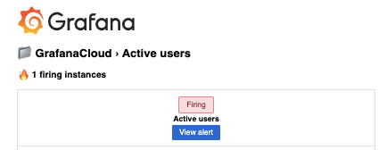

In a production environment, you would investigate the root cause. For this exercise, resolve the alert by adjusting the threshold:

1. Edit the rule by clicking the **pencil icon**.
2. Change the threshold to **above 100**.
3. Click **Preview** to confirm the state is now **Normal**.
4. Click **Save rule and exit**.

Grafana automatically adds annotations to the visualization showing when the alert was detected, when it fired, and when it was resolved. A green heart icon next to the panel title indicates a healthy state.

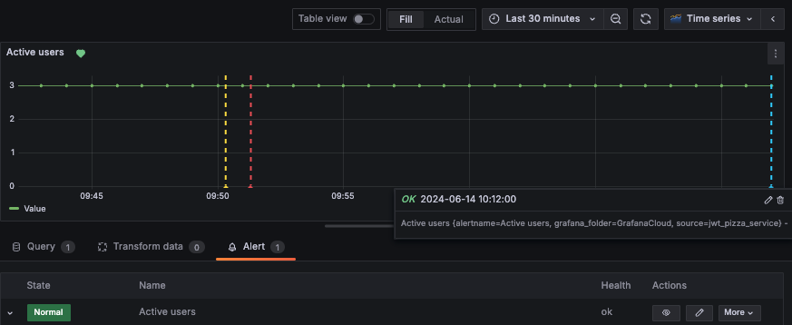


## ☑ Exercise


```masteryls
{"id":"710420a1-836d-49dc-9a38-43543f24c9f5", "title":"Grafana alerts", "type":"file-submission", "gradingCriteria":"Grafana metric panel displays annotations that an alert has fired and resolved"  }
Simple a screenshot of your dashboard panel with annotations that an alert has fired and been resolved.
```
