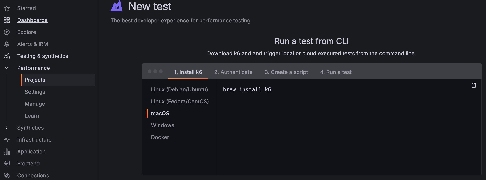
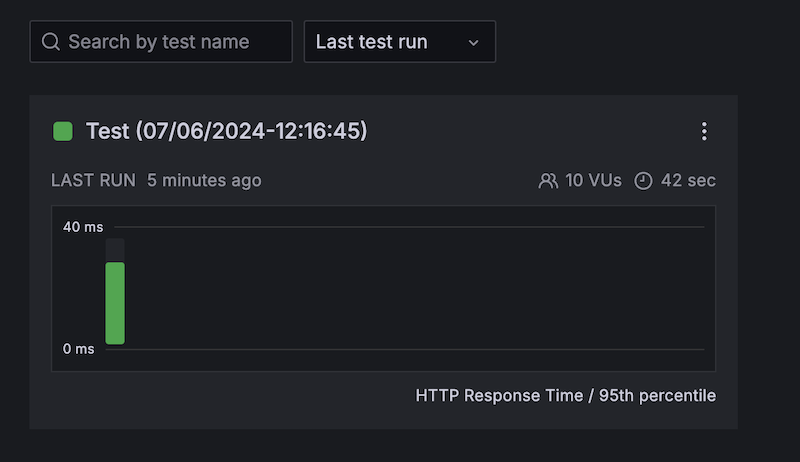
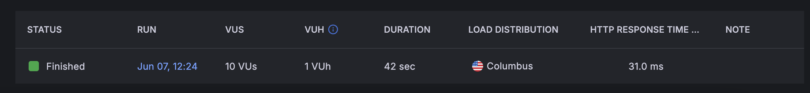

# K6


In 2000, a pair of game developers were working on an MMORPG (massively multiplayer online role-playing game). The demands of such a game required them to invest in load testing tools and design. This eventually led them to create a consulting company that helped others conduct effective load testing with their applications.
Eventually, in 2016, they took all the best practices they had learned and built an open source tool named K6 and sold it as a SaaS (software as a service) offering. In 2021, K6 was acquired by Grafana Labs and became part of Grafana Cloud.

## Run a test on a sample application

In this exercise, you will perform a simple load test on the [K6 example website](https://test.k6.io) so that you can get familiar with load testing. Take the following steps:

1. Open up your Grafana Cloud dashboard.
1. Select the `Testing and Synthetics > Performance > Projects` option from the home menu.
1. Press the `Start testing` button. This will create a default project.
1. Click on the `Default Project` and press the `Create new test` button. Steps will show up for running a test from the CLI.
1. Create a load testing folder in your development environment.

```sh
mkdir k6-example && cd k6-example
npm init -y
```

1. Follow the steps for installing K6 and authenticating.
1. Click on the `Create a script` step.



It should provide an example script like the following:

```javascript
import http from 'k6/http';
import { sleep } from 'k6';

export const options = {
  // 10 concurrent virtual users
  vus: 10,
  duration: '30s',
  cloud: {
    // Project: Default project
    projectID: 12345678,
    // Test runs with the same name groups test runs together.
    name: 'Test (30/05/2024-13:57:34)',
  },
};

export default function () {
  // Make a get request every second
  http.get('https://test.k6.io');
  sleep(1);
}
```

Let's break this down a bit.

### Options

The `vus` refers to the number of virtual users that will be using the test application concurrently. The `duration` is the amount of time the test will run for. The `cloud` object contains the project ID and the name of the test. Tests with the same name will be grouped together in Grafana Cloud. You can configure the options object to suit your needs. For example, instead of setting values for the `vus` and `duration` that remain constant over the whole test, you could add stages to the testing to simulate different users at different times:

```javascript
export const options = {
  stages: [
    // Ramp up over 30 seconds to 50 users
    { duration: '30s', target: 50 },
    // Ramp up over 1 minute to 100 users
    { duration: '1m', target: 100 },
    // Ramp down over 30 seconds to 0 users
    { duration: '30s', target: 0 },
  ],
    ...
```

Using stages like this would produce results that look like the following. Note how the number of VUs increases and decreases as defined in the stages given.


### Function

The `export default function()` is the main function that will be executed by the test.
The `http.get` function sends a get request to the specified url. The `sleep` function pauses the test for the specified amount of time.
In the given example, for each virtual user the test will send a get request to `https://test.k6.io` every second for 30 seconds.

### Run the test

1. Copy the example script into your `k6-example` folder.
1. Use the command given in the `Run a test` step to run the test in the cloud.
1. Use the breadcrumb to navigate back to `Default Project` and click on the test group you just ran.
   
1. At the bottom, you will see a list of test runs. We have made only one, so there is only one test run. Click on it to see the performance overview.
   

You should see that all the http requests were successful, along with the response time and other metrics. Take some time to explore the performance insights.


## ☑ Assignment: Run a simple load test on JWT Pizza

1. In your `jwt-pizza` repository, create a new directory called `k6`.
1. Navigate to the `Projects` section under `Testing and Synthetics` in Grafana Cloud.
1. Create a new project and name it `jwt-pizza-service`
1. `Create new test` and copy the script given in the `Create a script` step into a new file in your `k6` directory called `simpleLoadTest.js`.
1. Replace the test url with the url of your JWT Pizza application.
1. Run the test from the CLI and view the results in Grafana Cloud.
1. Submit a screenshot of the performance overview to the Canvas Assignment.
