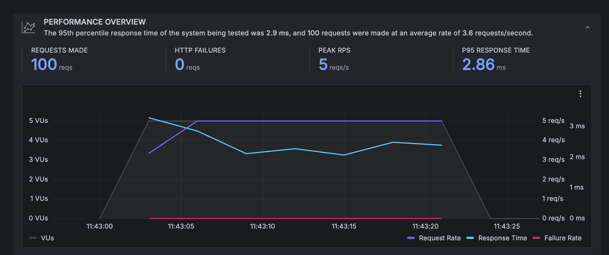

# K6

- Types of testing:
  Load test simple get requests
  Test getting a jwt pizza

K6 is an open source load testing tool that mainly uses http requests. You will be using it to execute end-to-end load testing on your JWT Pizza application. It was developed in 2016 by a load testing consulting company, before being acquired by Grafana in 2021. Grafana has integrated K6 into their cloud platform, so we can run our tests in the cloud and view the results in Grafana.

## Run a test on a sample application

This example will have you load test a sample application.

- Go to Grafana Cloud -> Testing and Synthetics -> Performance

- Click on the `Default Project`

- Follow the steps to run a test from cli.


These steps provide an example script like the following:

```javascript
import http from 'k6/http';
import { sleep } from 'k6';

export const options = {
  // 10 concurrent virtual users
  vus: 10,
  duration: '30s',
  cloud: {
    // Project: Default project
    projectID: 12345678,
    // Test runs with the same name groups test runs together.
    name: 'Test (30/05/2024-13:57:34)',
  },
};

export default function () {
  // Make a get request every second
  http.get('https://test.k6.io');
  sleep(1);
}
```

Let's break this down a bit.

### Options

The `vus` refers to the number of virtual users that will be using the test application concurrently. The `duration` is the amount of time the test will run for. The `cloud` object contains the project ID and the name of the test. You can configure the options object to suit your needs. For example, instead of setting the `vus` value, you could add stages to the testing to simulate different users at different times as follows:

```javascript
export const options = {
  stages: [
      // Ramp up over 1 minute to 50 users
      { duration: '1m', target: 50 },
      // Ramp up over 2 minutes to 100 users
      { duration: '2m', target: 100 },
      // Ramp down over 1 minute to 0 users
      { duration: '1m', target: 0 },
    ],
    ...
```

### Function

The `export default function()` is the main function that will be executed by the test.
The `http.get` function sends a get request to the specified url. The `sleep` function pauses the test for the specified amount of time.
In the given example, for each virtual user the test will send a get request to `https://test.k6.io` every second for 30 seconds.

Use the CLI to run the test in the cloud, then go to the project and view the metrics from the test.

You should see that all the http requests were successful, along with the response time and other metrics. Take some time to explore the performance insights.

## Run a test on JWT Pizza

- In your `jwt-pizza` repository, create a new directory called `k6`
- Go to Grafana Cloud -> Testing and Synthetics -> Performance -> Projects
- Create a new project and name it something like `jwt-pizza-simple`
- `Create new test` and copy the script given in the `Create a script` step into a new file in your `k6` directory called `loadTest.js`
- Replace the test url with the url of your JWT Pizza application
- Run the test from the CLI and view the results in Grafana Cloud


