# Grafana K6

🔑 **Key points**

- Grafana provides robust support for load testing with K6.
- You can create a K6 load test by recording browser requests or writing scripts.
- Analyzing metrics like P99 latency helps identify performance bottlenecks.

---


K6 automates load testing by playing back browser requests or executing HTTP commands written in JavaScript. K6 runs these requests concurrently using a defined number of simulated users. Given sufficient computational power and network bandwidth, you can simulate realistic traffic to ensure your system remains stable under heavy load.

### History

In 2000, two developers working on a multiplayer game needed to simulate high usage to test their system. Using the insights gained from building internal tools, they founded a consulting company to help others with load testing. In 2016, they codified their best practices into an open-source tool and SaaS offering named K6. In 2021, Grafana Labs acquired K6, integrating it into the Grafana Cloud ecosystem.

This story is a classic example of a small team identifying a niche need, building a high-quality tool, and scaling it into an industry standard.

> [!NOTE]
>
> Fun fact: The creators of K6 actually kept a pet alligator in their office.

## An example run

The following results are based on a load test against the JWT Pizza application. The test simulates a user logging in, browsing the menu, and purchasing a pizza. K6 generates comprehensive metrics and visualizations to help you understand application performance.

The graph below shows 10 concurrent virtual users (VUs) making a maximum of 3.33 requests per second, with an average 95th percentile (P95) response time of 118ms.

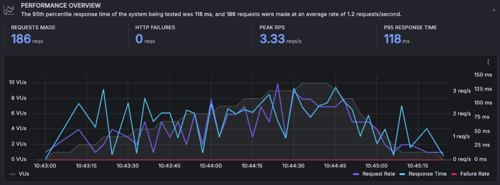

K6 provides a breakdown of metrics for each endpoint, including request counts and latency statistics. In this example, the login request (`api/auth`) takes an average of 108ms. This is expected, as the server must create a cryptographically signed JWT. The pizza creation call (`api/order`) averages 48ms, which is reasonable given that it requires an external call to the JWT Pizza Headquarters.

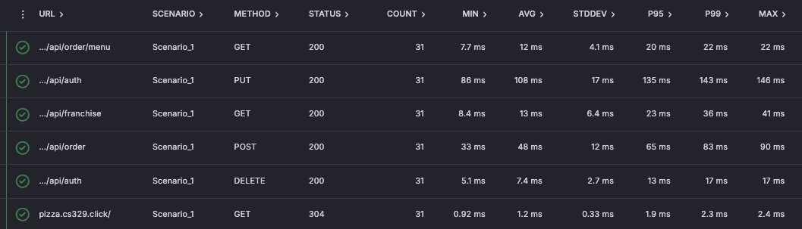

When evaluating performance, the most critical values are often found in the upper percentiles, such as the top 1% (P99) or 0.1% (P99.9) of requests. Here, while the average login time is 108ms, the P99 is 143ms with a standard deviation of 17ms.

In complex applications, a "layering effect" can occur. If a single user action triggers 12 separate endpoint requests in sequence, and each request has a 1% chance of taking 3 seconds, roughly 10% of your customers will experience a significant delay. By simulating load and experimenting with architectural changes, you can identify and remove these bottlenecks before they impact real users.

## Setting up a K6 test

You will create your first K6 load test against your JWT Pizza production deployment.

> [!WARNING]
> Normally, you should not load test a production system. Standard practice is to spin up a dedicated environment using automation templates (like CloudFormation). However, since your current production environment has no active traffic and no additional cost for hardware, we will use it for this exercise.

### Creating the project and test

1.  Open your Grafana Cloud dashboard.
1.  Navigate to the Home menu and click **Testing & synthetics > Performance > Projects**.
1.  Click the **Start testing** button.

    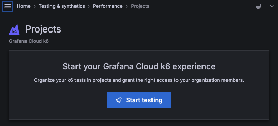

    This displays the default project created with your account. You can create a new project or use the default.

    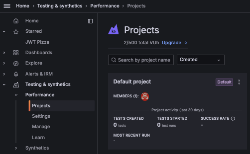

1.  Click the **Default project** name, then click **Create new test**.
1.  You will see several options for creating a test:
    1.  **K6 CLI**: Build tests locally in your development environment.
    2.  **Script Editor**: Write a JavaScript testing script directly in Grafana Cloud.
    3.  **Test Builder**: Use a GUI to construct tests (the fastest way to start).
    4.  **Record user flow**: Record actions directly in the browser.

1.  Click **Start Building** to use the **Test Builder**.

    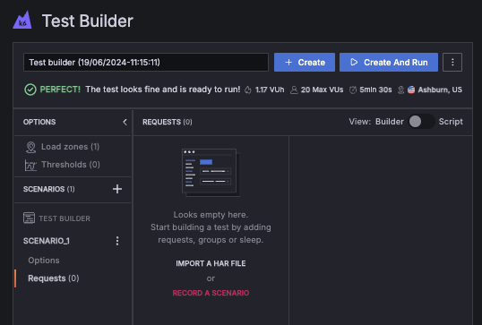

    While you can record a scenario using a Chrome extension, we will instead record and upload an HTTP Archive (HAR) file, which requires no additional installations.

1.  Rename the test from the default to `Login and order pizza`.

### Recording a HAR file

A HAR file contains all HTTP requests and responses captured by the browser.

**Note:** Before recording, you must enable the export of sensitive data so the HAR file includes authorization tokens. In Chrome DevTools, click the **Settings (gear icon)** > **Preferences** > **Network** and check **Allow to generate HAR with sensitive data**.

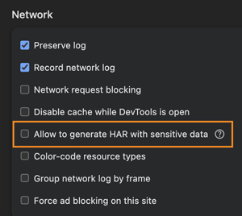

1.  Open Chrome and navigate to your JWT Pizza website. Ensure you are logged out and clear your browser cache to avoid sending cached headers.
1.  Open DevTools and go to the **Network** tab.
1.  Select **Preserve log** and clear any existing recorded requests.


1.  Refresh the page. Log in, select a pizza, complete the purchase, and verify the order.
1.  Click the **Export HAR** (download arrow) icon in the Network tab. Name the file `buyPizza.har`.

### Initializing the test with the HAR file

1.  Return to the Grafana Test Builder and click **IMPORT A HAR FILE**.
1.  Drag your `buyPizza.har` file into the upload area.

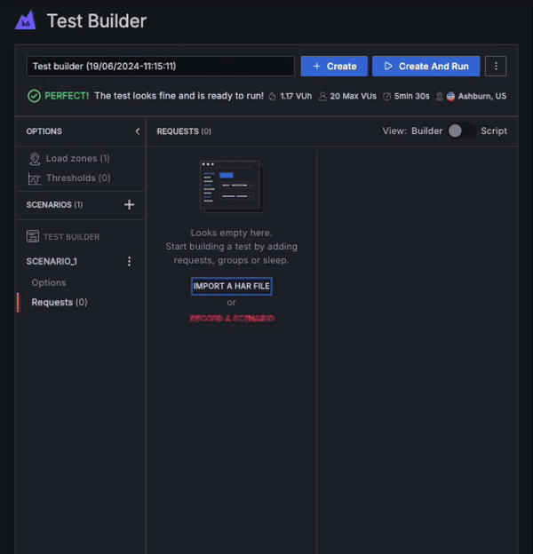

1.  During import, select **Correlate the request and response data**. Do **not** include **Static assets** (like images) unless you specifically want to test their download speeds. Select **Generate sleep** to simulate realistic user pauses.
1.  Disable filtering on necessary domains (e.g., `pizza-factory.cs239.click`) to ensure all relevant requests are included.

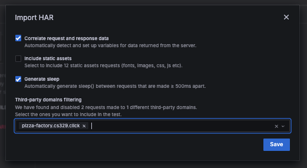

The builder will generate a list of test steps. Review the requests (path, headers, and query parameters). You may see several `HTTP OPTIONS` requests; you can delete these using the trash icon to simplify the script.

### Finalizing the test

Review each step and provide descriptive names for the requests. You should have approximately 10 steps.

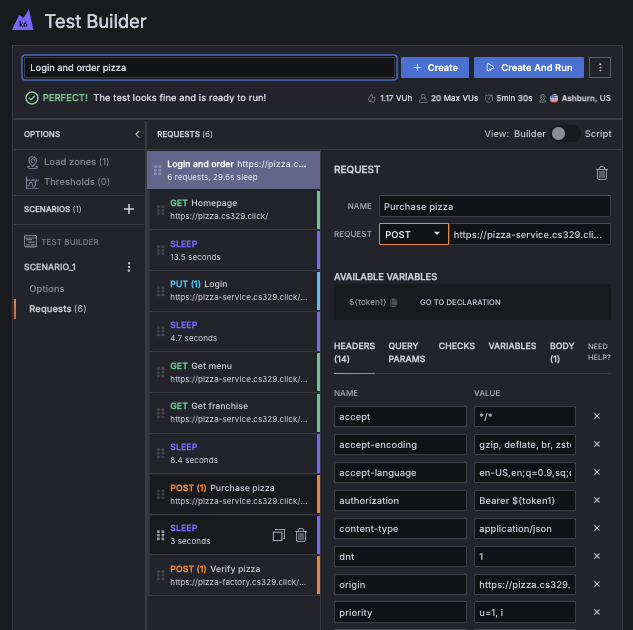

Next, define the execution scenario. In the left-hand menu, click **SCENARIO_1 -> Options**. By default, K6 ramps up from 0 to 20 VUs over 1 minute, stays at 20 VUs for 3.5 minutes, and then ramps down.

**Note:** High-volume tests generate real traffic and can impact AWS costs. For this exercise, adjust the target VUs and duration to match the following:

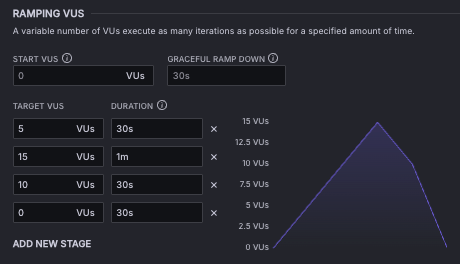

When finished, click **Create**.

## Running a test

Open your test and click **Run**. You can also **Set up a schedule** if you prefer to run tests during off-peak hours.

It takes a few minutes for K6 to provision the load-generation servers and begin the script. Results will begin to populate in real time.

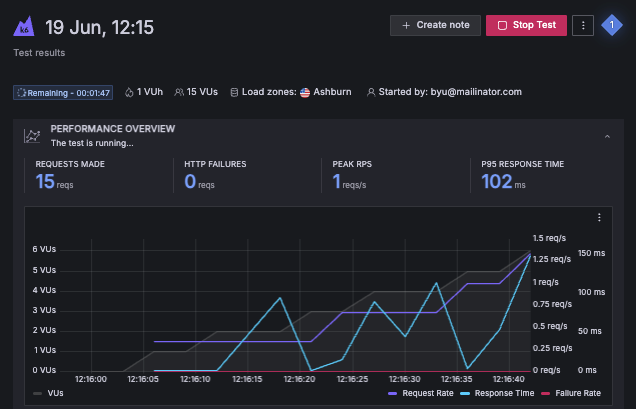

As the test completes, the request rates will decrease. If the test behaves unexpectedly, you can click **Stop Test** at any time.

## Analyzing the results

Once the test finishes, examine the metrics.

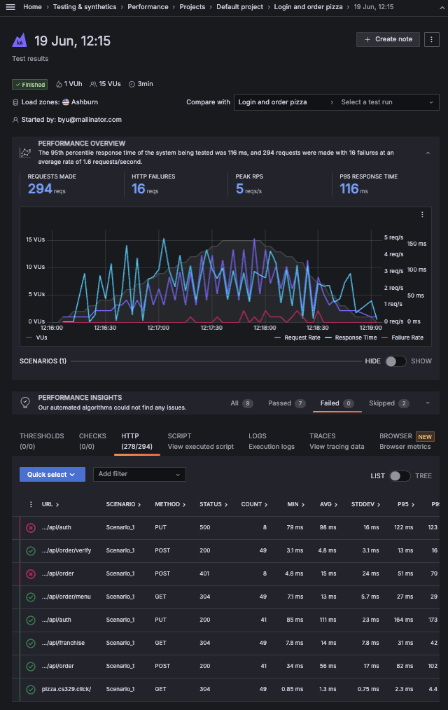

In this example, the **login** and **order** requests show several failures. Clicking a request line expands it to show the specific error codes.

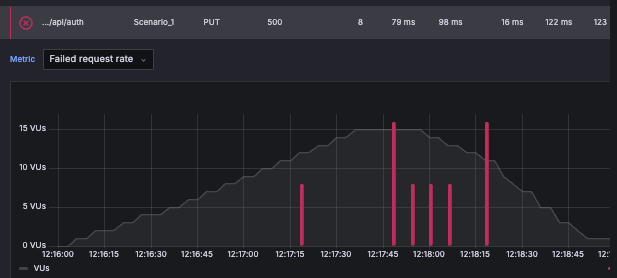

Here, login requests returned a `500` error, while order requests returned a `401`. This is logical: if the authentication fails, the subsequent order will be unauthorized.

Explore the **PERFORMANCE INSIGHTS** and the **ANALYSIS** tab. These graphs help you understand performance trends. You can toggle between average values and specific percentiles to see how the system handles outliers.

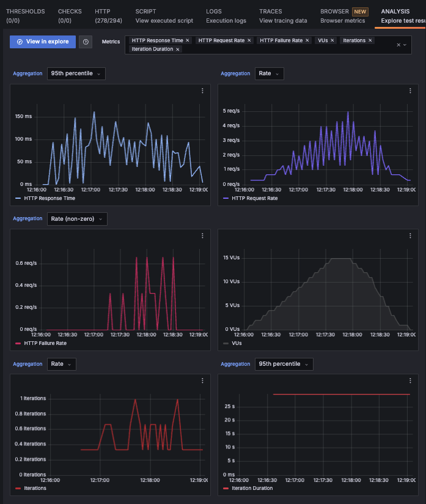

### Adding a check

To prevent the script from continuing after a login failure, add a validation check.

1.  Edit the test.
1.  Select the login step (`[PUT] /api/auth`) and go to the **Checks** tab.
1.  Click **ADD NEW CHECK**.
1.  Set the type to **HTTP status code**, the condition to **Equals**, and the value to `200`.

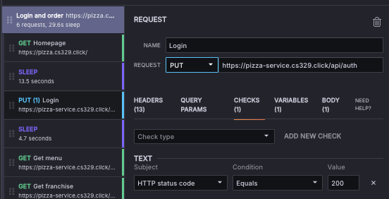

If you toggle the view from **Builder** to **Script**, you can see the generated JavaScript code for the check:

```javascript
response = http.put('https://pizza-service.cs329.click/api/auth', '{"email":"d@jwt.com","password":"a"}', {
  headers: {
    accept: '*/*',
    'content-type': 'application/json',
    dnt: '1',
    origin: 'https://pizza.cs329.click',
    priority: 'u=1, i',
  },
});
check(response, { 'status equals 200': (response) => response.status.toString() === '200' });
```

## Editing the test script

To stop the iteration immediately upon failure, we must move from the visual Builder to the **Script Editor**.

1.  Copy the current script from the Builder.
1.  Return to the project root, click **Create new test**, and select **Script Editor**.
1.  Paste your script.
1.  Modify the `k6` import to include the `fail` function:

```javascript
import { sleep, check, group, fail } from 'k6';
```

5. Update the check logic to stop execution if the status is not 200:

```javascript
if (!check(response, { 'status equals 200': (response) => response.status.toString() === '200' })) {
  console.log(response.body);
  fail('Login was *not* 200');
}
```

6. Click **Create** and run the script.

The test will now abort the current iteration whenever a login fails, preventing "cascading" errors in the order requests.

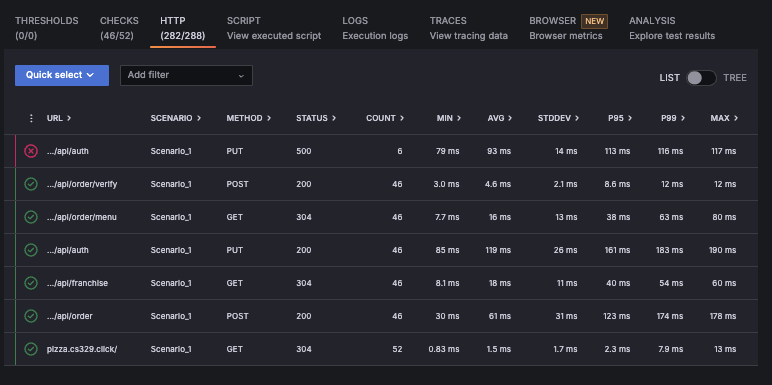

If you check the **Logs** tab, a `500` error might reveal a "Duplicate entry" message. This indicates a bottleneck in the JWT Pizza Service database handling concurrent logins for the same user—a valuable finding for your performance report.

## Using variables

K6 uses standard JavaScript, allowing you to use variables for dynamic data. When importing a HAR file, K6 often automatically creates variables for authentication tokens.

```javascript
const vars = {};

// login
response = http.put('https://pizza-service.byucsstudent.click/api/auth', '{"email":"d@jwt.com","password":"diner"}', {
  headers: {
    accept: '*/*',
    origin: 'https://pizza.byucsstudent.click',
  },
});
check(response, { 'status equals 200': (response) => response.status.toString() === '200' });

// Store the token from the response
vars.authToken = response.json().token;
```

This `authToken` is then passed into subsequent requests:

```javascript
// Get menu
response = http.get('https://pizza-service.byucsstudent.click/api/order/menu', {
  headers: {
    accept: '*/*',
    authorization: `Bearer ${vars.authToken}`,
    origin: 'https://pizza.byucsstudent.click',
  },
});
```

Using variables ensures that your test uses the specific data generated during that session (like a new pizza ID or a fresh JWT) rather than stale data from the original recording.

## Wrap up

Congratulations! You have successfully created and analyzed your first load test. Mastering tools like K6 is a vital part of DevOps, as it allows you to use automation to ensure system reliability and performance before real users ever encounter a bottleneck.

## ☑ Exercise

```masteryls
{"id":"f63caa8c-6e31-472e-a0e5-170c165cead8", "title":"Grafana K6", "type":"file-submission", "gradingCriteria":"Must contain a representation of a Grafana K6 execution of a load test", "gradingCriteria":"Grafana K6 load test execution timeline"  }
Submit a screenshot of the K6 execution timeline over the entire duration of your test.
```
