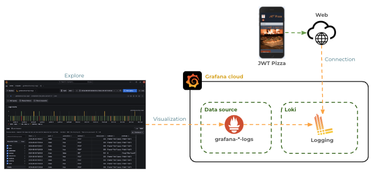
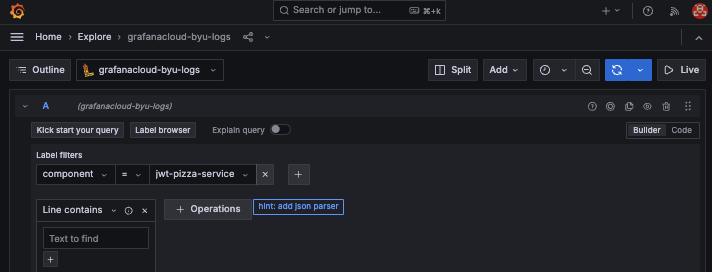
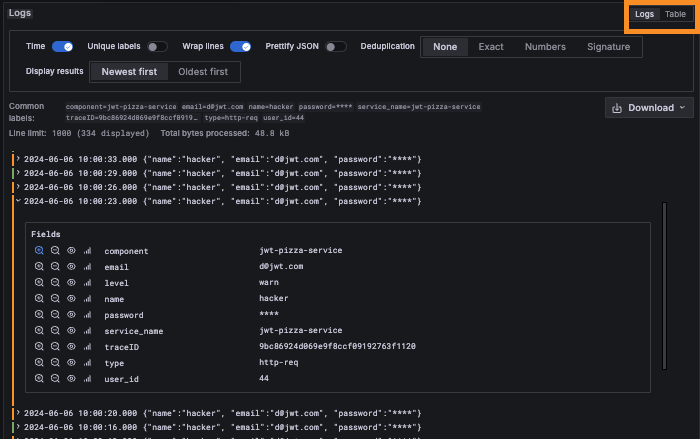
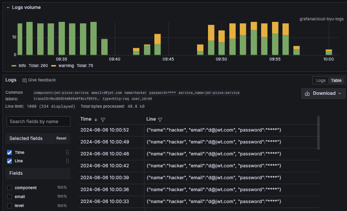
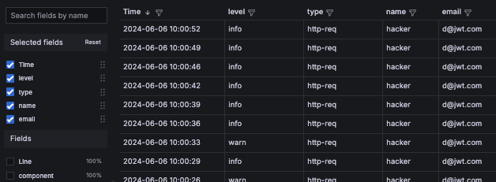
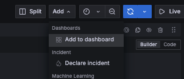
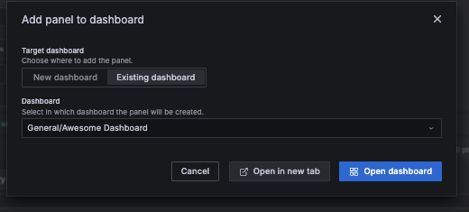
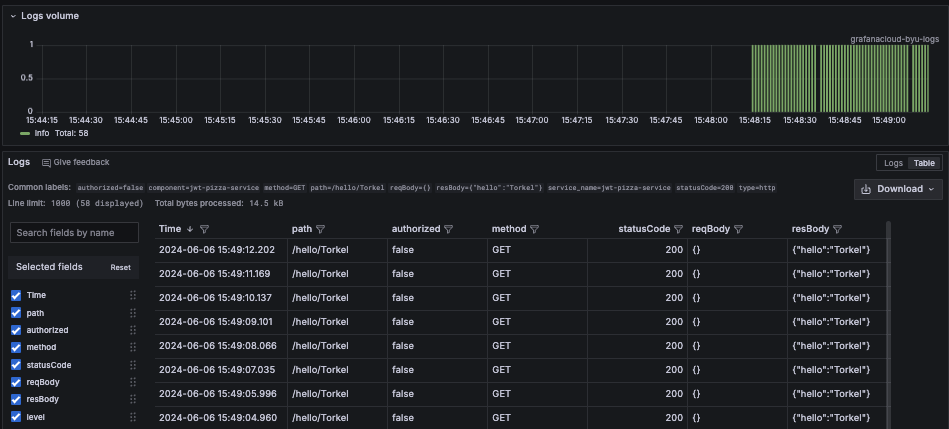
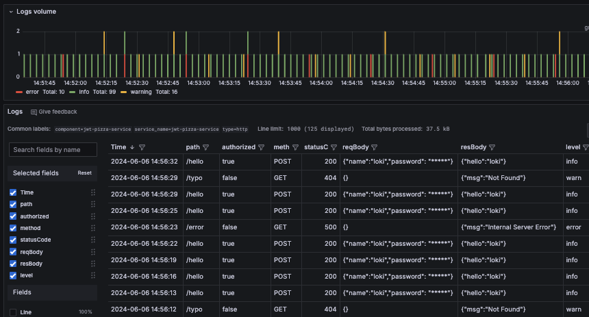
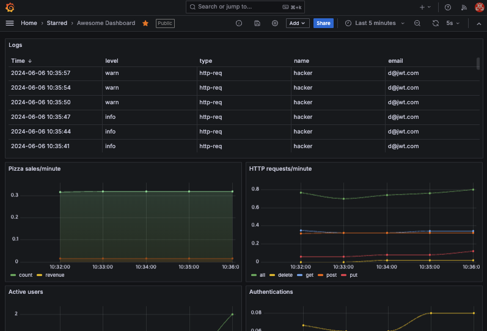

# Grafana Logging

🔑 **Key points**

- Generate logs using Curl or application code via HTTP requests.
- Use Grafana Explore to review, search, and filter logs.
- Build a simple Node.js service to automate request logging.
- Simulate log-generating traffic using Curl loops.

---


Grafana Cloud provides a service called **Loki**, a log-aggregation system inspired by Prometheus. Loki is designed to be cost-effective and easy to operate because it does not index the contents of the logs, but rather indexes a set of labels for each log stream.

Your application sends log events over HTTP to the Loki service, which stores them persistently. A Grafana data source then connects to Loki, allowing you to search logs and create visualizations on your dashboard.



## Inserting logs using HTTP

In this exercise, you will use the **Loki** (sometimes listed as **Logs**) connection to insert data into Grafana Cloud. You will use a data source typically named `grafanacloud-youraccountnamehere-logs` that is created by default when you set up your account.

To send logs over HTTP, you need an Access Policy token (API key).

1. Open your Grafana Cloud dashboard.
2. Select **Connections** from the left-hand menu and click **Add new connection**.
3. Search for **Loki** or **Logs** and select it.
4. This page provides the details and templates necessary to send logs to your Loki instance.
5. Under the section for creating a token, provide the name `jwt-pizza-logs` for the **Access Policy token name**.
6. Click **Create token**.
7. Review the section titled **Anatomy of your Loki log**. This defines the JSON structure required to upload data to Loki.
8. Review the section titled **Send logs from your application code**. This provides examples for Curl, Node.js, or Go. The example contains your specific API key, Account ID, and Endpoint URL.

   ```sh
   curl -X POST -H "Content-Type: application/json" -H "Authorization: Bearer 1032529:glc_222222222222" -d '{"streams": [{"stream": {"Language": "Curl", "source": "Shell"},"values": [["'"$(($(date +%s)*1000000000))"'", "This is my log line"]]}]}' https://logs-prod-006.grafana.net/loki/api/v1/push
   ```

9. Extract the **Account ID**, **API Key**, and **Endpoint URL** from the example Curl command.
    - The **Account ID** is typically a seven-digit number.
    - The **API Key** is a long string starting with `glc_`.
    - The **Endpoint URL** is the target URL (e.g., `https://logs-prod-006.grafana.net/loki/api/v1/push`).
10. Assign these to shell variables for easier use:

   ```sh
   endpoint_url="https://logs-prod-006.grafana.net/loki/api/v1/push"
   api_key="glc_222222222222"
   account_id="1032529"
   ```

11. **Save these values in a secure location.** You will need them to configure your application later.

### Loki JSON log syntax

The HTTP body of a logging request must follow the [Loki HTTP API syntax](https://grafana.com/docs/loki/latest/reference/loki-http-api/#ingest-logs).

Each request is composed of one or more **streams**. A stream contains **labels** (metadata tags) and a list of **values**. Each value is an array containing a nanosecond-precision timestamp, the log message string, and an optional metadata object.

**Note on Labels:** Labels are indexed and searchable. Metadata is not indexed but can be used for filtering. Avoid using labels with high cardinality (fields with many unique values, like User IDs), as this significantly degrades Loki's performance.

The general syntax looks like this:

```json
{
  "streams": [
    {
      "stream": {
        "label": "value"
      },
      "values": [
        ["<unix epoch in nanoseconds>", "<log line>", { "<metadata label>": "<metadata value>" }]
      ]
    }
  ]
}
```

Example log message for an HTTP request:

```json
{
  "streams": [
    {
      "stream": { "component": "jwt-pizza-service", "level": "info", "type": "http-req" },
      "values": [
        ["1717627004763000000", "{\"name\":\"pizza diner\", \"email\":\"d@jwt.com\"}", { "traceID": "0242ac120002" }]
      ]
    }
  ]
}
```

### Using Curl to insert logs

Using your credentials, you can now manually insert a log entry. Ensure your URL matches the one provided in your Grafana dashboard, as the subdomain (e.g., `logs-prod-006`) varies by region.

```sh
endpoint_url="https://logs-prod-006.grafana.net/loki/api/v1/push"
api_key="glc_222222222222"
account_id="1032529"

curl -X POST \
  -H "Content-Type: application/json" \
  -H "Authorization: Bearer $account_id:$api_key" \
  -d '{"streams": [{"stream": {"component":"jwt-pizza-service", "level": "info", "type":"http-req"},"values": [["'"$(($(date +%s)*1000000000))"'","{\"name\":\"hacker\", \"email\":\"d@jwt.com\", \"password\":\"****\"}",{"user_id": "44","traceID": "9bc86924d069e9f8ccf09192763f1120"}]]}]}' \
  $endpoint_url
```

Key aspects of this log event:
1. **Labels:** `component`, `level`, and `type` are indexed for efficient searching.
2. **JSON Body:** By sending the log line as a JSON string, Loki and Grafana can automatically parse fields for filtering.
3. **Dynamic Timestamp:** The `date` command generates the current Unix timestamp in nanoseconds.
4. **Security:** The password field is manually masked (`****`). Never store raw passwords in logs.

To generate a stream of data for visualization, run this loop in your terminal:

```sh
for i in {1..100}; do
  (( RANDOM % 2 )) && level="warn" || level="info"

  curl -X POST \
    -H "Content-Type: application/json" \
    -H "Authorization: Bearer $account_id:$api_key" \
    -d '{"streams": [{"stream": {"component":"jwt-pizza-service", "level": "'"$level"'", "type":"http-req"},"values": [["'"$(($(date +%s)*1000000000))"'","{\"name\":\"hacker\", \"email\":\"d@jwt.com\", \"password\":\"****\"}",{"user_id": "44","traceID": "9bc86924d069e9f8ccf09192763f1120"}]]}]}' \
    $endpoint_url

  sleep 3
done
```

## Using Grafana Explore

The **Explore** tool allows you to query and examine your data sources without creating permanent dashboard panels.

1. Open your Grafana Cloud dashboard.
2. Click **Explore** in the left-hand menu.
3. Select your log data source (e.g., `grafanacloud-youraccountname-logs`).
4. In the **Label filters**, select `component` and set the value to `jwt-pizza-service`.
   
5. Click the suggestion to **add json parser** (or manually add `| json` to your query).
6. Click **Run Query**.

The results show log messages from the selected time range. You can adjust the range using the time picker or by dragging across the **Logs volume** histogram.

Because you applied the JSON parser, Grafana identifies fields within the log line and color-codes entries based on the `level` field.



Switch from the **Logs** view to the **Table** view to see the data in a structured format.



You can customize which columns appear by selecting fields from the sidebar.



### Creating a visualization

Once your query in Explore is refined:
1. Click the **Add** button at the top and select **Add to dashboard**.
   
2. Choose **Existing dashboard**, select your **Pizza Dashboard**, and click **Open in new tab**.
   
3. Arrange and save the new panel on your dashboard.

You can now stop the Curl loop in your terminal. Next, you will generate logs directly from application code.

## Sending logs from code

To demonstrate programmatic logging, we will create a simple Node.js Express service.

1. Create a new directory and initialize the project:
   ```sh
   mkdir loggingExample && cd loggingExample
   npm init -y
   npm install express
   ```
2. Add a start script to `package.json`:
   ```json
     "scripts": {
       "start": "node index.js"
     },
   ```
3. Create a `config.js` file for your credentials. **Important:** Add this file to your `.gitignore` to prevent leaking your API key to GitHub.

   ```js
   module.exports = {
     source: 'jwt-pizza-service',
     endpointUrl: 'https://logs-prod-006.grafana.net/loki/api/v1/push',
     accountId: '1032529',
     apiKey: 'glc_222222222222',
   };
   ```

4. Create `logger.js`. This module mirrors the Curl logic but adds features like:
    - **Middleware:** `httpLogger` captures request and response data automatically.
    - **Sanitization:** The `sanitize` function masks sensitive data using regex.
    - **Level Mapping:** Converts HTTP status codes to log levels (e.g., 500 -> error).

   ```js
   const config = require('./config');

   class Logger {
     httpLogger = (req, res, next) => {
       let send = res.send;
       res.send = (resBody) => {
         const logData = {
           authorized: !!req.headers.authorization,
           path: req.originalUrl,
           method: req.method,
           statusCode: res.statusCode,
           reqBody: JSON.stringify(req.body),
           resBody: JSON.stringify(resBody),
         };
         const level = this.statusToLogLevel(res.statusCode);
         this.log(level, 'http', logData);
         res.send = send;
         return res.send(resBody);
       };
       next();
     };

     log(level, type, logData) {
       const labels = { component: config.source, level: level, type: type };
       const values = [this.nowString(), this.sanitize(logData)];
       const logEvent = { streams: [{ stream: labels, values: [values] }] };

       this.sendLogToGrafana(logEvent);
     }

     statusToLogLevel(statusCode) {
       if (statusCode >= 500) return 'error';
       if (statusCode >= 400) return 'warn';
       return 'info';
     }

     nowString() {
       return (Math.floor(Date.now()) * 1000000).toString();
     }

     sanitize(logData) {
       logData = JSON.stringify(logData);
       return logData.replace(/\\"password\\":\s*\\"[^"]*\\"/g, '\\"password\\": \\"*****\\"');
     }

     sendLogToGrafana(event) {
       const body = JSON.stringify(event);
       fetch(`${config.endpointUrl}`, {
         method: 'post',
         body: body,
         headers: {
           'Content-Type': 'application/json',
           Authorization: `Bearer ${config.accountId}:${config.apiKey}`,
         },
       }).then((res) => {
         if (!res.ok) console.log('Failed to send log to Grafana');
       });
     }
   }
   module.exports = new Logger();
   ```

5. Create `index.js`. This service uses the `logger.httpLogger` middleware to handle logging globally.

   ```js
   const express = require('express');
   const app = express();
   const logger = require('./logger');

   app.use(express.json());
   app.use(logger.httpLogger);

   app.get('/hello/:name', (req, res) => {
     res.send({ hello: req.params.name });
   });

   app.post('/hello', (req, res) => {
     res.send({ hello: req.body.name });
   });

   app.get('/error', (req, res) => {
     throw new Error('Trouble in river city!');
   });

   app.use((req, res) => {
     res.status(404).send({ msg: 'Not Found' });
   });

   app.use((err, req, res, next) => {
     res.status(500).send({ msg: 'Internal Server Error' });
   });

   app.listen(3000, function () {
     console.log(`Listening on port 3000`);
   });
   ```

6. Start the service:
   ```sh
   npm start
   ```
7. In a separate terminal, trigger the endpoint:
   ```sh
   while true; do curl localhost:3000/hello/Torkel; sleep 1; done;
   ```

Check your Grafana dashboard to see the real-time log entries.



### Generating diverse log events

Test different scenarios to see how the logger handles various statuses and sensitive data:

```sh
# Post request with sensitive data
while true; do curl -X POST localhost:3000/hello -H "Content-Type:application/json" -H "Authorization: Bearer xyz" -d '{"name":"loki", "password":"toomanysecrets"}' ; sleep 3; done;

# Trigger 500 Error
while true; do curl localhost:3000/error ; sleep 30; done;

# Trigger 404 Not Found
while true; do curl localhost:3000/typo ; sleep 17; done;
```

In Grafana, you will observe:
1. Correct reporting of Authorization headers.
2. Accurate HTTP methods, paths, and status codes.
3. Full request/response bodies.
4. Properly sanitized passwords.



## ☑ Exercise

Complete the following:

1. Build the example Node.js logging application.
2. Generate log messages by calling the service endpoints with Curl.
3. Use the **Explore** tool to filter logs by component and level.
4. Add a log visualization panel to your primary dashboard.

Upon completion, your dashboard should display a live feed of application logs similar to the one below.

