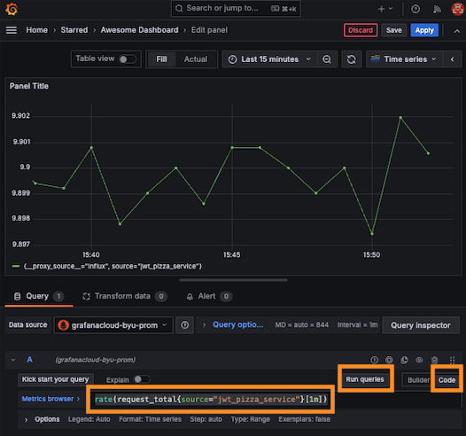
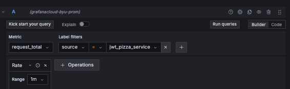
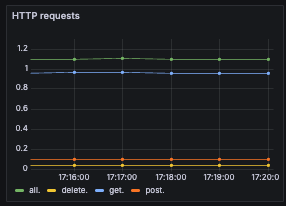
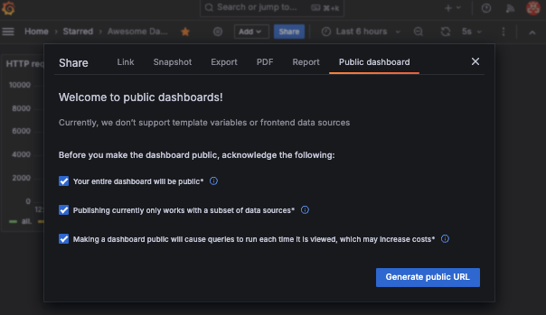

# Grafana metrics


In previous instruction we used the TestData data source to display randomly generated metrics on a Grafana dashboard. Now we want to demonstrate how to actually to actually supply data for visualization.

Grafana has dozens of predefined data sources for all kinds of data services. This includes services such as MySQL, AWS CloudWatch, Caddy Server, CSV files, ElasticSearch, GitHub, and so on. Each of these data sources define how to connect to the service and what data they expose for visualization in a dashboard panel.

## Metrics demonstration

🚧 Add a discussion about using the Grafana Pizza demonstration dashboard

## Inserting metrics using HTTP

For this exercise you will use the `HTTP Metrics` connector to insert data into a Prometheus data service hosted on Grafana Cloud and exposed using the `grafana-youraccountnamehere-prom` data source that Grafana created by default when you set up your account.


In order to send metrics over HTTP you will need an API key.

1. Open up your Grafana Cloud dashboard.
1. Select the `Connections` option from the left home menu and press `Add new connection`.
1. In the connection search box enter `HTTP Metrics` and press enter

   

1. This will display the template necessary to obtain the API Key for uploading metrics to the Grafana Cloud Prometheus service.
1. Supply the name `jwt-pizza-metrics` for the `Access Policy token name`.
1. Press `Create token`.
1. Copy the token to a secure location in your development environment. You will need this token to upload metrics.
1. Note the section titled `Anatomy of a metric`. This defines how to format the data that you upload to Prometheus.
1. Note the section titled `Send a Prometheus metric from your application code`. This gives you examples of how to upload a metric using things like Curl, Node.js, or Go. The example has your API Key already prepopulated in the example.
1. Copy the `userId` from the top of the Node example to the same location you saved the token. You will need this later.
1. Copy the example for Curl. It will look something like the following:

   ```sh
   API_KEY="1111111:glc_111111111111111111111111111111111111111111="
   URL="https://influx-prod-13-prod-us-east-0.grafana.net/api/v1/push/influx/write"

   curl -X  POST -H  "Authorization: Bearer $API_KEY" -H  "Content-Type: text/plain" "$URL" -d "test,bar_label=abc,source=grafana_cloud_docs metric=35.2"
   ```

   The first two commands set shell variables for the API key and the connection URL for the Prometheus service. The final command tells Curl to upload a metric.

### InfluxDB line protocol syntax

The metric string uses uses the [InfluxDB line protocol syntax](https://docs.influxdata.com/influxdb/cloud/reference/syntax/line-protocol/). This has the following general syntax.

```sh
<measurement>[,<tag_key>=<tag_value>]* [<field_key>=<field_value>]*
```

The example that you copied looks like this:

```sh
test,bar_label=abc,source=grafana_cloud_docs metric=35.2
```

This will create a Prometheus metric named **test_metric** with a value of 35.2 that is tagged with two labels: **bar_label** and **source**.

We want to insert data that represents the number of total HTTP requests we have seen, and so we will use the following:

```sh
request,source=jwt-pizza-service total=1000
```

### Using Curl to insert metrics

Using the example command and your newly minted API key you can now insert data into Prometheus.

1. Open up a command console window.
1. Paste and execute the commands that set up the key and URL shell variables.
1. Modify the Curl command to insert the data so that it represents total number of requests.
   ```sh
   curl -X  POST -H  "Authorization: Bearer $API_KEY" -H  "Content-Type: text/plain" "$URL" -d "request,source=jwt-pizza-service total=1000"
   ```
   This should execute without any error and put your first metric into the Prometheus database.
1. Now modify the shell command so that it inserts a new metric every few seconds.
   ```sh
   total=0; while true; do total=$((total+1000)); curl -X POST -H "Authorization: Bearer $API_KEY" -H "Content-Type: text/plain" "$URL" -d "request,source=jwt-pizza-service total=$total"; sleep 10; done;
   ```
   This should simulate about 100 requests per second. That should be enough data to make things interesting. Keep this running while you create your visualization.

## Create a visualization

1. Open up your Grafana Cloud dashboard.
1. Open the Home menu, click on Dashboards, and then select **Pizza Dashboard** that you previous created.
1. Click the `Add` button on the top menu and create a new visualization.
1. For the `Data source` specify **grafanacloud-youraccountnamehere-prom**.
1. Toggle the query editor to `Builder` mode.
1. For `Metric` select **request_total**, and for `Label filters` select **source** with a value of **jwt-pizza-service**. These are the values that you provided with the Curl command.
1. Press `Run Queries` to cause the data source to pull data from Prometheus.
1. Change the time range, on the top menu bar, to be the last 15 minutes.

   

1. Press the `Save` button, confirm the save, and then press `Apply` to return to your dashboard.

This should display the metrics that you inserted using Curl. You can experiment with this by executing more Curl commands and refreshing the dashboard to see the result.

### Calculating metrics

If you insert enough metrics you will see the total request count going up and up. What you really want to know is how many requests have happened over the last period. You can accomplish this by changing the query that you use to generate the visualization data.

1. Edit the panel.
1. Toggle the query editor to `Code` mode.
1. Replace the query that is there with one that computes the difference over a one minute period.
   ```
   rate(request_total{source="jwt-pizza-service"}[1m])
   ```
1. Press the `Run queries` button. This should recalculate the displayed data to show a difference instead of a total.

   

If you switch the visualization editor back to `Builder` mode then you can experiment with all of the query operations that Prometheus provides. Take some time to play with these and see what you can do.



## Sending metrics from code

Next we will create a simple Express service that sends metrics to Grafana.

Create a simple Express app by doing the following.

1. Open your command console.
1. Execute the commends:
   ```sh
   mkdir metricsExample && cd metricsExample
   npm init -y
   npm install express
   ```
1. Modify the `package.json` file to include a start script.
   ```json
     "scripts": {
       "start": "node index.js"
     },
   ```
1. Create a `config.json` file to include your Grafana credentials. Replace the values with the ones that were supplied when you created the data source connection. The `userId` can be found by going to any of the other code snippets where you got the curl commands. Make sure you include this in your `.gitignore` file if you push this code to GitHub so that you don't publicly post your Grafana API key.

   ```json
   {
     "source": "jwt-pizza-service",
     "userId": 1,
     "url": "",
     "apiKey": ""
   }
   ```

1. Create a `metrics.js` file that basically does the same thing that the curl command was doing. The difference is that the total request count only increments every time `incrementRequests` is called. Note that `unref` is called on the timer so that node.js will shutdown even though the timer is still running.

   ```js
   const config = require('./config.json');

   class Metrics {
     constructor() {
       this.totalRequests = 0;

       // This will periodically sent metrics to Grafana
       const timer = setInterval(() => {
         this.sendMetricToGrafana('request', 'all', 'total', this.totalRequests);
       }, 10000);
       timer.unref();
     }

     incrementRequests() {
       this.totalRequests++;
     }

     sendMetricToGrafana(metricPrefix, httpMethod, metricName, metricValue) {
       const metric = `${metricPrefix},source=${config.source},method=${httpMethod} ${metricName}=${metricValue}`;

       fetch(`${config.url}`, {
         method: 'post',
         body: metric,
         headers: { Authorization: `Bearer ${config.userId}:${config.apiKey}` },
       })
         .then((response) => {
           if (!response.ok) {
             console.error('Failed to push metrics data to Grafana');
           } else {
             console.log(`Pushed ${metric}`);
           }
         })
         .catch((error) => {
           console.error('Error pushing metrics:', error);
         });
     }
   }

   const metrics = new Metrics();
   module.exports = metrics;
   ```

1. Create an `index.js` that contains your simple demonstration service. Every time an HTTP request is made to the service it will increment the total request count.

   ```js
   const express = require('express');
   const app = express();

   const metrics = require('./metrics');
   let greeting = 'hello';

   app.use(express.json());

   app.get('/hello/:name', (req, res) => {
     metrics.incrementRequests();
     res.send({ [greeting]: req.params.name });
   });

   app.listen(3000, function () {
     console.log(`Listening on port 3000`);
   });
   ```

1. Start up the service.

   ```sh
   npm run start
   ```

1. Run a curl command to repeatedly hit the **hello** endpoint.
   ```sh
   while true; do curl localhost:3000/hello/Torkel; sleep 1; done;
   ```

You should be able to now go back to your dashboard and see a request rate of about 1 per second.

## ☑ Assignment

At this point you should have a pretty good idea how to create a Grafana dashboard that displays a simple request count metric as generated from JavaScript. Now it is time to take it to the next level. Do the following:

1. Modify the service code to do the following:
   1. Provides a POST endpoint that sets the greeting.
   1. Provides a DELETE endpoint that resets the greeting back to the default.
   1. Sends metrics that count the total for each HTTP method.
1. Create Curl commands that call all of the service's endpoints.
1. Change the visualization so that it shows multiple series with the counts for each type of HTTP method.

When you are done, you should have a dashboard that looks something like this:



### Make your dashboard public

In order to complete the assignment you need to make your dashboard public so that all of your adoring fans (i.e. the TAs) can admire it.

1. From your Grafana dashboard click on the `Share` button.
1. Click on the `Public dashboard` tab.
1. Acknowledge all the warnings.

   

1. Press the `Generate public URL` button.
1. Copy the generated dashboard URL.

Go to the associated Canvas assignment and submit the dashboard URL.
