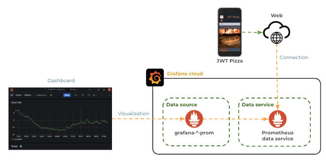
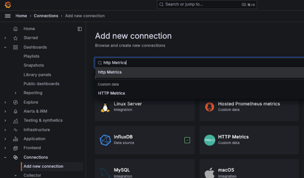
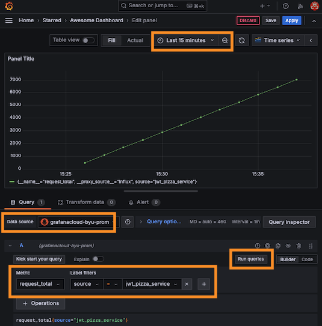
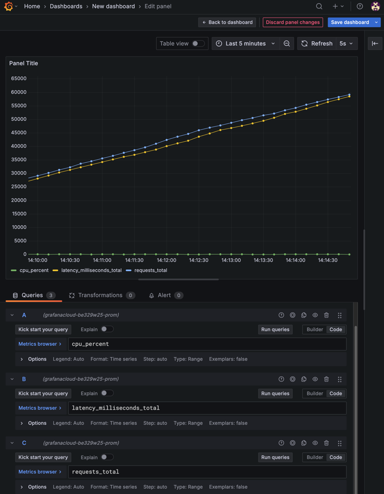
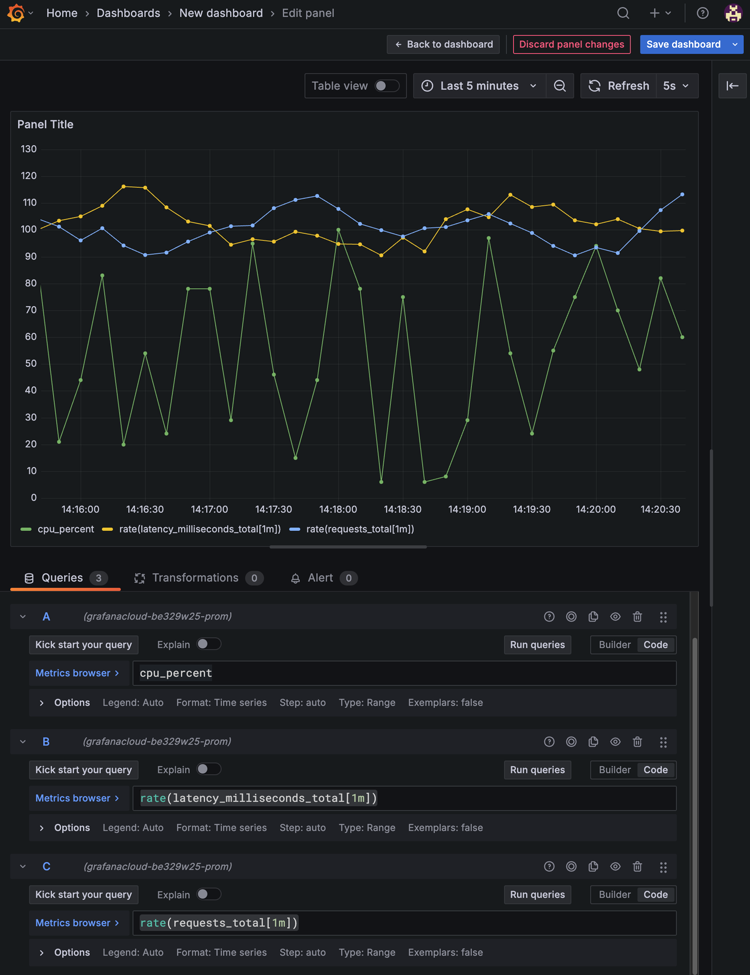

# Grafana metrics

🔑 **Key points**

- You can report metrics easily using HTTP requests.
- Grafana allows you to easily create visualizations.
- Report metrics for a simple service and create a Grafana dashboard.

---


In previous instruction we used the TestData data source to display randomly generated metrics on a Grafana dashboard. Now we want to demonstrate how to actually supply data for visualization.

Grafana has dozens of predefined data sources for all kinds of data services. This includes services such as MySQL, AWS CloudWatch, Caddy Server, CSV files, ElasticSearch, GitHub, and so on. Each of these data sources define how to connect to the service and what data they expose for visualization in a dashboard panel.

## Open Telemetry

Grafana supports the [Open Telemetry](https://opentelemetry.io/) (OTel) standard for representing metric data. This is a commonly used standard for representing observability data. It is well worth taking the time to learn. 💡 You could even consider doing a curiosity report on the subject.

OTel uses standard data units, type of metrics, and methods for adding attributes to represent a metric. For example, a simple JSON representation of an OTel metric for current CPU usage with a **jwt-pizza-service** source attribute, would look like the following:

```json
{
  "resourceMetrics": [
    {
      "scopeMetrics": [
        {
          "metrics": [
            {
              "name": "cpu",
              "unit": "%",
              "gauge": {
                "dataPoints": [
                  {
                    "asInt": 50,
                    "timeUnixNano": "1700000000000000000",
                    "attributes": [
                      {
                        "key": "source",
                        "value": { "stringValue": "jwt-pizza-service" }
                      }
                    ]
                  }
                ]
              }
            }
          ]
        }
      ]
    }
  ]
}
```

### Open Telemetry settings

The following tables describe the common units and data types that OTel supports. You can use these to describe the meaning of different metrics.

#### Metric units

Units specify the measure of the metric. This impacts the labels and operations that are available for the metric.

| Unit | Meaning      | Characteristics              |
| ---- | ------------ | ---------------------------- |
| 1    | Simple count | Number of requests           |
| s    | Seconds      | Latency, uptime              |
| ms   | Milliseconds | Latency, uptime              |
| %    | Percentage   | CPU utilization, memory used |
| By   | Bytes        | Data sent                    |
| MiBy | Megabytes    | Data written                 |

#### Metric types

Types specify how a metric should be interpreted. This impacts the default rendering and possible operations you can perform on the metric.

| Type      | Meaning           | Characteristics                        | Example          |
| --------- | ----------------- | -------------------------------------- | ---------------- |
| sum       | Counter over time | Number of requests, errors, bytes sent | request_total    |
| gauge     | Instantaneous     | Temperature, CPU usage, memory usage   | cpu_usage        |
| histogram | Distribution      | Request latency, payload sizes         | request_duration |

### Example of a `Sum` metric

If you are providing `sum` data then you must also provide information about how the data is aggregated. This includes both an aggregation temporality value (cumulative or delta) and a monotonic description (true or false). For example, with a metric that represent request latency, you would set the type to be `sum` and specify that the aggregation is cumulative and monotonically increasing.

```json
{
  "name": "latency",
  "unit": "ms",
  "sum": {
    "dataPoints": [
      {
        "asInt": 50,
        "timeUnixNano": "1700000000000000000",
        "attributes": [
          {
            "key": "source",
            "value": { "stringValue": "jwt-pizza-service" }
          }
        ]
      }
    ],
    "aggregationTemporality": "AGGREGATION_TEMPORALITY_CUMULATIVE",
    "isMonotonic": true
  }
}
```

## Inserting metrics using HTTP

For this exercise you will use the `HTTP Metrics` connector to insert data into a Prometheus data service hosted on Grafana Cloud and exposed using the `grafana-youraccountnamehere-prom` data source that Grafana created by default when you set up your account.



In order to send metrics over HTTP you will need an API key.

1. Open up your Grafana Cloud dashboard.
1. Select the `Connections` option from the left home menu and press `Add new connection`.
1. In the connection search box enter `HTTP Metrics` and press enter

   

1. This will display the template necessary to obtain the API Key for uploading metrics to the Grafana Cloud Prometheus service.
1. Supply the name `jwt-pizza-metrics` for the `Access Policy token name`.
1. Press `Create token`.
1. **Copy the token to a secure location in your development environment**. You will need this token to upload metrics.
1. Note the section titled `Send a Otel metric from your application code`. This gives you examples of how to upload a metric using things like Curl, Node.js, or Go. The example has your API Key already prepopulated in the example.
1. Look at the `Curl` example. Pull out the `-u` parameter to get your client ID and API key. Pull out the target host to get the URL that you will upload metrics to. Assign these to command shell variables like the following:

   ```sh
   URL="https://otlp-gateway-prod-us-east-2.grafana.net/otlp/v1/metrics"
   API_KEY="222222:glc_111111111111111111111111111111111111111111="
   ```

1. Use the following Curl command to insert your first metrics:

   ```sh
   while true; do curl -k -i -X POST -H 'Content-Type: application/json' -H "$OTEL_EXPORTER_OTLP_HEADERS" -u "$API_KEY" $URL -d '{
   "resourceMetrics": [
      {
         "scopeMetrics": [
         {
            "metrics": [
               {
               "name": "cpu",
               "unit": "%",
               "gauge": {
                  "dataPoints": [
                     {
                        "asInt": '"$((RANDOM % 101))"',
                        "timeUnixNano": "'$(date +%s000000000)'",
                        "attributes": [
                        {
                           "key": "source",
                           "value": { "stringValue": "jwt-pizza-service" }
                        }
                     ]
                     }
                  ]
               }
               }
            ]
         }
         ]
      }
   ]
   }'; sleep .5; done;
   ```

## Create a visualization

Now that you have a bunch of data sent to your collector, you can create a visualization of the data.

1. Open up your Grafana Cloud dashboard.
1. Open the Home menu, click on Dashboards, and then select **Pizza Dashboard** that you previously created.
1. Click the `Add` button on the top menu and create a new visualization.
1. For the `Data source` specify **grafanacloud-youraccountnamehere-prom**.
1. Toggle the query editor to `Builder` mode.
1. For `Metric` select **cpu_percent**, and for `Label filters` select **source** with a value of **jwt-pizza-service**. These are the values that you provided with the Curl command.
1. Change the `Query options` to have an **interval** of 1s.
1. Press `Run Queries` to cause the data source to pull data from Mimir.
1. Change the time range, on the top menu bar, to be the last 5 minutes and set the refresh to be every 5 seconds.

   

1. Press the `Save` button, confirm the save, and then press `Apply` to return to your dashboard.

This should display the metrics that you inserted using Curl. You can experiment with this by changing the Curl command and refreshing the dashboard to see the result.

## Generating data with JavaScript

Now that we have some experience both generating and visualizing metrics, let's implement a simple metric generation program ([metricsGenerator.js](visualizingMetricsExample/metricsGenerator.js)) that creates a variety of metrics. First, we need to move our data source credentials from environment variables into a `config.js` file that we can access from our JavaScript. This should looks something like:

```js
module.exports = {
  source: 'jwt-pizza-service',
  url: 'https://otlp-gateway-prod-us-east-2.grafana.net/otlp/v1/metrics',
  apiKey: '2222222:glc_111111111111111111111111111111111111111111=',
};
```

Then we can write code that makes fetch requests similar to our Curl example. However, in this case we provide three different simulated metrics: CPU, request count, and request latency. This is done using the `setInterval` function to generate metrics make fetch requests to send it to Grafana every second.

```js
const config = require('./config');

let requests = 0;
let latency = 0;

setInterval(() => {
  const cpuValue = Math.floor(Math.random() * 100) + 1;
  sendMetricToGrafana('cpu', cpuValue, 'gauge', '%');

  requests += Math.floor(Math.random() * 200) + 1;
  sendMetricToGrafana('requests', requests, 'sum', '1');

  latency += Math.floor(Math.random() * 200) + 1;
  sendMetricToGrafana('latency', latency, 'sum', 'ms');
}, 1000);

function sendMetricToGrafana(metricName, metricValue, type, unit) {
  const metric = {
    resourceMetrics: [
      {
        scopeMetrics: [
          {
            metrics: [
              {
                name: metricName,
                unit: unit,
                [type]: {
                  dataPoints: [
                    {
                      asInt: metricValue,
                      timeUnixNano: Date.now() * 1000000,
                    },
                  ],
                },
              },
            ],
          },
        ],
      },
    ],
  };

  if (type === 'sum') {
    metric.resourceMetrics[0].scopeMetrics[0].metrics[0][type].aggregationTemporality = 'AGGREGATION_TEMPORALITY_CUMULATIVE';
    metric.resourceMetrics[0].scopeMetrics[0].metrics[0][type].isMonotonic = true;
  }

  const body = JSON.stringify(metric);
  fetch(`${config.url}`, {
    method: 'POST',
    body: body,
    headers: { Authorization: `Bearer ${config.apiKey}`, 'Content-Type': 'application/json' },
  })
    .then((response) => {
      if (!response.ok) {
        response.text().then((text) => {
          console.error(`Failed to push metrics data to Grafana: ${text}\n${body}`);
        });
      } else {
        console.log(`Pushed ${metricName}`);
      }
    })
    .catch((error) => {
      console.error('Error pushing metrics:', error);
    });
}
```

Go grab an apple 🍏 while you let this run for a couple minutes. This will give you some meaningful data to play with.

## Enhancing your visualization

Now that you are generating data for three different metrics: cpu, requests, and latency, go ahead an create a new visualization pane on your Grafana dashboard.

Click the `+ Add query` button, change from Builder to Code mode, and add the query for each metric: **requests_total**, **latency_millisecond_total**, and **cpu_percent**. Then press the `Run queries` button. This should display the different metrics. You may need to adjust the duration to something smaller, like the last 5 minutes. You can also set the refresh to happen every 5 seconds.



Because the CPU metric is of type gauge it shows the current CPU value, while the the latency and request metrics are summing with each passing second. You can modify the visualization of the summed metrics by using the `rate` operation to calculate the rate of change over a given period. The following examples calculate over the last minute.

```txt
rate(requests_total[1m])

rate(latency_milliseconds_total[1m])
```

With that change your visualization should show clearly what you CPU, requests, and latency are as they change over time.


