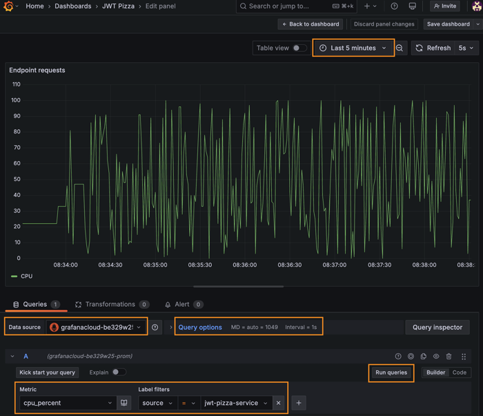

# Grafana metrics

🔑 **Key points**

- You can report metrics easily using HTTP requests.
- Grafana allows you to easily create visualizations.
- Report metrics for a simple service and create a Grafana dashboard.

---


In previous instruction we used the TestData data source to display randomly generated metrics on a Grafana dashboard. Now we want to demonstrate how to actually supply data for visualization.

Grafana has dozens of predefined data sources for all kinds of data services. This includes services such as MySQL, AWS CloudWatch, Caddy Server, CSV files, ElasticSearch, GitHub, and so on. Each of these data sources define how to connect to the service and what data they expose for visualization in a dashboard panel.

## Inserting metrics using HTTP

For this exercise you will use the `HTTP Metrics` connector to insert data into a Prometheus data service hosted on Grafana Cloud and exposed using the `grafana-youraccountnamehere-prom` data source that Grafana created by default when you set up your account.


In order to send metrics over HTTP you will need an API key.

1. Open up your Grafana Cloud dashboard.
1. Select the `Connections` option from the left home menu and press `Add new connection`.
1. In the connection search box enter `HTTP Metrics` and press enter

   

1. This will display the template necessary to obtain the API Key for uploading metrics to the Grafana Cloud Prometheus service.
1. Supply the name `jwt-pizza-metrics` for the `Access Policy token name`.
1. Press `Create token`.
1. **Copy the token to a secure location in your development environment**. You will need this token to upload metrics.
1. Note the section titled `Send a Otel metric from your application code`. This gives you examples of how to upload a metric using things like Curl, Node.js, or Go. The example has your API Key already prepopulated in the example.
1. Look at the `Curl` example. Pull out the `-u` parameter to get your client ID and API key. Pull out the target host to get the URL that you will upload metrics to. Assign these to command shell variables like the following:

   ```sh
   URL="https://otlp-gateway-prod-us-east-2.grafana.net/otlp/v1/metrics"
   API_KEY="222222:glc_111111111111111111111111111111111111111111="
   ```

1. Use the following Curl command to insert your first metrics:

   ```sh
   while true; do curl -k -i -X POST -H 'Content-Type: application/json' -H "$OTEL_EXPORTER_OTLP_HEADERS" -u "$API_KEY" $URL -d '{
   "resourceMetrics": [
      {
         "scopeMetrics": [
         {
            "metrics": [
               {
               "name": "cpu",
               "unit": "s",
               "gauge": {
                  "dataPoints": [
                     {
                        "asInt": '"$((RANDOM % 101))"',
                        "timeUnixNano": "'$(date +%s000000000)'",
                        "attributes": [
                        {
                           "key": "source",
                           "value": { "stringValue": "jwt-pizza-service" }
                        }
                     ]
                     }
                  ]
               }
               }
            ]
         }
         ]
      }
   ]
   }'; done;
   ```

This uses the Open Telemetry protocol to send a series of simulated CPU metrics to the Grafana data collector.

## Create a visualization

Now that you have a bunch of data sent to your collector, you can create a visualization of the data.

1. Open up your Grafana Cloud dashboard.
1. Open the Home menu, click on Dashboards, and then select **Pizza Dashboard** that you previously created.
1. Click the `Add` button on the top menu and create a new visualization.
1. For the `Data source` specify **grafanacloud-youraccountnamehere-prom**.
1. Toggle the query editor to `Builder` mode.
1. For `Metric` select **cpu_seconds**, and for `Label filters` select **source** with a value of **jwt-pizza-service**. These are the values that you provided with the Curl command.
1. Change the `Query options` to have an **interval** of 1s.
1. Press `Run Queries` to cause the data source to pull data from Mimir.
1. Change the time range, on the top menu bar, to be the last 5 minutes and set the refresh to be every 5 seconds.

   

1. Press the `Save` button, confirm the save, and then press `Apply` to return to your dashboard.

This should display the metrics that you inserted using Curl. You can experiment with this by changing the Curl command and refreshing the dashboard to see the result.

## Sending metrics from code

Next we will create a simple Express service that sends metrics to Grafana.

Create a simple Express app by doing the following.

1. Open your command console.
1. Execute the commends:
   ```sh
   mkdir metricsExample && cd metricsExample
   npm init -y
   npm install express
   ```
1. Modify the `package.json` file to include a start script.
   ```json
     "scripts": {
       "start": "node index.js"
     },
   ```
1. Create a `config.json` file to include your Grafana credentials. Replace the values with the ones that were supplied when you created the data source connection. Note that the API_KEY provided by Grafana actually contains both the User ID and the API key. Split those values up when you convert them into your configuration file. So if the credentials your received when you created your HTTP Metrics connection looked like this:

   ```txt
   HOST="https://otlp-gateway-prod-us-east-2.grafana.net/otlp/v1/metrics"
   API_KEY="222222:glc_111111111111111111111111111111111111111111="
   ```

   Your `config.json` would look like this:

   ```json
   {
     "source": "jwt-pizza-service",
     "host": "https://influx-prod-13-prod-us-east-0.grafana.net/api/v1/push/influx/write",
     "apiKey": "2222222:glc_111111111111111111111111111111111111111111="
   }
   ```

   Make sure you include `config.json` in your `.gitignore` file so that you don't publicly post your Grafana API key.

1. Create a `metrics.js` file that basically does the same thing that the curl command was doing. The difference is that it tracks the sum of each HTTP method type.

   ```js
   const config = require('./config.json');

   const requests = {};

   function track(req, res, next) {
     requests[req.method] = (requests[req.method] || 0) + 1;
     next();
   }

   // This will periodically send metrics to Grafana
   const timer = setInterval(() => {
     Object.keys(requests).forEach((httpMethod) => {
       sendMetricToGrafana('requests', requests[httpMethod], { method: httpMethod });
     });
   }, 10000);

   timer.unref();

   function sendMetricToGrafana(metricName, metricValue, attributes) {
     attributes = { ...attributes, source: config.source };

     const metric = {
       resourceMetrics: [
         {
           scopeMetrics: [
             {
               metrics: [
                 {
                   name: metricName,
                   unit: 's',
                   gauge: {
                     dataPoints: [
                       {
                         asInt: metricValue,
                         timeUnixNano: Date.now() * 1000000,
                         attributes: [],
                       },
                     ],
                   },
                 },
               ],
             },
           ],
         },
       ],
     };

     Object.keys(attributes).forEach((key) => {
       metric.resourceMetrics[0].scopeMetrics[0].metrics[0].gauge.dataPoints[0].attributes.push({
         key: key,
         value: { stringValue: attributes[key] },
       });
     });

     fetch(`${config.host}`, {
       method: 'POST',
       body: JSON.stringify(metric),
       headers: { Authorization: `Bearer ${config.apiKey}`, 'Content-Type': 'application/json' },
     })
       .then((response) => {
         if (!response.ok) {
           console.error('Failed to push metrics data to Grafana');
         } else {
           console.log(`Pushed ${metricName}`);
         }
       })
       .catch((error) => {
         console.error('Error pushing metrics:', error);
       });
   }

   module.exports = { track };
   ```

1. Create an `index.js` that contains your simple demonstration service. Every time an HTTP request is made to the service it will increment the total request count.

   ```js
   const express = require('express');
   const app = express();

   const metrics = require('./metrics');
   let greeting = 'hello';

   app.use(express.json());

   app.get('/hello/:name', metrics.track, (req, res) => {
     res.send({ [greeting]: req.params.name });
   });

   app.listen(3000, function () {
     console.log(`Listening on port 3000`);
   });
   ```

1. Start up the service.

   ```sh
   npm run start
   ```

1. Run a curl command to repeatedly hits the **hello** endpoint.
   ```sh
   while true; do curl localhost:3000/hello/Torkel; sleep 1; done;
   ```

You should be able to now go back to your dashboard and see a request rate of about 1 per second.

## Enhancing visualizations

There are a lot of setting that you can use to enhance your visualization. Take some time to experiment with them. For example, you will probably notice that the above code generates a metric that accumulates over time. In order to get it to render as the number of requests that were made over the last period you must apply a metric operation that computes the **rate of change** over a period of time. You do this with the `rate` operation.

```
rate(requests_seconds{source="jwt-pizza-service"}[30s])
```

You may also want to change the label that is used in the visualization. You can change that in the `Options` section for the visualization. First choose a custom labeling and then provide the variable name that you want to use for the label.


## ☑ Exercise

At this point you should have a pretty good idea how to create a Grafana dashboard that displays a simple request count metric as generated from JavaScript. Now it is time to take it to the next level. Do the following:

1. Modify the service code to do the following:
   1. Provides a POST endpoint that sets the greeting.
   1. Provides a DELETE endpoint that resets the greeting back to the default.
1. Create Curl commands that call all the service's endpoints.
1. Change the visualization so that it shows multiple series with the counts for each type of HTTP method.

When you are done, you should have a dashboard that looks something like this:


### Make your dashboard public

In order to complete the assignment you need to make your dashboard public so that all of your adoring fans (i.e. the TAs) can admire it.

1. From your Grafana dashboard click on the `Share` button.
1. Click on the `Public dashboard` tab.
1. Acknowledge all the warnings.

   

1. Press the `Generate public URL` button.
1. **You must enable** the ability for the TA to change the range of the dashboard and also view annotations.

   

1. Press the **Copy** button for the generated dashboard URL.

> [!IMPORTANT]
>
> You will provide this URL for the Metrics and Logging deliverable. So make sure you keep track of how you get the URL and test that it works in an incognito window.
