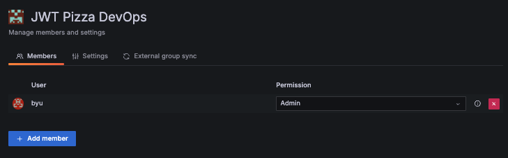
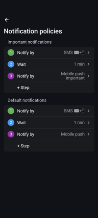
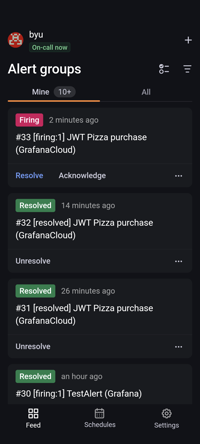

# Grafana OnCall

📖 **Deeper dive reading**: [Grafana OnCall](https://grafana.com/docs/oncall)

Grafana Cloud provides a service called `OnCall` that generates notifications that are triggered by your logging, metrics, or synthetic testing. To get started you define a on-call schedule for team members and define your alerts. When an alert is triggered anyone who is on-call will be notified according to their notification preferences. If no one is on-call, or they do not respond, then the notification escalate according to a predefined escalation chain.

## Architectural pieces

Grafana OnCall works by defining alert rules. Each rule has a trigger such as when CPU goes above 90% for 10 minutes. When a rule is triggered it notifies the

- **Alert**:
- **Contact point**:
- **Alert group**: Aggregated sets of related alerts that are grouped by some attribute.
- **Escalation chain**: A set of predefined steps, rules, and time intervals dictating how and when alerts are directed to OnCall schedules or users directly.
- **Routes**: Configurable paths that direct alerts to designated responders or channels. Tailor Routes to send alerts to specific escalation chains based on alert details. Additionally, enhance flexibility by incorporating regular expressions when adding routes to integrations.
- **On-call schedule**: A calendar-based system defining when team members are on-call.
- **Shift**: The designated time period within a rotation when a team or individual is actively on-call.
- **Notification policy**: Set of rules dictating how, when, and where alerts notifications are sent to a responder.

## Setup

1. create a contact
1. Create an integration
1. Set up an alert

The following steps will allow you to create an alerting system in Grafana:

### Attempt 99

1. Set up you contact info
1. Create a team
1. Add yourself to the team
1. Create a schedule with you on it. Set the team for the schedule.
1. Create the integration
   1. Create a contact point
   1. Associate the team.
1. Create a contact point for grafana oncall
1. Create an alert.
   1. Create an evaluation group.
   1. connect the contact point created earlier.

### Attempt 1

This is all you need to do to get alerting working assuming that you have added your email in the list for the `grafana-default-email` contact point.

If you want it to show up in the OnCall Alert Groups you also need to add the Grafana OnCall integration to the `grafana-default-email` contact point. This will force you to create an integration. The funny thing is that you cannot create an integration without a contact point. They are tightly coupled.

1. Create a rule
   1. Rename condition
   1. Metric: Purchase bucket, category: count
   1. Specify the query `increase(purchase_bucket{category="count"}[1m])`
   1. I deleted the default expressions.
   1. `Add expression` type: threshold
   1. Input: Purchase, is above 2
   1. Set as `alert condition`
   1. Press `Preview`. Note that it should be firing.
   1. Set the evaluation behavior to be Folder: GrafanaCloud.
   1. New Evaluation group named `jwt pizza`. You can reuse this for future rules.
   1. Set the contact point to the one we previously created. I used `grafana-default-email` for right now.
   1. Press Save rule and exit

The only way you can get a Grafana user associated with an alert is to create a escalation chain that references the user and then associate the escalation chain with the integration.

1. Escalation Chain

   1. new escalation chain
   1. Add a step for default notification to User and then your user.
   1. Add another step to wait 5 minutes
   1. Add another step to send important notification to your user.

1. Modify Integration that was created when you created the contact point
   1. Click on Routes `default`
   1. Choose the escalation chain you just created.

### Attempt 2

We will need:

1. An integration and its associated contact
1. A schedule
1. An alert

### Configure your ability to receive notifications

1. Open up your Grafana Cloud dashboard.
1. Open the Home menu, from the `Alerts & IRM` category click on `OnCall`, and then select **Users**.
1. Press the `Edit` button for your user.
1. Verify that your **Email** address is correct.
1. Click on the `Phone Verification` tab, enter your phone number, and press the `Send Code` button in order to verify your phone number so that you can receive notifications.
   

   Verify your number using the code that is provided and then press the `Make Test Call` button so that you can make sure the system is set up correctly.

You can also install the Grafana OnCall application ([iOS](https://apps.apple.com/us/app/grafana-oncall/id1669759048) or [Android](https://play.google.com/store/apps/details?id=com.grafana.oncall.prod)), associate your Slack account, or integrate you Google Calendar. This makes provides you different ways to receive notifications and configure your OnCall shifts.

Back on the `User info` tab, you can specify how you want to be notified. There are two types of notifications: **Default** and **Important**. You define a series of steps involving different notification methods and waiting periods. For example, you could specify that for a Default notification you would receive an email, followed by a five minute wait, and then an SMS message.

### Create a contact point

There is a default contact point. You can set yourself as the default by editing it and then setting the integration.

1. Open up your Grafana Cloud dashboard.
1. Open the Home menu, from the `Alerts & IRM` category click on `Alerting`, and then select **Contact points**.
1. Press the `Add contact point` button.
1. Supply the name `jwt-pizza-devops`
1. Select **Grafana OnCall** as the `Integration`.

### Create an integration

There are things like Email, or discord, but there is also Grafana OnCall which I think gives better control. You can console to messages that are sent.

### Create a rule

grafanacloud-byu-prom
metric=purchase_bucket category=count
add an expression, threshold > 2 for the alert purchase_bucket.

### Random notes

- An alert will not show up in the OnCall Alert Groups unless you have a contact point with a Grafana OnCall integration associated with it.
- Contact point: who to contact. This references an integration that can be Grafana OnCall or a bunch of things like AWS SNS, Discord, Pager Duty, ...Each has their own configuration.
- Alertmanager: There is a default of Grafana. Grafana is built in and accessible from the top level alert settings. I have associated my cs Email with this manager as the `grafana-default-email`.
- Notification policies: tell who to send them to and how to aggregate alerts. There is a default policy that is sent to `grafana-default-email`, group for 30s and then wait 5 minutes before sending updates.
- ML Support - They can look for patterns and forecast from data sources.
- You can define your SLO, put them on a dashboard and generate alerts.
- You can manage and declare incidents

- OnCall and alerts are related by not the same thing.
- An integration connects contact points, message templates, routes, and escalation chains to OnCall. Without an integration you cannot use the notification settings for a user.

- If you don't want to use onCall then you can just create a contact point and associated it with an alert. The problem is that it only allows email by default.

# --------------------------------- OLD

1. Create a Contact Point
   - Note - The Contact Point is the bridge between an alert and the OnCall integration

- Alerting -> Contact Points -> Add Contact Point
- Give it a name (I named mine after myself)
- Select Grafana OnCall for Integration

1. Create an Escalation Chain

- An escalation chain is a chain of actions to be taken to escalate the alert - notifying those who need to take action.

- OnCall -> Escalation Chains -> New Escalation Chain
- Give it a name
- Add escalation step to notify users
  - Options include:
    - Send single notification (default or important)
    - Do one of the above once every minute until the alert is acknowledged
- Select notification style, yourself as the user

1. Create an integration

- OnCall -> Integrations -> New Integration
- Choose Grafana Alerting
- Name it
- Choose Grafana as the alert manager
- Add your contact point
- Save
- Send a demo alert

1. Create an Alert Rule

- Give it a name
- Create query (I queried requests per minute)
- Reduce can stay same, threshold whatever you want it
- Store and evaluate in Pizza Server
- No labels, add contact point

Escalation chains options
I have it send a single text to my phone.
I could get it to text every minute until resolved, call me, send an email, whatever.
