# Grafana OnCall

🔑 **Key points**

- Grafana provides significant alerting infrastructure.
- Infrastructure includes metrics, triggers, and on call scheduling.
- You must create and trigger an alert.

---

📖 **Deeper dive reading**: [Grafana OnCall](https://grafana.com/docs/oncall)

Grafana can generate alerts based on metric thresholds that we define as part of a metric visualization definition. Those alerts can trigger a wide variety of notification types. For example, they can send emails, post to a Discord server, activate PagerDuty, invoke AWS Simple Notification System, or invoke an HTTP endpoint. Grafana also provides a more complex alerting system, named `OnCall`, that allows us to set up teams, rotation schedules, and incident management.

## Simple Grafana alerts

Let's first take a look at the simple alerting system. There are two steps involved. First we define a contact point, then we associate the contact with an alert definition. When the alert triggers it sends the notification to whatever the contact point is defined to use.

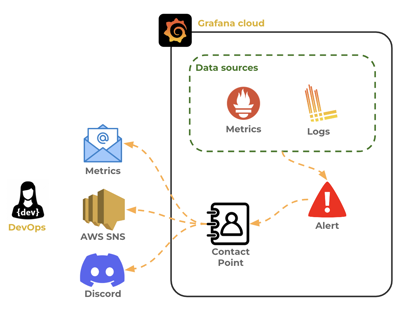

### Creating an email contact point

We create a contact point by opening our Grafana Cloud dashboard and selecting `Alerts & IRM > Alerting > Contact points`. This will display all of our currently defined contact points. If we haven't created any contact points then the `grafana-default-email` contact will be the only thing in the list. Let's create a new contact point by pressing the `Add contact point` button. This will give us the option to provide a name and define the integration for notification. Provide the name **JWT Pizza Email** with an integration choice of **Email** and an email address that you can access. For this example I used the throw away _Mailinator_ email service.

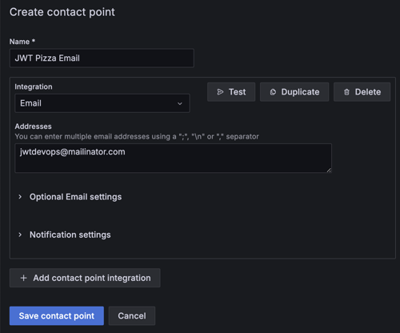

We then press the `Test` button and check our email. There we find the notification message. We can use the Contact Point optional email settings to configure the format and what the message says.

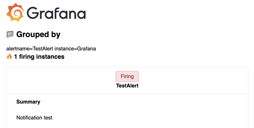

Save the contact point.

### Create an email alert

Now that we have a contact point we can attach it to an alert. We can define the alert directly from the main menu using `Alerting > Alert rules` navigation, or by editing the visualization that we want to trigger the alert. Let's use the visualization from our `Pizza Dashboard` that displays the current number of active users. From the visualization panel we can define an alert by editing the visualization, selecting the alerts tab, and pressing `New alert rule`.

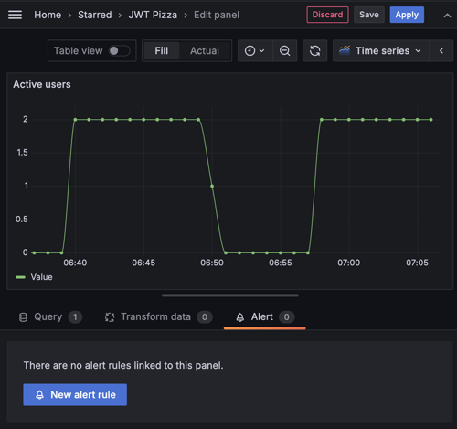

This displays the alert dialog with everything preset to trigger based on the state of the _Active users_ visualization. This includes the PromQL query that selects the metric data. In this case it is querying the current count of pizza users from the JWT Pizza Service.

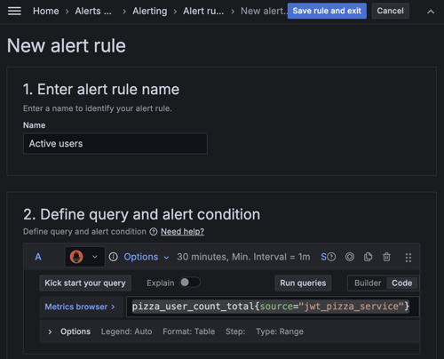

As we scroll the settings for the alert, we see that it is reducing the metric data to only select the last value. Other options include things such as selecting the _average_ or the _sum_ of the data. The threshold for triggering the alert is customizable with predicates such as _above_, _below_, or a specific _range_. We set the value for the threshold to anything above 1.

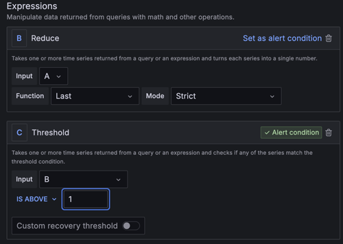

If we press the `Preview` button it will display that the threshold is **Firing**.

Next we define what happens when the event triggers. This includes where the rule should be stored, how this rule should be grouped with other rules, and how long we want to be in the alerting state before the rule triggers. Set the folder to the **GrafanaCloud** folder that was created along with your account. Create a new evaluation group named **jwt-pizza**. Leave the `Pending period` set to **1m**.

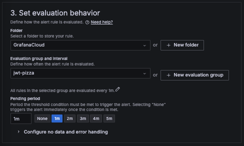

Our last alert configuration step specifies the contact point. Specify the contact point that we created previously.

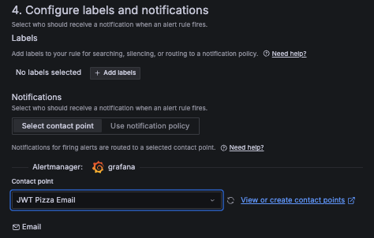

That is enough configuration to get started. Now press the `Save rule and exit` button. This will return us to the panel visualization, where our newly defined alert is displayed. Initially the state will appear as **Normal**, but as the pending period expires it will move to **Pending** and then **Firing**.

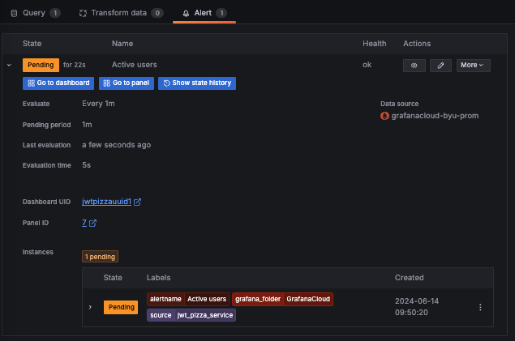

### Responding to the alert

Once the alert triggers it should initiate the notification to the contact point. If we check our email we will see the notification.

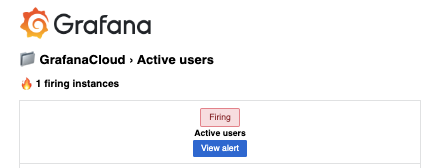

Normally we would investigate the problem and figure out what is causing the notification. In this case we can solve the problem by setting our trigger threshold to be higher. To do this we edit the rule by pressing the pencil icon and changing the threshold to be **100**. Press the `Preview` button, and it should display that the alert is back to **Normal**.

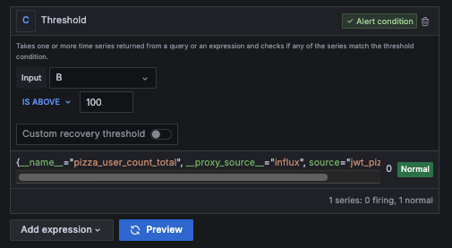

Press `Save rule and exit`. This takes us back to the visualization panel where we can see that Grafana has automatically added annotations that show when the alert was detected, when it fired, and when it was resolved. There is also a nice little green heart next to the visualization title that shows everything is good.

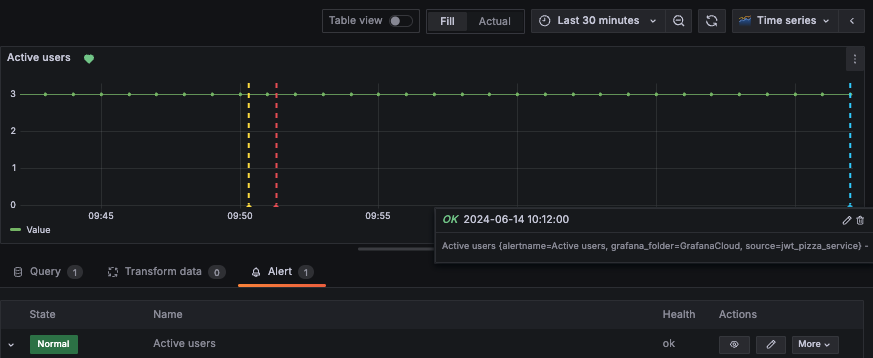

## OnCall

Grafana's simple alerting functionality is good for a single person, but if we have a team of DevOps engineers that need to schedule their availability, coordinate their response, and generate incident reports, we might consider Grafana's `OnCall` service.

Here is a list of the functionality that OnCall provides above the simple notification ability provided by metric alerting.

- **Escalation chains**: Prioritized action paths that escalate the management of an alert until it is resolved.
- **Teams**: Any number of specialized teams can be created and associated with escalation chains or alerts.
- **Scheduling**: Individuals or teams can be scheduled for being _on call_. When an event is triggered, the escalation chain attempts to notify the scheduled team members first.
- **Alert groups**: Associate related alerts and serve as a history for responses and resolutions.
- **Incident management**: Provides long-running tracking, managing, and reporting of an incident that results from an alert.
- **Notifications**: Convenient email, text message, and push notification.
- **Mobile application integration**: A full mobile app for team members that allows them to adjust their schedule, respond to alerts, and define their desired notification chain.

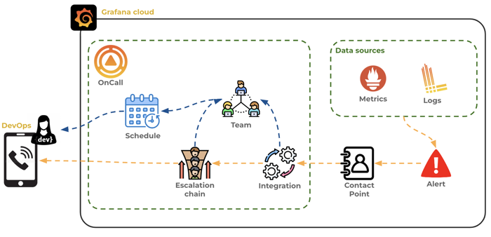

## OnCall setup

In order to use OnCall, some significant initial configuration is needed. This may seem like a lot of overhead, but each piece is an important part of an enterprise incident management system.

Here are steps you need to go through.

1. Define communication preferences
1. Create and associate yourself with a team
1. Schedule yourself for an OnCall shift
1. Create an escalation chain that describes how events should be handled
1. Create an integration between a Grafana alert contact point and the escalation chain

Let's discuss each of these steps in detail.

### Define communication preferences

To define communication preferences, use the Grafana Cloud main navigation menu for `Alerts & IRM > OnCall > Users`. There you should see your name listed as the only user in your account. Press the `Edit` button.

Add your phone number and verify it using the steps found on the `Phone Verification` tab.

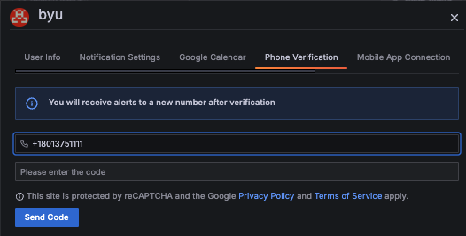

Install the OnCall Mobile app using the steps found on the `Mobile App Connection` tab. Make sure that after you have installed the application, you allow it to make audible notifications. Use the `Test push` buttons to verify you have it all set up correctly.

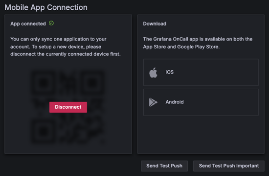

You can also associate your Slack account or integrate your Google Calendar if you desire.

Set up your `Default Notifications` so that you receive notifications both for the **Default** and **Important** levels of events. You can specify to notify you with SMS, email, phone calls, or mobile push notifications. Intersperse the notifications with appropriate wait periods as you desire.

The different steps in the notifications will each successively trigger until you finally acknowledge that you have received the notification. The idea is that you want things to get gradually louder and more annoying until you finally respond.

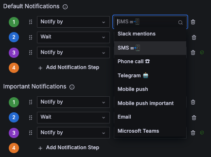

The following user configuration specifies that first an SMS message is sent and then if no response is acknowledged after 1 minute then a mobile push notification is sent. The **Mobile push** alert is much more muted than the **Mobile push important** alert.

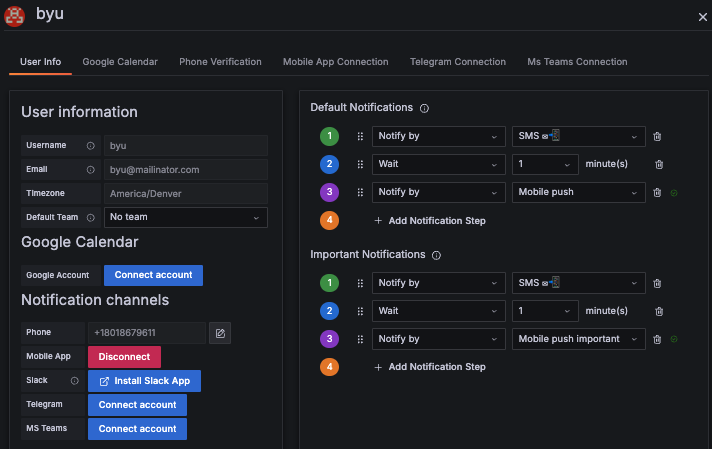

### Create and associate yourself with a team

Create a Grafana Cloud team so that you can define on-call schedules and notification priorities.

Use the Grafana Cloud main navigation menu for `Administration > Users and access > Teams`. Press the `New team` button and provide the `Name` of **JWT Pizza DevOps**. Select the roles for alerting, annotations, dashboards, data sources, and folders.

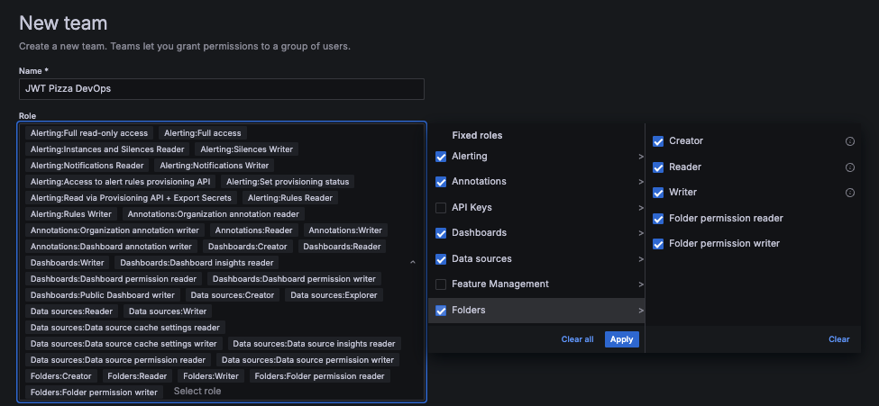

Press the `Create` button. This should automatically add you as the admin for the team.

### Schedule yourself for an OnCall shift

Create an on-call schedule so that unless escalated, only on-call team members are notified of events.

To create a schedule, use the Grafana Cloud main navigation menu for `Alerts & IRM > IRM > Schedules`. Press the `New Schedule` button. Press the `Set up on-call rotation schedule` create button. Name the schedule `JWT Pizza` and assign the team to the **JWT Pizza DevOps** that you just created. Press the `Create Schedule` button.

This will show an empty schedule with the quality marked in red as **Bad**. That is because no one is currently assigned. Fix this by pressing the `Add` button and selecting **New layer with rotation**.

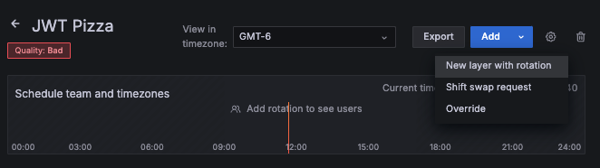

Leave everything as the defaults and add yourself as a `User`. Press the `Create` button. This will add you as the only team member and put you on call 24 hours a day, 7 days a week. The quality of the schedule will now turn green and be marked as **Great**. Obviously this is not an ideal team schedule, but until JWT Pizza really takes off, it will have to do.

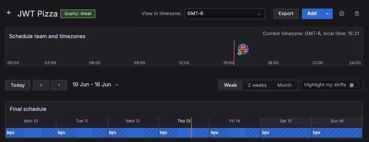

### Create an escalation chain that describes how events should be handled

An escalation chain defines an ordered list of notification quests that should progressively increase in both audience and volume until someone acknowledges the event and begins the process of resolution.

To create an escalation chain, use the Grafana Cloud main navigation menu for `Alerts & IRM > IRM > Escalation chains`. Press the `New escalation chain` button.

Assign the **JWT Pizza DevOps** team and give the name `JWT Pizza` for the chain. Press the `Create Escalation Chain` button.

Add the following steps:

1.  **Notify users from on-call schedule** and then specify the **JWT Pizza, JWT Pizza DevOps** schedule. This should send a default level notification to the team member who is on-call. This should resolve to be you since you are always on-call.

    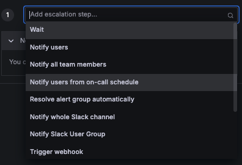

1.  **Wait** for 5 minutes. This will pause for a minute before moving on to the next escalation step.
1.  **Notify users from on-call schedule** and then specify the **JWT Pizza, JWT Pizza DevOps** schedule. Change the notification from **Default** to **Important**. This will send out an important level notification to the team member who is on-call. Once again this will be you, but this should use your preference for important notifications.
1.  **Wait** for 5 minutes.
1.  **Notify all team members** and then specify **JWT Pizza DevOps**. This will send a notification to everyone on your team.
1.  **Wait** for 5 minutes.
1.  **Notify users** and specify your name as a user. Change the notification from **Default** to **Important**.

The escalation chain should look something like the following when you are done. If this doesn't wake you up when an alert is triggered, then I don't think anything will.

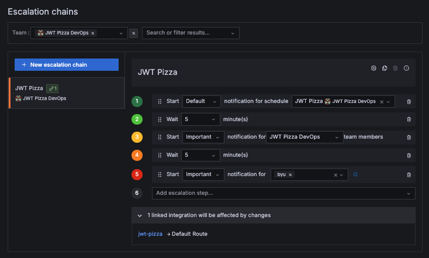

### Create an integration between a Grafana alert contact point and the escalation chain

Now we need to define the contact and integration that will connect the escalation chain to a Grafana alert.

To create a contact point, use the Grafana Cloud main navigation menu for `Alerts & IRM > Alerting > Contact points`. Press the `Add contact point` button and supply the name **JWT Pizza DevOps**. Select the `Grafana IRM` integration, select **New IRM integration** as the connection method, and provide `jwt-pizza` as the new integration name. Press `Save contact point`.

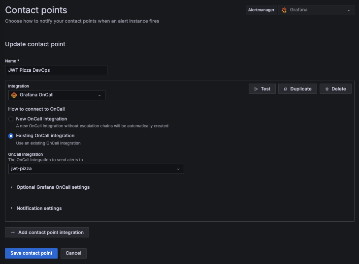

This will create both the contact point and the integration, but you need to associate your team with the integration, so we need to edit the integration.

To edit an integration, use the Grafana Cloud main navigation menu for `Alerts & IRM > IRM > Integrations`. Edit the `jwt-pizza` integration by pushing the triple dot button and selecting `Integration settings`. Specify **JWT Pizza DevOps** as the team and press `Update integration`.

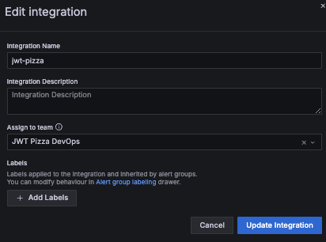

The last thing we need to do is modify the route that the integration executes when triggered. Go back to the integrations view and click on the `jwt-pizza` name to bring up its configuration.

Click on the default route and specify the `JWT Pizza, JWT Pizza DevOps` escalation chain.

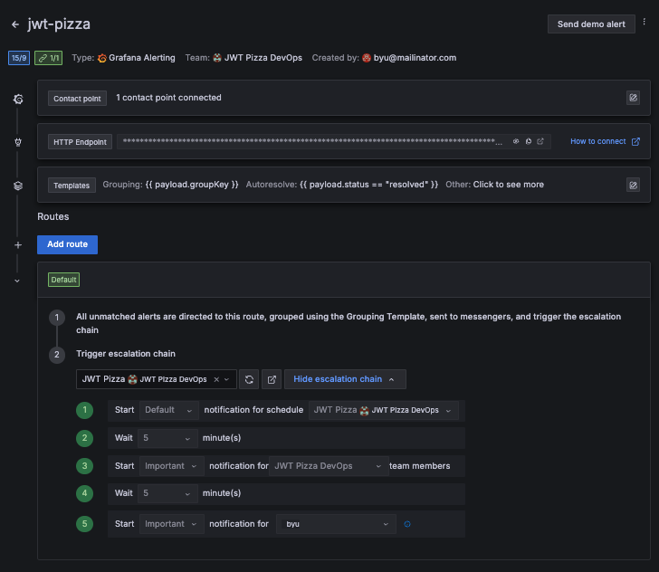

Like we said earlier, that is a lot of configuration to perform. However, with all of that in place, you can now easily add alerts that will utilize an extensive escalation and notification system for an entire DevOps team.

## Testing OnCall

With all the configuration in place you are ready to test it out. Back on the integration configuration page for `jwt-pizza` there is a `Send demo alert` button in the top right corner. Press the button.

If you configured everything correctly, an event is created and your escalation chain is executed as defined by your on-call schedule and team definition.

After a minute you should get an SMS message on your phone. Don't respond to it. Wait another minute and you should get a mobile push notification. If you continue to wait you should get several other notifications.

When the mobile push notification arrives, you can click on it, and it will display the OnCall application with the event information.

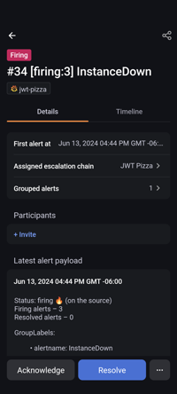

Press the `Acknowledge` button.

In your browser, use the Grafana Cloud main navigation menu for `Alerts & IRM > IRM > Alert groups` to view the information for the generated alert. Click on the alert title to see the detail. This should display the timeline of the alert with the final entry being your acknowledgement of the alert.

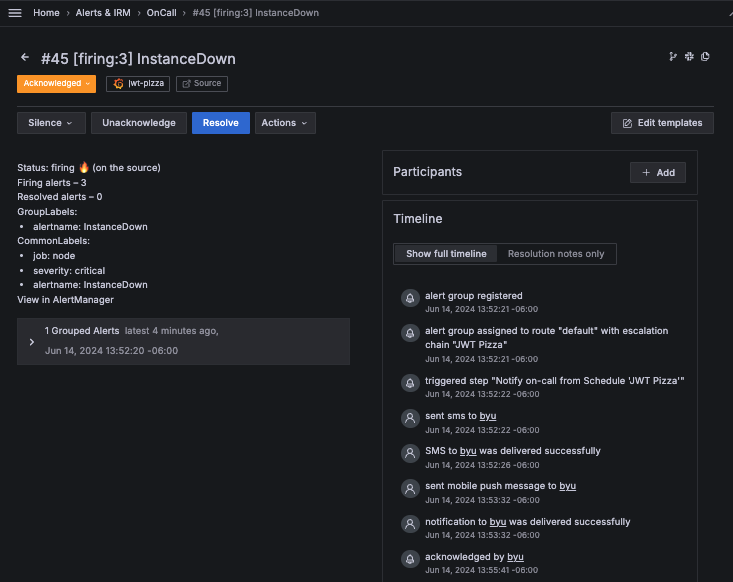

At this point you would start talking with your team, perhaps create an incident to track the conversation and important details, add additional participants, and eventually resolve the problem by pressing the `Resolve` button.

## Triggering a real alert

Now that you know how to create alerts and manage them with a simple contact point, or one that interacts with the OnCall service, it is time to hook those two together and use your metrics to generate an OnCall notification.

Go back to your alert rule definition for the `Active users` and change the contact point for the notification from **JWT Pizza Email** to **JWT Pizza DevOps**. Then change the Threshold for the rule back down to 1 instead of 100. Press `Save rule and exit`.

Assuming that you actually have more than one active user the alert should get triggered, and after a few minutes, your phone notified. Play around with the OnCall functionality and eventually resolve the alert.

## ☑ Exercise

Complete the above tutorial. This should generate an alert from one of your actual metrics using Grafana OnCall. Capture a screenshot of the resolved alert from the `Alerts & IRM > IRM > Alert groups` view.

Once you are done, it should look something like the following.

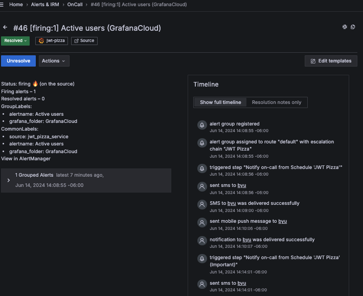
