# Grafana OnCall

🔑 **Key points**

- Grafana provides enterprise level issue response functionality.
- This guide covers how to create, configure, and administrate Grafana Oncall

---

📖 **Deeper dive reading**: [Grafana OnCall Documentation](https://grafana.com/docs/oncall)

Grafana generates alerts based on metric thresholds defined within a visualization. These alerts can trigger a wide variety of notification types, including emails, Discord posts, PagerDuty incidents, AWS Simple Notification Service (SNS) messages, or generic HTTP webhooks. Grafana also provides a sophisticated incident management system named **OnCall**, which facilitates team management, rotation schedules, and complex escalation policies.

> [!NOTE]
>
> Grafana OnCall is meant for enterprise level application support. The following information describes how an enterprise support team would operate. However, there is no expectation that you actually implement OnCall for your JWT Pizza applicaiton.

While simple alerts work for individuals, teams of DevOps engineers require advanced coordination. Grafana **OnCall** provides several enterprise-level features:

- **Escalation chains**: Prioritized paths that escalate an alert until someone acknowledges it.
- **Teams**: Specialized groups associated with specific escalation chains.
- **Scheduling**: Management of on-call rotations to ensure 24/7 coverage.
- **Alert groups**: Logic to group related alerts and maintain response history.
- **Incident management**: Tools for long-term tracking and reporting of major issues.
- **Multi-channel notifications**: Support for SMS, phone calls, and mobile push notifications.
- **Mobile app**: A dedicated app for managing schedules and responding to alerts on the go.

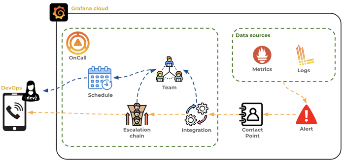

## OnCall setup

Setting up OnCall requires a few configuration steps to establish the incident management workflow.

1. Define communication preferences.
2. Create and join a team.
3. Schedule an on-call shift.
4. Create an escalation chain.
5. Integrate a Grafana alert contact point with the escalation chain.

### Define communication preferences

1. Navigate to **Alerts & IRM > IRM > Users**.
2. Click **Edit** next to your username.
3. **Phone Verification**: Add your phone number and verify it to enable SMS and voice notifications.

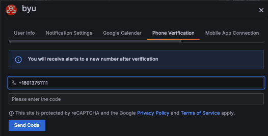

4. **Mobile App**: Install the Grafana OnCall mobile app and connect it to your account. Ensure notifications are enabled and use the **Test push** button to verify the connection.

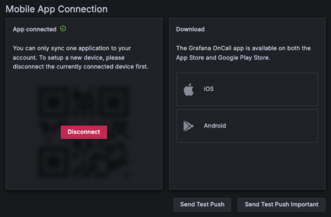

5. **Notification Rules**: Under your user profile, configure your **Notification rules**. Set up different behaviors for **Default** and **Important** events. For example, you might want an immediate push notification for "Important" events, but a delayed SMS for "Default" ones.

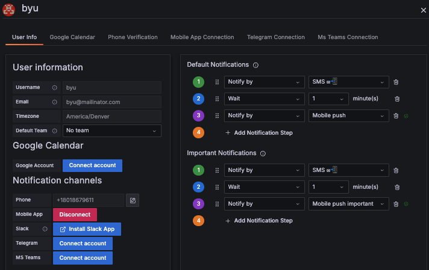

### Create and associate yourself with a team

1. Navigate to **Administration > Users and access > Teams**.
2. Click **New team** and name it **JWT Pizza DevOps**.
3. Assign appropriate roles (Alerting, Dashboards, etc.) and click **Create**. You should be automatically added as the team admin.

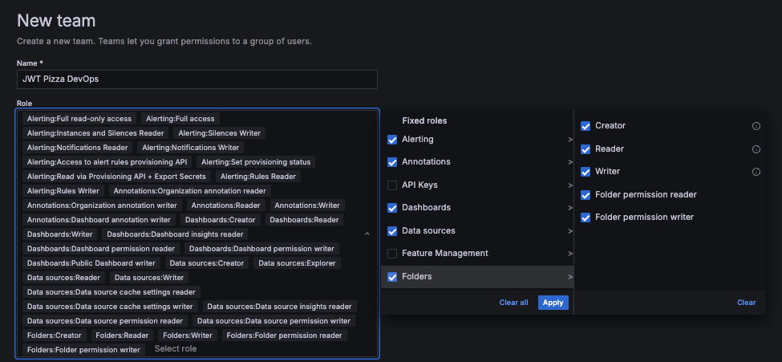

### Schedule yourself for an OnCall shift

1. Navigate to **Alerts & IRM > IRM > Schedules**.
2. Click **New Schedule** and select **Set up on-call rotation schedule**.
3. Name it **JWT Pizza** and assign the **JWT Pizza DevOps** team.
4. Initially, the schedule quality will be marked as **Bad** because it is empty.
5. Click **Add** and select **New layer with rotation**.
6. Add yourself as the user and click **Create**. This places you on-call 24/7, turning the schedule status to **Great**.

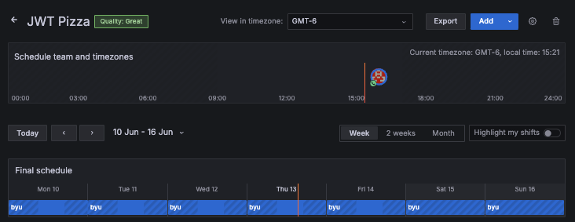

### Create an escalation chain

An escalation chain defines the steps taken until an alert is acknowledged.

1. Navigate to **Alerts & IRM > IRM > Escalation chains** and click **New escalation chain**.
2. Name it **JWT Pizza** and assign it to your team.
3. Add the following steps:
   - **Notify users from on-call schedule**: Select the **JWT Pizza** schedule (Default level).
   - **Wait**: 5 minutes.
   - **Notify users from on-call schedule**: Select the **JWT Pizza** schedule (Important level).
   - **Wait**: 5 minutes.
   - **Notify all team members**: Select **JWT Pizza DevOps**.

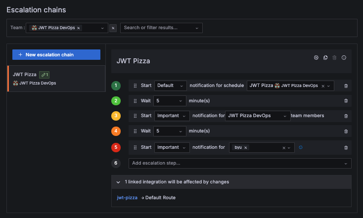

### Create the integration

Now, connect the Grafana Alerting system to the IRM (OnCall) system.

1. Navigate to **Alerts & IRM > Alerting > Contact points**.
2. Click **Create contact point**.
3. Name it **JWT Pizza DevOps Contact**.
4. Select **Grafana IRM** as the integration.
5. Choose **New IRM integration** and name it **jwt-pizza**.
6. Save the contact point.
7. Navigate to **Alerts & IRM > IRM > Integrations**.
8. Edit the **jwt-pizza** integration settings to ensure it is assigned to the **JWT Pizza DevOps** team.
9. Click on the integration name to view its routes. Set the **Default route** to use the **JWT Pizza** escalation chain.

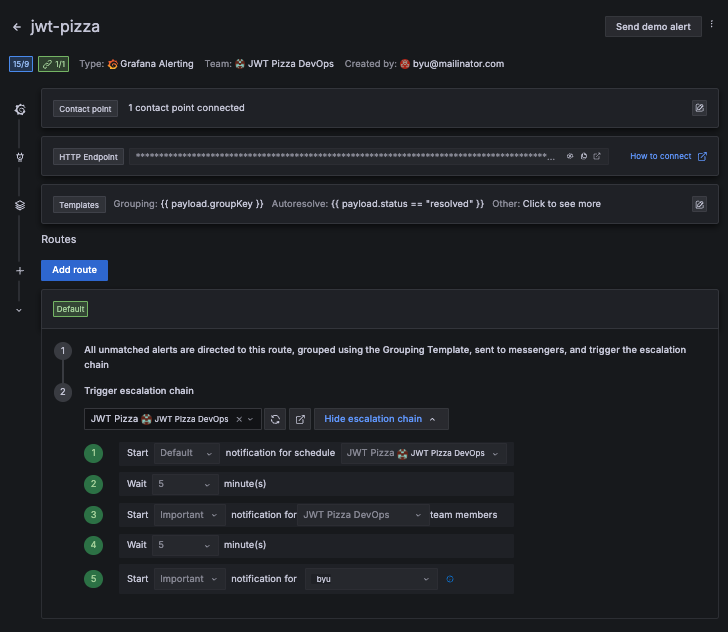

## Testing OnCall

1. On the **jwt-pizza** integration page, click **Send demo alert** in the top right.
2. If configured correctly, an event will be created and the escalation chain will begin.
3. Check your phone for SMS or push notifications.
4. Open the mobile app, view the alert details, and press **Acknowledge**.

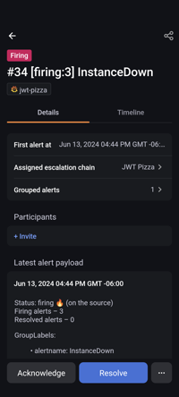

In the Grafana web UI, navigate to **Alerts & IRM > IRM > Alert groups**. You can see the timeline of the alert, including when you acknowledged it.

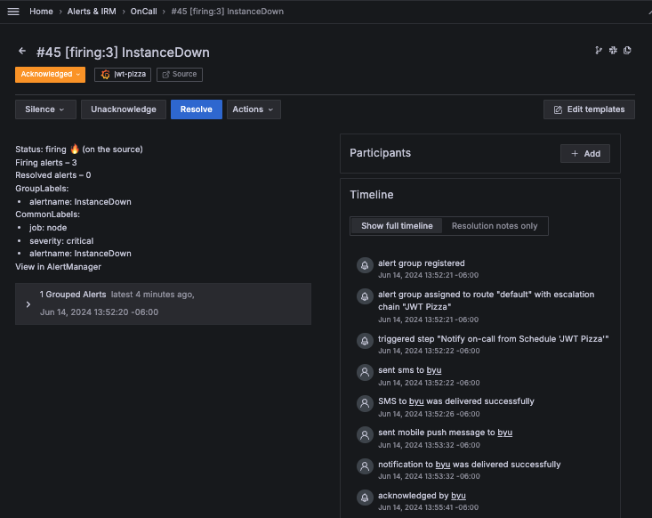

## Triggering a real alert

Finally, connect your actual metric metrics to the OnCall system.

1. Edit your **Active users** alert rule.
2. Change the **Contact point** from the email contact to the **JWT Pizza DevOps Contact**.
3. Change the threshold back to **above 1**.
4. **Save rule and exit**.

When the alert triggers, it will now follow the OnCall escalation chain, notifying your phone and allowing you to manage the incident through the IRM dashboard.

When the alert is resolved it will move into the **Resolved** state.

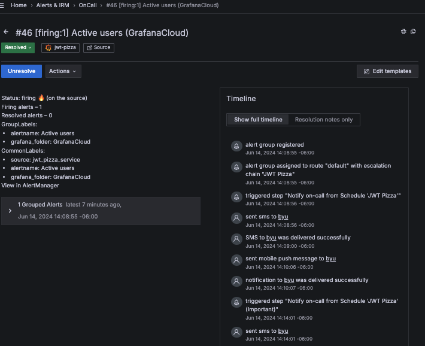
