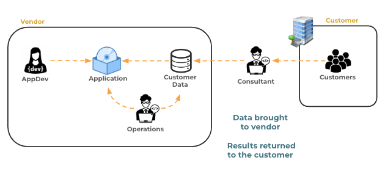
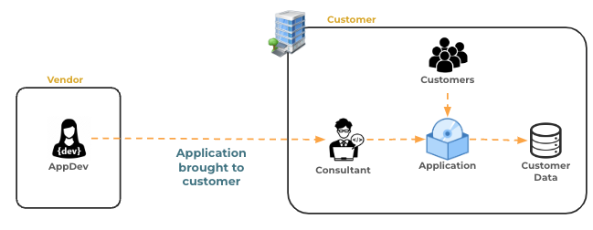
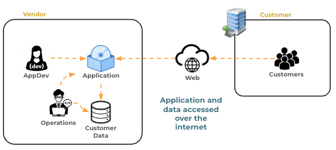
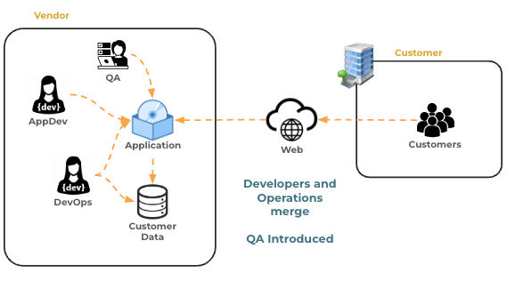
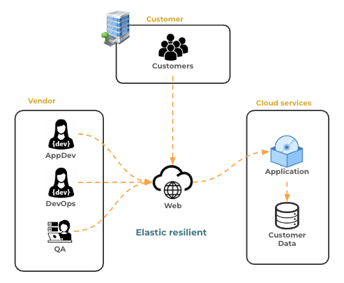
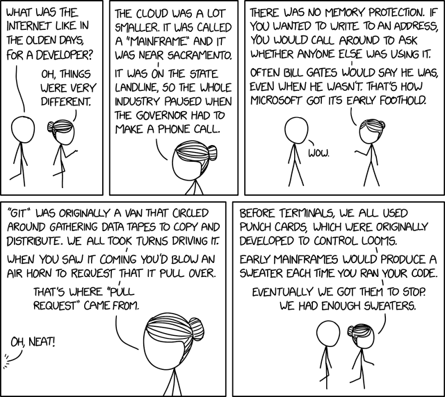

# A brief history of QA and DevOps

🔑 **Key points**

- QA and DevOps have revolutionized software development over the last decade.
- Cloud services have significantly increased the effectiveness of QA and DevOps teams.

---

While the fundamental principles of how software engineers build applications have remained remarkably consistent, the processes for ensuring quality and delivering software have changed drastically over the last two decades. In the early days of computing, the expense and complexity of hardware required applications to be hosted at the provider's physical location. Customers would bring their data to the vendor's office for processing, and the vendor would execute extensive manual testing to ensure the application behaved properly.



In the 1960s and 70s, as computing solutions became more affordable, customers began hosting hardware at their own offices. Software vendors then hired teams of consultants to visit customer locations to deploy and manage applications on the customer's computers.



Often, these consultants discovered bugs that only occurred in the customer's specific environment. These issues were reported back to the vendor, inadvertently beginning the practice of using real-world customer environments as a primary testing ground.

When the internet boomed in the late 1990s, software hosting moved back to the vendor's data centers, with customers providing data over the web. Many consultants transitioned into roles as data center operational staff. These operations teams managed the hardware and controlled how and when applications were delivered to the production servers.



In this model, application engineers were charged with adding value through new features, while Quality Assurance (QA) and operations staff were responsible for ensuring the application remained stable and accessible. This created a natural conflict of interest: application engineers wanted to deploy new code quickly, while operations teams wanted to minimize changes to maintain stability. Changes often broke existing functionality, while a focus on stability slowed the deployment of enhancements, security updates, and bug fixes.

When these competing goals became entrenched in organizational bureaucracy, they created a software delivery bottleneck that harmed both customer satisfaction and vendor profits.

## Agile and the birth of DevOps and Quality Assurance

Starting in the mid-90s, Agile techniques began to transform software development. [Agile methodologies](https://www.agilealliance.org/agile101/the-agile-manifesto/) encouraged moving quickly through small, incremental steps verified by automated testing. These practices made software easier to change and revert through quality coding practices and version control.

As the industry became adept at applying Agile principles to development, it became clear that these same principles could solve the software delivery bottleneck. This led to the rise of **Development Operations (DevOps)**, a hybrid approach that broke down the walls between building, testing, and deploying applications. Simultaneously, the **Quality Assurance (QA)** role was formalized to automate the independent review of application quality.



## Quality Assurance and development operations

Initially, QA and DevOps tasks were extensions of the application engineer's role. Engineers no longer just wrote the application code; they also wrote the software used to automatically test and deploy it.

The success of QA and DevOps centers on the **automation** and acceleration of four major goals:

1. **Versioning**: Providing easy, trackable, and reversible modifications.
2. **Testing**: Verifying quality through automated checks.
3. **Deployment**: Streamlining the process of pushing and rolling back releases.
4. **Management**: Monitoring and controlling all operational aspects of the system.

To accomplish these goals, successful teams focus on drastically reducing human involvement (**Toil**) and replacing it with automated processes (**Infrastructure as Code**). By solving delivery problems with automation, we replace slow, error-prone human intervention with processes that run continuously, quickly, and predictably. This also enables teams to immediately reverse failed deployments, reducing the impact on the customer. Even failure detection is handled by automated processes, removing the need for constant manual monitoring.

Ultimately, DevOps and QA teams build the internal applications and pipelines that enable external customers to successfully use the company's products. This shift has allowed applications to be delivered at unprecedented speeds while simultaneously increasing quality and customer satisfaction.

## Cloud services: Automating hardware deployment

The next revolution arrived in the early 2000s when cloud services, such as Amazon Web Services (AWS), began providing elastic computing, massive storage, managed databases, and global networking. Because these services were accessible via Application Programming Interfaces (APIs), they were a perfect fit for the automation mindset. 

Previously, automation focused on building and testing code. With cloud services, DevOps and QA engineers could also automate infrastructure scaling, capacity, and performance.



For many companies, this reduced the need for traditional, siloed operations and testing departments. Organizations no longer needed to build and manage costly physical data centers. A small team of engineers could now architect an automated process that removed the human element from infrastructure management, greatly increasing the velocity of development and deployment.

## Site Reliability Engineering

As DevOps matured, it evolved into a specialized role within large organizations. Google, for example, codified these practices into the **Site Reliability Engineering (SRE)** role. SRE is a discipline that incorporates aspects of software engineering and applies them to infrastructure and operations problems. The goal of an SRE team is to create a bridge between development and operations by using software as a tool to manage systems and solve problems.

💡 You might find SRE an interesting topic for further study; Google has published several [books](https://sre.google/books/) on the subject.

## Platform engineering

As DevOps infrastructure became more complex, a set of standardized tools and best practices emerged. This led to the creation of the **Platform Engineer** role. A platform engineering team acts as a service provider within an organization, building and maintaining the internal platforms and tools that application teams need to get their software into production efficiently.

## Application delivery goals

Application, DevOps, Site Reliability, and Platform engineers all share the same primary objectives:

1. **Satisfaction**: Optimize customer satisfaction, delivery velocity, scalability, and cost.
2. **Automate**: Treat testing, deployment, and management as programming problems to minimize manual intervention.

The purpose of this course is to teach you the techniques and tools necessary to master these implementations. Understanding this history—and the recurring themes of innovation—provides a deeper appreciation for the modern ecosystem of software delivery.

## Exercises


```masteryls
{"id":"544e5344-9e3a-4375-b868-6475363aec74", "title":"Why DevOps", "type":"essay", "gradingCriteria":"- Must include a description of Googles SRE program" }
What are the primary factors that lead to the creation of Development Operations?
```


## A bit of fun



> _source: [XKCD](https://xkcd.com/2324/)_