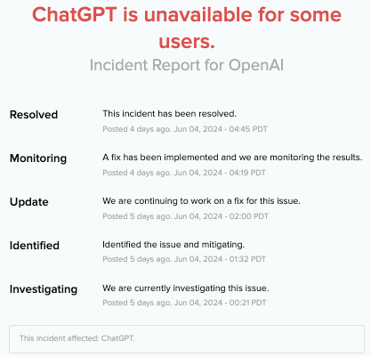
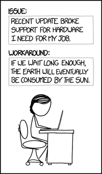

# Incident report

🔑 **Key points**

- The incident report is a critical tool for improving failure response.
- Creating a public facing incident report restores trust.

---

When a failure occurs, the entire team needs to be focused on recovering from the failure. Usually this will require some sort of manual or automated intervention. Once the panic of mitigating the failure has decreased, it is vital that you take steps to understand what happened, what the impact was, and how the system can be improved to avoid a repeated failure of the same type. An indispensable tool for formalizing this discussion is the `incident report`.

## It's not about blame

Successful incident reports focus not on assigning blame, but in understanding the conditions that allowed the failure and preventing them in the future. If there is a culture of fear that results from failures, team members will instinctively hide important information and seek to minimize any risk that could potentially reflect poorly on them. This actually increases the chance of failure and decreases the team's ability to provide value.

## Timeliness

It is essential that the key facts are collected and preserved during the course of the incident. Oftentimes the facts can be pulled from your observability system, but sometimes they need to be collected in the moment when a key artifact is displayed on a user's screen. Having a designated incident recorder can help capture everything in one place and compile it into artifacts for the report. If possible, it is helpful to have automated issue tracking that can service as the incident recorder. That tracking system can then automatically update the customers on the progress and resolution of the issue.

It is also critical that the incident report is compiled as soon as possible after the incident while it is still fresh on the team members' minds. Even waiting a few days after the incident will significantly decrease the insights that the report might have otherwise provided.

## Composition

The following table contains information that is commonly included in a successful incident report. You can find a template for an incident report on the [Atlassian website](https://www.atlassian.com/incident-management/postmortem/templates).

| Item                | Purpose                                                                                                                                                                  |
| ------------------- | ------------------------------------------------------------------------------------------------------------------------------------------------------------------------ |
| Summary             | An executive summary that gives a high level description of the incident, its impact, and resolution.                                                                    |
| Detection           | A comprehensive representation of how the incident was discovered. Was it customer reported, internally noticed, or triggered by automated means?                        |
| Impact              | A discussion of the affected services, user impact, and business impact.                                                                                                 |
| Timeline            | A chronological ordering of all relevant events. When was the problem first noticed? When did analysis begin? When was a resolution proposed and eventually implemented? |
| Root cause analysis | No incident report is complete unless the root cause of the failure can be identified. This includes the underlying issues as well as the immediate cause.               |
| Resolution          | How was the incident eventually resolved? What discussion lead to the resolution?                                                                                        |
| Prevention          |                                                                                                                                                                          |
| Action items        |                                                                                                                                                                          |

## Public facing incident report

It is important for the image of your company to release, as quickly as possible, a public incident report for any incident that caused significant customer impact.

This can be as simple as an automated report placed on your status page by your issue tracking system, as represented by this report for a ChatGPT outage.

For major incidents such as security incidents related to personally identifiable information or monetary funds, or for major service outages, you will want to create a more extensive report that details why the incident occurred, and most importantly, why it will not happen again. Here is an example of AWS's report on the [2017 S3 outage](https://aws.amazon.com/message/41926/). Notice the clear reference to the alteration of the practices related to how humans interact with the system.

> An authorized S3 team member using an established playbook executed a command which was intended to remove a few servers for one of the S3 subsystems. Unfortunately, one of the inputs to the command was entered incorrectly and a larger set of servers was removed than intended.
>
> We are making several changes as a result of this operational event. This will prevent an incorrect input from triggering a similar event in the future. We are also auditing our other operational tools to ensure we have similar safety checks.

## Your incident report

Later on in the instruction you will have the opportunity to create your own incident report. Take the time to consider what you would include in your report in order to decrease the possibility of a repeated failure.

## A bit of fun

> _source: [XKCD](https://xkcd.com/1822/)_
