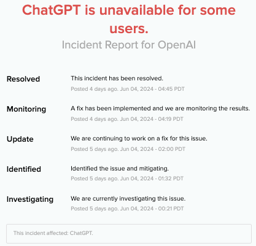

# Incident report

🔑 **Key points**

- The incident report is an essential tool for improving failure response and system resilience.
- A blameless culture encourages transparency and deeper technical analysis.
- Creating a public-facing incident report restores customer trust through transparency.

---

When a failure occurs, the entire team focuses on recovery. This usually requires manual or automated intervention. Once the immediate pressure of mitigating the failure has subsided, it is vital to take steps to understand what happened, what the impact was, and how the system can be improved to avoid a recurrence. An indispensable tool for formalizing this discussion is the `incident report`.

## It's not about blame

Successful incident reports—often called "blameless post-mortems"—focus on understanding the conditions that allowed the failure to occur rather than assigning blame to individuals. If a culture of fear surrounds failure, team members may instinctively hide important information or avoid risks that could reflect poorly on them. This lack of transparency actually increases the chance of future failures and decreases the team's ability to provide value.

## Timeliness

It is essential to collect and preserve key facts during the incident. While data can often be pulled from observability systems, some artifacts (like specific error messages on a user's screen) must be captured in the moment. 

Having a designated **incident recorder** helps centralize these artifacts. If possible, use automated issue tracking to serve as the incident recorder. These systems can often automatically update customers on the progress and resolution of the issue.

It is also critical to compile the report as soon as possible while the details are still fresh. Waiting even a few days can significantly decrease the accuracy and depth of the insights provided.

## Composition

The following table contains information commonly included in a successful incident report. You can find a standard template on the [Atlassian website](https://www.atlassian.com/incident-management/postmortem/templates).

| Item                | Purpose                                                                                                                                                                  |
| ------------------- | ------------------------------------------------------------------------------------------------------------------------------------------------------------------------ |
| Summary             | An executive summary providing a high-level description of the incident, its impact, and its resolution.                                                                    |
| Detection           | A description of how the incident was discovered (e.g., customer report, internal observation, or automated monitoring).                        |
| Impact              | A discussion of affected services, user experience, and business consequences.                                                                                                 |
| Timeline            | A chronological log of relevant events: when the problem was noticed, when analysis began, and when a resolution was implemented. |
| Root cause analysis | An identification of the underlying issues and the immediate triggers that led to the failure.               |
| Resolution          | A description of how the incident was resolved and the reasoning behind the chosen solution.                                                                 |
| Prevention          | Specific strategies or architectural changes designed to ensure this failure mode does not recur.                                                                        |
| Action items        | Discrete, assigned tasks with deadlines to implement improvements and preventive measures.                                                                        |

## Public-facing incident reports

To maintain a company's reputation, it is important to release a public incident report quickly for any event that caused significant customer impact.

This can be as simple as an automated update on a status page, like this report for a ChatGPT outage:

For major incidents—such as security breaches involving personally identifiable information (PII) or significant service outages—you should create an extensive report detailing why the incident occurred and how you will prevent it from happening again. 

Consider this example from [AWS's 2017 S3 outage report](https://aws.amazon.com/message/41926/). Note the clear explanation of how human interaction with the system will change:

> An authorized S3 team member using an established playbook executed a command which was intended to remove a few servers for one of the S3 subsystems. Unfortunately, one of the inputs to the command was entered incorrectly and a larger set of servers was removed than intended.
>
> We are making several changes as a result of this operational event. This will prevent an incorrect input from triggering a similar event in the future. We are also auditing our other operational tools to ensure we have similar safety checks.

## Your incident report

Later in this module, you will have the opportunity to create your own incident report. Consider what information is most valuable to include to decrease the possibility of a repeated failure.

- [Template incident report](templateIncidentReport.md) for use with your chaos incident reporting.
- [Example incident report](exampleIncidentReport.md) regarding the time Unix Time impacted internet services.

## A bit of fun

> _Source: [XKCD](https://xkcd.com/1822/)_