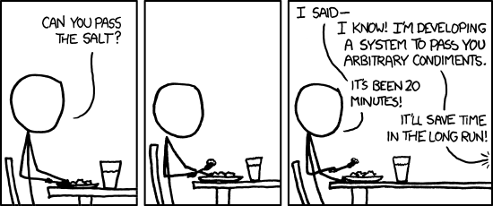

# Infrastructure as code (IaC)

🔑 **Key points**

- IaC enables automation, consistency, and scalability in infrastructure management.
- Infrastructure code should be version-controlled and tested just like application code.

---

📖 **Deeper dive reading**: [IaC at AWS](https://docs.aws.amazon.com/whitepapers/latest/introduction-devops-aws/infrastructure-as-code.html)

---

## What is infrastructure as code?

Infrastructure as code (IaC) is the practice of managing and provisioning application infrastructure through machine-readable definition files. Rather than manually configuring hardware or using interactive web consoles, you treat your infrastructure as part of the application code itself. This allows you to use the same tools and workflows—such as version control, automated testing, and CI/CD pipelines—to manage your servers, networks, and databases. This approach is powerful because it makes infrastructure deployment repeatable and predictable.

## Why is IaC important?

As previously discussed, manual work (or "toil") is the enemy of DevOps. It might be easy to justify the manual effort used to set up a small project—like a JWT Pizza cloud hosting environment—as a one-time task. However, manual processes are difficult to scale and prone to human error. While scripting and automating your infrastructure requires an initial investment of time, there are critical reasons to reduce toil:

1. **Disaster recovery**: System failures are inevitable. Extreme weather, human error, or hardware degradation can take down services at any time. Having code that can immediately and reliably restore your critical infrastructure is one of the characteristics that differentiate world-class organizations from those that struggle to recover.
1. **Creating new environments**: If you have automation that can rebuild your production environment, you can easily spin up identical environments for staging, external auditing, penetration testing, or market research. This makes your organization more agile and ensures consistency across the entire development lifecycle.
1. **Documentation**: You likely will not be working on the same system forever. IaC serves as living documentation of how the system is configured. Just like automated testing, it allows you to enhance your infrastructure without introducing regression errors, providing a clear history of changes for whoever maintains the system next.

## How to implement IaC

Proper IaC begins with an **automation mindset**. Whenever you set up a system or process, immediately consider how you can automate that work. Often, the best approach is to perform the task manually first while taking meticulous notes on every step. You then translate those steps into an automated script, a declarative configuration file (such as Terraform or CloudFormation), or a program written in a standard programming language.

Once you have written your infrastructure code, you must test it. This involves running the code to build a parallel "twin" of your manual system. You can then compare the two to ensure they are equivalent. Once the code is validated, you can decommission the temporary environment and store your IaC in a version control repository, ensuring it is ready for deployment at a moment's notice.


## ☑ Exercise


```masteryls
{"id":"7431a086-5f7a-4053-bf10-7c312ee91dfe","title":"The Purpose of IaC","type":"multiple-choice"}
What is the primary objective of implementing Infrastructure as Code (IaC) within a DevOps environment?

- [ ] To replace automated provisioning with manual, GUI-based configurations to ensure human oversight of every resource.
- [ ] To create a static documentation library that describes hardware components without interacting with the actual cloud environment.
- [x] To manage and provision infrastructure through machine-readable definition files, ensuring consistency and repeatability across different environments.
- [ ] To eliminate the need for version control systems by storing configuration settings directly within the physical hardware's firmware.
```

## A bit of fun



> _source: [XKCD](https://xkcd.com/974/)_