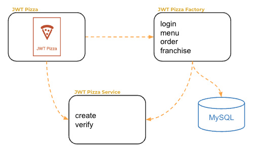

# Integration testing

🔑 **Key points**

- Integration test increases your confidence that component work together correctly
- Mocking can hide significant integration bugs
- Removing mocking can improve application performance and design

---

We previously briefly introduced the concept of integration testing. Let's take a bit of a deeper look at what integration testing means and the trade-offs that it presents.

Integration testing makes sure that dependent components work well with each other. It would seem, that if you mock out all of those dependencies then it is easier to test the target component without having to deal with the messy details of the dependencies. But is that really true?

Think about the implications of mocking out dependencies. First off you need to create a skeleton copy of the dependency. Once created that copy must be forever maintained. Any change to the dependency will require an equivalent change in the mock. That means you now have duplicated code with different implementations and there is always the chance that those implementations will get out of sync. How will you know when they do get out of sync? Well your customers may tell you, or you might have higher level end-to-end tests that actually don't mock the dependency. This doesn't sound good.

What is the alternative? Don't mock. Actually test the component as it naturally exists. That is the whole point of integration testing. Don't give a false sense of confidence that something is working unless you actually test that component in the way it actually works.

## Making integration testing work

Now that we have stated the motivation for getting rid of mocking, the question then becomes how can we mitigate the impact of that decision? The justification for mocking comes in to forms:

1. It is **faster** to test because you do not have to invoke the dependencies.
1. It is **easier** to test because the output of dependencies is predictable.

These can both be true, and they may justify the use of mocking. However, it should not be assumed that they are always true and therefore mocking should be used in every case. Often times the dependencies can easily be instrumented so that the response is predictable or at least the unpredictable parts such as IDs or dates can be abstracted away. Likewise, dependencies are not always slow. Oftentimes they respond in nanoseconds and are just as fast as the mocking infrastructure.

### Exposing performance problems

Now let's consider the benefits for dropping the mocks. First, if the dependencies are slow, doesn't it make sense to actually solve that problem? After all, testing is not just about assuring the correctness of the response data, but the acceptability of the time it takes to get that response. No one cares if an algorithm can compute Fibonacci to the 1000 position correctly if it takes 10 years for that computation to complete. Instead of hiding a performance problem behind a mock, go and fix the problem.

### Encouraging better design

Next up is the complications of instrumenting a dependency so that it can reliably return a predictable answer. This commonly happens when you are testing against an environment where application state is stored and reused between test runs. For example, you might have a database that is always used for your tests. Without mocking, you will start to accumulate lots of users, pizzas, and franchises. This is further complicated that you can't just keep using the same names for your test data because there will be existing data from the last run with the same name. Likewise, if you have two tests that use the same name they will stomp on each other, and if you have tests that depend on the data generated by the previous test things get even worse.

Once again, it should be clear that all of these problems are due to writing sloppy tests and poorly designed application code. Every test should be able to execute independently of any other test. This does not have to be done by mocking out all the dependencies, but instead you can accomplish it by making sure that the data dependencies are scoped to the test, completely unique, or spun up in an environment that is isolated to the test. If you build those abstractions into your code then it makes your application better because it can use those same abstractions to isolated different customer's data or to quickly spin up additional specialized environments. Once again, the application becomes better because you didn't hide the problem behind mocking.

## When mocking might be necessary

There are times when mocking might be necessary. This includes cases where a third party service is involved. This is especially true when calling the service creates a monetary impact. You don't want to write a test for a real estate application that will actually buy a house every time you run it.

There also might be the case were the initialization cost of the test is so high that it discourages you from running tests. Usually this only happens with extremely large, complex, applications. However, this usually happens at the application level, not the component, or integration, level.

## JWT Pizza integration testing

Consider the major JWT Pizza components. How do you want to conduct your integration testing?

An obvious candidate for integration testing is to assure the quality of the integration between the `jwt-pizza` and `jwt-pizza-service` code. Here are some ways you can approach this:

1. **None** - Don't do integration testing. Just mock out the integration. This has some appeal. It means the frontend and backend teams can develop the application completely independent of each other. The frontend can build functionality that is still in the design phase on the backend. The test setup is easier in the sense that you don't need to run a backend at all. However, the benefits probably don't outweigh the disadvantages. Additionally, just because we mock out the coupling between the frontend and backend doesn't mean that you have removed the coupling. You have just hidden a whole class of bugs that the mocks may be hiding.
1. **jwt-pizza and jwt-pizza-service** - Integrate the testing of the frontend and the backend, but mock out the pizza factory service and the database. This seems like an obvious choice. With a mocked out database, the performance characteristics of the integration test should be excellent, and we get a more realistic representation of the performance of the frontend/backend communication. We also will immediately know if we introduce any bugs in the service endpoints.
1. **jwt-pizza-service and database** - Integrate the testing of the backend and the database. This makes a lot of sense as long as we can initialize the database with sufficient testing data as well as be confident that the performance of the database in a development environment will not discourage the execution of tests.
1. **jwt-pizza, jwt-pizza-service, and database** - Integrate everything but the pizza factory. Since the pizza factory is outside of the codebase for the product it seems logical to exclude it. However, even testing this much of the application actually goes beyond integration testing and enters the realm of end-to-end testing. Additionally, the testing configuration of the database is going to be coupled to the tests that you run on the frontend. This might result in complex and brittle tests, or tests that require a significant amount of setup.

Give some thought about the trade-offs for all of these decisions. What value does integration testing provide? Would it be easier to do integration testing using mocks of the dependencies? What do you gain by doing integration testing without mocks?
