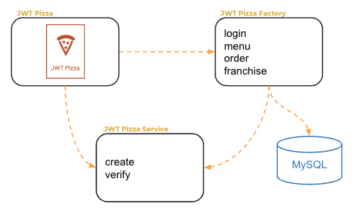

# Integration testing

🔑 **Key points**

- Integration testing increases confidence that components work together correctly.
- Mocking can hide significant integration bugs by masking real-world behavior.
- Reducing reliance on mocking can improve application performance and architectural design.

---

We previously introduced the concept of integration testing. Let's take a deeper look at what integration testing means and the trade-offs it presents.

Integration testing ensures that dependent components work correctly with each other. It might seem that mocking those dependencies makes it easier to test a target component without dealing with the messy details of external systems. But is that always the best approach?

Consider the implications of mocking dependencies. First, you must create a "skeleton" copy of the dependency. Once created, that copy must be maintained indefinitely. Any change to the real dependency requires an equivalent change in the mock. This results in duplicated logic with different implementations, creating a high risk that they will fall out of sync. How will you know when they do? You might only find out when a customer reports a bug, or if you have higher-level end-to-end tests that don't use mocks. Neither scenario is ideal.

The alternative is to avoid mocking where possible. Test the component as it naturally exists within the system. This is the core purpose of integration testing: providing genuine confidence that a system works by testing it in a realistic environment.

## Making integration testing work

If we aim to reduce mocking, how can we mitigate the challenges that come with it? The justification for mocking usually falls into two categories:

1. It is **faster** because you do not have to invoke external dependencies.
2. It is **easier** because the output of dependencies is predictable.

While these points can be true, they shouldn't be used as a default excuse to mock everything. Often, dependencies can be configured so their responses are predictable—or unpredictable parts, such as IDs or timestamps, can be abstracted. Furthermore, dependencies are not always slow. Modern local databases or internal services often respond in milliseconds, making them nearly as fast as a mocking framework.

### Exposing performance problems

Removing mocks can actually highlight performance issues. If a dependency is slow, shouldn't that be addressed rather than hidden? Testing is not just about data correctness; it is also about the acceptability of the time it takes to get a response. No one cares if an algorithm computes a result correctly if it takes ten years to complete. Instead of hiding a performance bottleneck behind a mock, use integration testing to identify and fix the problem.

### Encouraging better design

Testing against real dependencies can be complicated when application state is stored and reused between test runs. For example, if you use a shared database for tests, you might accumulate a cluttered mess of users, pizzas, and franchises. If multiple tests use the same data names, they will conflict. If tests depend on data generated by a previous run, they become brittle.

These problems are often symptoms of poorly designed tests or application code. Every test should be able to execute independently. Instead of mocking, you can achieve isolation by ensuring that data dependencies are:
- Scoped to the specific test.
- Completely unique (e.g., using UUIDs).
- Spun up in an isolated environment (e.g., using containers or temporary databases).

Building these abstractions makes your application better. The same logic used to isolate test data can be used to isolate customer data or to quickly spin up specialized environments for staging or production. The application improves because you didn't hide the architectural friction behind a mock.

## When mocking is necessary

There are still times when mocking is appropriate. This includes:
- **Third-party services:** You don't want a test for a real estate application to actually buy a house every time it runs.
- **Monetary impact:** Avoid services that charge per API call during a test suite.
- **High initialization costs:** If the setup time for a dependency is so high that it discourages developers from running tests, a mock might be necessary. This is more common in extremely large, complex legacy systems.

## JWT Pizza integration testing

Consider the major JWT Pizza components. How should you approach integration testing for this architecture?



An obvious candidate for integration testing is the connection between the `jwt-pizza` (frontend) and `jwt-pizza-service` (backend). Here are several approaches:

1. **No integration testing:** Mock everything. This allows frontend and backend teams to work independently, even if the backend API isn't ready. However, this hides a whole class of bugs that only appear when the two sides actually communicate.
2. **Frontend + Backend (Mocked Database):** Integrate the frontend and backend but mock the pizza factory service and the database. This provides a realistic representation of frontend/backend communication with high performance, and you'll immediately catch bugs in service endpoints.
3. **Backend + Database:** Integrate the backend and the database. This is highly effective as long as you can initialize the database with fresh data and ensure database performance doesn't slow down the development cycle.
4. **Full Integration (Frontend + Backend + Database):** Integrate everything except the external pizza factory. While this provides high confidence, it enters the realm of end-to-end (E2E) testing. The database configuration becomes tightly coupled to the frontend tests, which can lead to complex and brittle setups.

Consider the trade-offs for each decision. What value does the integration provide? Does a mock make the test easier to write at the expense of catching real bugs? What do you gain by testing against the real implementation?

## ☑ Exercise


```masteryls
{"id":"6e6925ac-fed4-4532-97c6-48703215e391", "title":"Integration testing", "type":"essay" }
Describe the factors you would consider when determining if integration testing in appropriate for a given module.
```
