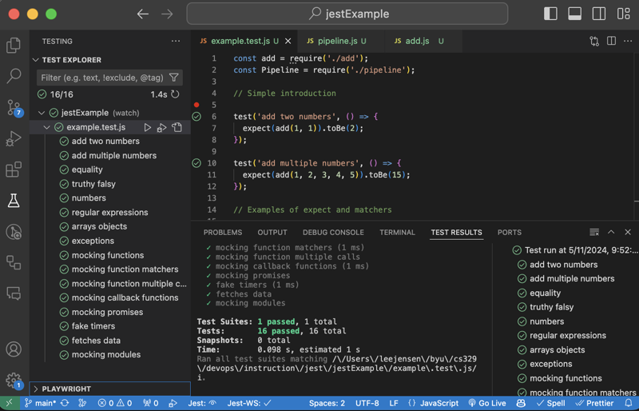
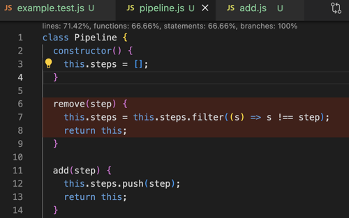

# Jest


[Official Jest website](https://jestjs.io/)

Jest is the most common framework for testing JavaScript. It was created back in 2011 when Facebook’s chat feature was rewritten in JavaScript. After extensive internal use, Facebook release Jest as open source in 2014. In 2022 they transferred ownership of Jest to [OpenJS](https://openjsf.org/). We owe much thanks to Facebook for investing in and openly sharing such a valuable piece of code.

## Installing Jest

In order to use Jest a your unit testing framework you need to first create an NPM project and install Jest package. Note that then installing we use the `-D` parameter to tell NPM that Jest is only used during development and it shouldn't be included in any production deployment.

```sh
mkdir jestExample && cd jestExample
npm init -y
npm install -D jest
```

Then change the package.json script so that the `test` command runs Jest.

```json
{
  "name": "jestExample",
  "main": "index.js",
  "scripts": {
    "test": "jest"
  },
  "devDependencies": {
    "jest": "^29.7.0"
  }
}
```

Now you need a simple test that will demonstrate that everything is wired up correctly. All you need to do is include the phrase `.test.` as part of your file name and Jest will pick the test up automatically. In this test we just expect that one plus one will be 2. Notice how the Jest syntax reads naturally.

**index.test.js**

```js
test('1 + 1 equals 2', () => {
  expect(1 + 1).toBe(2);
});
```

With the Jest package installed and our first test written, we can run it with the NPM test command. This results in the following:

```sh
npm test

 PASS  ./index.test.js
  ✓ 1 + 1 equals 2 (1 ms)

Test Suites: 1 passed, 1 total
Tests:       1 passed, 1 total
Snapshots:   0 total
Time:        0.122 s
Ran all test suites.
```

## Calling code from the test

The previous test isn't very interesting since it only runs code within the test itself. So instead, let's create a function called `add` in an `add.js` file and have the test call that instead.

```js
function add(...numbers) {
  return numbers.reduce((a, c) => (a += c), 0);
}

module.exports = { add };
```

You can then rewrite the test to import and create a couple tests for our new `add` function.

```js
const add = require('./add');

test('add two numbers', () => {
  expect(add(1, 1)).toBe(2);
});

test('add multiple numbers', () => {
  expect(add(1, 2, 3, 4, 5)).toBe(2);
});
```

When we rerun the tests.

```sh
npm test

 FAIL  ./index.test.js
  ✓ add two numbers (1 ms)
  ✕ add multiple numbers (1 ms)

  ● add multiple numbers
    Expected: 2
    Received: 15

       6 |
       7 | test('add multiple numbers', () => {
    >  8 |   expect(add(1, 2, 3, 4, 5)).toBe(2);
         |                              ^
       9 | });
      10 |

Test Suites: 1 failed, 1 total
Tests:       1 failed, 1 passed, 2 total
```

The first test works great, but the second test fails. This is because the test is incorrectly expected the wrong resulting value. After fixing the value to be the correct result of `15`, all the tests pass.

## Jest configuration

[Jest configuration docs](https://jestjs.io/docs/configuration)

You may have noticed that you didn't have to import the Jest dependencies or specify where your test files were in order for the tests to run. That is because when Jest runs it analyzes all of the project paths and looks for files that match a regex pattern of `**/?(*.)+(spec|test).[tj]s?(x)`. When it finds those files, it runs them in an environment where the Jest code is already loaded.

You can override the default configuration for Jest by adding a `jest.config.json` file to your project. In that file you can specify options such as a different regex pattern for matching tests, making the output verbose, collecting coverage, and automatically generating mocks.

Here is a configuration file that tests jest to collect coverage information and output verbose information. Everything looks great. All the tests are passing and you have 100% coverage.

```json
{
  "collectCoverage": true,
  "verbose": true
}
```

Now you get simple coverage information returned when you run the tests.

```sh
npm test

 PASS  ./index.test.js
  ✓ add two numbers (1 ms)
  ✓ add multiple numbers (1 ms)

----------|---------|----------|---------|---------|-------------------
File      | % Stmts | % Branch | % Funcs | % Lines | Uncovered Line #s
----------|---------|----------|---------|---------|-------------------
All files |     100 |      100 |     100 |     100 |
 index.js |     100 |      100 |     100 |     100 |
----------|---------|----------|---------|---------|-------------------
Test Suites: 1 passed, 1 total
Tests:       2 passed, 2 total
```

## Jest Visual Studio Code Extension

You can run Jest from the console, but it is much nicer to install an extension that allows you to run the test right inside your IDE. With the [Jest Visual Studio Code extension](https://marketplace.visualstudio.com/items?itemName=Orta.vscode-jest) you can selectively run one, or all of your tests and visually see the results.



Make sure you checkout the ability for the extension to run the tests whenever they change and also to show the code coverage. To access this functionality click on the gear icon in the Test Explore pane. Then chose when you want the test to run and also toggle the coverage option.



Turning on the coverage will display the coverage statistics at the top of each code window and also highlight lines that are not covered in red.

## Jest expect and matchers

[Jest Expect](https://jestjs.io/docs/expect)

When you create assertions with Jest, you use the `expect` method to generate an expectation object. The expectation object has numerous matcher operations that assert the state of the expectation. You will want to be come familiar with all of the matchers, but we will give you a taste fo the most common ones here.

### Equality

You have already seen one of the most common matcher operations, `toBe()` which tests equality. If you want to test for deep equality then use the `toEqual` matcher. Note that this match will ignore values that are undefined.

```js
test('equality', () => {
  expect(add(1, 1)).toBe(2);
  expect('2').not.toBe(2);

  expect({ id: 2, data: { name: 'cow' }, xid: undefined }).toEqual({ id: 2, data: { name: 'cow' } });
});
```

### Truthy and falsy

Determining if a variable is truthy or falsy is a common operation in JavaScript and so Jest has numerous matchers to help you with this.

```js
test('truthy falsy', () => {
  expect(true).toBeTruthy();
  expect(true).not.toBeFalsy();
  expect(false).not.toBeTruthy();
  expect(false).toBeFalsy();

  expect(undefined).not.toBeDefined();
  expect(undefined).toBeUndefined();

  expect(null).toBeNull();
  expect(null).toBeDefined();
  expect(null).not.toBeUndefined();
  expect(null).not.toBeTruthy();
  expect(null).toBeFalsy();

  expect(0).not.toBeNull();
  expect(0).toBeDefined();
  expect(0).not.toBeUndefined();
  expect(0).not.toBeTruthy();
  expect(0).toBeFalsy();
});
```

### Numbers

There are numerous matchers that help with the comparison of numbers. This includes dealing with situations where floating point precision might be in question.

```js
test('numbers', () => {
  expect(4).toBeGreaterThan(3);
  expect(4).toBeGreaterThanOrEqual(3.5);

  expect(4).toBeLessThan(5);
  expect(4).toBeLessThanOrEqual(4.5);

  expect(0.1 + 0.2).toBeCloseTo(0.3);
});
```

### Regular expressions

Oftentimes you need to test for things that contain unpredictable variations in results. This is where the regular expression matcher, `toMatch`, comes in handy. In the following example we only check to see if the date field is present without caring for its value.

```js
test('regular expressions', () => {
  const body = JSON.stringify({ date: '20240202T00:00:10Z', name: 'orem' });
  expect(body).toMatch(/{"date":".*","name":"orem"}/);
});
```

### Arrays and objects

You can also match on specific array contents or object properties.

```js
test('arrays objects', () => {
  expect('abcd').toContain('bc');
  expect([1, 2, 3]).toContain(2);
  expect([1, 2, 3]).toEqual(expect.arrayContaining([2, 3]));
  expect({ id: 2, cost: 3 }).toHaveProperty('cost', 3);
  expect({ id: 2, cost: 3 }).toEqual(expect.objectContaining({ id: 2 }));
});
```

### Exceptions

No testing is complete unless it checks for the unhappy paths. You can validate that exceptions are thrown, or not thrown.

```js
test('exceptions', () => {
  expect(() => {
    throw new Error('error');
  }).toThrow();
  expect(() => {}).not.toThrow();
});
```

## Mocking with Jest

[Jest Mocking](https://jestjs.io/docs/mock-function-api)

Mocking parameters and return results enables you to create unit tests without having to worry about integrating with the rest of the code base. This is especially important when you need to isolate fetch or database requests.

Jests support mocking in two major ways. The first way is by creating a mocking function that tracks the calls that are made to function, and mock out the return values. The second way is to mock an entire module so that you can replace or alter what how the module interacts with the code you are trying to test.

### Mocking functions

You create a mocked function by calling the `jest.fn` method. The returned object has a `mock` property that provides access to all the calls and return values of the function. Here is a simple example of creating a mocked function that returns a stringified version of the parameters.

```js
test('mocking functions', () => {
  const mockFn = jest.fn((p) => `${p}`);

  mockFn(1);
  mockFn(2);

  expect(mockFn.mock.calls[0][0]).toBe(1);
  expect(mockFn.mock.results[0].value).toBe('1');

  expect(mockFn.mock.calls[1][0]).toBe(2);
  expect(mockFn.mock.results[1].value).toBe('2');
});
```

This might seem like we are just creating and calling a normal JavaScript function, but the magic happens in the tracking of all the calls to the mocked function. By referencing the `calls` and `results` properties you can see what happened with each invocation of the function. The `calls` property provides an array with an entry representing an array for all the parameters for every call. In this example, there was two calls and so there are two array values in the call property. Likewise the `results` property contains an array for each call's return value. This tracking enables you to assert that your code is flowing as expected.

#### Expect mocking helper methods

Jest provides several helper methods that make it easier to work with the calls and results. This includes the `toHaveBeenCalledWith` function that checks if a call has ever been made with the given parameters, and the `toHaveBeenLastCalledWith` that assert parameters for the last call.

```js
test('mocking function matchers', () => {
  const mockFn = jest.fn((p) => `${p}`);

  expect(mockFn(1)).toBe('1');
  expect(mockFn(2)).toBe('2');

  expect(mockFn).toHaveBeenCalledWith(1);
  expect(mockFn).toHaveBeenLastCalledWith(2);
});
```

#### Setting return values

If you don't need to write a function to return values based on the inputs, you can simply set a default return value from your mocked function with `mockReturnValue`. If you need to override the default for the next few calls you can supply the return value with `mockReturnValueOnce`. These can be changed together to supply a series of needed return values. As demonstrated by the following code, once all the specific values have been used up it it will return to the default.

```js
test('mocking function multiple calls', () => {
  const mockFn = jest.fn();

  // Set the default return value to 42
  mockFn.mockReturnValue(42);
  expect(mockFn()).toBe(42);

  // Override the default for the next two calls to 1 and 2
  mockFn.mockReturnValueOnce(1).mockReturnValueOnce(2);
  expect(mockFn()).toBe(1);
  expect(mockFn()).toBe(2);

  // Next call is back to the default
  expect(mockFn()).toBe(42);
});
```

#### Mocking function parameters

To this point we really haven't show a valid use for mocking out parameters. Let's correct that by considering a pipeline module that provides a class named `Pipeline` that takes a series of step functions than then calls them when the Pipeline `run` method is called.

```js
class Pipeline {
  constructor() {
    this.steps = [];
  }

  add(step) {
    this.steps.push(step);
    return this;
  }

  run(data) {
    this.steps.forEach((step) => step(data));
  }
}

module.exports = Pipeline;
```

Using mocked functions it is easy to write a test that verifies that each step added to the pipeline is called at the appropriate number of times and with the right data.

```js
test('mocking callback functions', () => {
  const mockStep = jest.fn();

  new Pipeline().add(mockStep).add(mockStep).run('data');

  expect(mockStep).toHaveBeenCalledTimes(2);
  expect(mockStep.mock.calls).toEqual([['data'], ['data']]);
});
```

### Mocking modules

Mocking functions is fine if all you need to do is supply and verify callbacks, but you often need to completely or partially mock out entire classes, or even modules.

You can mock a class by simply extending it and overriding the desired functionality. We can do that for the Pipeline class that we introduced earlier.

```js
return class MockPipeline extends Pipeline {
  constructor() {
    super();
    this.mockRun = jest.fn();
  }
  run(p) {
    super.run(p);
    return this.mockRun(p);
  }
};
```

This works if you are creating the instance of the desired object and passing it into the code you are trying to test, but what if you are calling code that internally creates a class? This is where mocking out entire modules comes in handy.

We can mock out the `pipeline.js` module using the `jest.mock` function. This will instrument the objects returned from the module so that any code that uses the module will get your mocked version. Notice the use of `jest.requireActual` so that you can still use the original implementation and do a partial mocking of the module's objects if desired.

```js
jest.mock('./pipeline', () => {
  const originalModule = jest.requireActual('./pipeline');
  return class MockPipeline extends originalModule {
    constructor() {
      super();
      this.mockRun = jest.fn();
    }
    run(p) {
      super.run(p);
      return this.mockRun(p);
    }
  };
});
```

Here is an example of using the mocked version of the pipeline module. Notice that we can reference the mocked classes `mockRun` function to see how the `Pipeline.run` function was called.

```js
test('mocking modules', () => {
  const stepMock = jest.fn();
  const pipeline = new Pipeline();

  pipeline.add(stepMock);
  pipeline.add(stepMock);

  pipeline.run('call1');
  pipeline.run('call2');

  expect(stepMock).toHaveBeenCalledTimes(4);
  expect(pipeline.mockRun.mock.calls).toEqual([['call1'], ['call2']]);
});
```

## Dealing with asynchronicity

Jest also has the ability to mock promises. This is necessary for testing any code that expects to work with a promise.

```js
test('mocking promises', async () => {
  const mockFn = jest.fn().mockResolvedValue(42);

  const result = await mockFn();
  expect(result).toBe(42);
});
```

## Fake Timers

If your code functionality is based on dates, time, or timeouts then Jest provides you with the ability to override the runtime execute of those functions. The Jest fake times put you in control of when time moves forward.

To use the the fake times call `jest.useFakeTimers` and set any of the various [options](https://jestjs.io/docs/jest-object#jestusefaketimersfaketimersconfig).

Make sure you reset the timers back to a real implementation when you are done by calling `jest.useRealTimers`.

Here is an example of specifying the current date to be zero and then incrementing it by one second.

```js
test('fake timers', async () => {
  jest.useFakeTimers({ now: 0 });
  expect(Date.now()).toBe(0);

  jest.advanceTimersByTime(1000);
  expect(Date.now()).toBe(1000);

  // Still 1000 even after waiting
  const timeoutMock = jest.fn();
  await setTimeout(() => {
    timeoutMock();
  }, 1000);
  expect(timeoutMock).not.toHaveBeenCalled();
  expect(Date.now()).toBe(1000);

  jest.advanceTimersByTime(2000);
  expect(Date.now()).toBe(3000);

  jest.useRealTimers();
});
```

## Mocking fetch requests

One common testing need is to isolate your execution from external calls such as making network fetch requests. To mock out the runtime's fetch function we can simply assign a mocked function to `global.fetch`. The following demonstrates how you can supply a switch statement to return mocked data based upon the requesting URL.

```js
test('fetches data', async () => {
  global.fetch = jest.fn((url) =>
    Promise.resolve({
      json: () => {
        switch (url) {
          case 'https://one.com':
            return Promise.resolve({ data: 'one data' });
          case 'https://two.com':
            return Promise.resolve({ data: 'two data' });
          default:
            return Promise.resolve({ data: 'default data' });
        }
      },
    })
  );

  const response = await fetch('https://two.com');
  const data = await response.json();
  expect(data).toEqual({ data: 'two data' });
  expect(fetch).toHaveBeenCalledWith('https://two.com');
});
```

## Wrap up

That is a lot of functionality, and honestly, we have only covered the basics of what Jest offers. Take some time to play with it and dive deep into understand how to use this valuable tool. We are going to use Jest to unit test the JWT Pizza service. By the time you are done you are going feel like a Jest master.

## ☑ Assignment

Create an project based on the code provided below. Install Jest and write tests until you get 100% code coverage.

**catFact.js**

```js
class CatFact {
  constructor() {
    this.facts = [];
  }

  // Add a step to the pipeline. Each step is called in the order it was
  // added.
  async add() {
    try {
      const response = await fetch('https://meowfacts.herokuapp.com/');
      const payload = await response.json();
      const fact = payload.data[0];
      this.facts.push(fact);
      return fact;
    } catch (error) {
      return null;
    }
  }

  // Get the history of cat facts
  history() {
    return this.facts;
  }

  // Call the given callback with a new cat fact every `time` milliseconds
  call(time, callback) {
    setInterval(async () => {
      const fact = await this.add();
      callback(fact);
    }, time);
  }
}

module.exports = CatFact;
```

Once you are done, go over to Canvas and submit a screenshot of your code with 100% coverage.

The following is an example of what you should submit. Notice the coverage line at the top of the `catFact.js` file that demonstrated the complete coverage.


