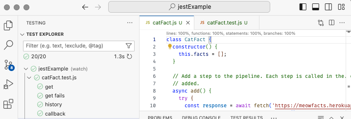

# Jest advanced

🔑 **Key points**

- Jest supports mocking at multiple levels.
- Jest handles asynchronous code.
- Create a Jest test with 100% coverage.

---

Now that you understand the basics of Jest, it is time to learn some of the more advanced functionality and actually write some tests yourself.

## Mocking with Jest

[Jest Mocking](https://jestjs.io/docs/mock-function-api)

Mocking parameters and return results enables you to create unit tests without having to worry about integrating with the rest of the code base. This is especially important when you need to isolate fetch or database requests.

Jest supports mocking in two major ways. The first way is by creating a mocking function that tracks the calls that are made to the function, and mock out the return values. The second way is to mock an entire module so that you can replace or alter how the module interacts with the code you are trying to test.

### Mocking functions

You create a mocked function by calling the `jest.fn` method. The returned object has a `mock` property that provides access to all the calls and return values of the function. Here is a simple example of creating a mocked function that returns a stringified version of the parameters.

```js
test('mocking functions', () => {
  const mockFn = jest.fn((p) => `${p}`);

  mockFn(1);
  mockFn(2);

  expect(mockFn.mock.calls[0][0]).toBe(1);
  expect(mockFn.mock.results[0].value).toBe('1');

  expect(mockFn.mock.calls[1][0]).toBe(2);
  expect(mockFn.mock.results[1].value).toBe('2');
});
```

This might seem like we are just creating and calling a normal JavaScript function, but the magic happens in the tracking of all the calls to the mocked function. By referencing the `calls` and `results` properties you can see what happened with each invocation of the function. The `calls` property provides an array with each entry representing an array containing all the parameters for that call. In this example, there were two calls and so there are two array values in the `calls` property. Likewise, the `results` property contains an array for each call's return value. This tracking enables you to assert that your code is flowing as expected.

#### Expect mocking helper methods

Jest provides several helper methods that make it easier to work with the calls and results. This includes the `toHaveBeenCalledWith` function that checks if a call has ever been made with the given parameters, and the `toHaveBeenLastCalledWith` function that asserts parameters for the last call.

```js
test('mocking function matchers', () => {
  const mockFn = jest.fn((p) => `${p}`);

  expect(mockFn(1)).toBe('1');
  expect(mockFn(2)).toBe('2');

  expect(mockFn).toHaveBeenCalledWith(1);
  expect(mockFn).toHaveBeenLastCalledWith(2);
});
```

#### Setting return values

If you don't need to write a function to return values based on the inputs, you can simply set a default return value from your mocked function with `mockReturnValue`. If you need to override the default for the next few calls you can supply the return value with `mockReturnValueOnce`. These can be changed together to supply a series of needed return values. As demonstrated by the following code, once all the specific values have been used up, it will return to the default.

```js
test('mocking function multiple calls', () => {
  const mockFn = jest.fn();

  // Set the default return value to 42
  mockFn.mockReturnValue(42);
  expect(mockFn()).toBe(42);

  // Override the default for the next two calls to 1 and 2
  mockFn.mockReturnValueOnce(1).mockReturnValueOnce(2);
  expect(mockFn()).toBe(1);
  expect(mockFn()).toBe(2);

  // Next call is back to the default
  expect(mockFn()).toBe(42);
});
```

#### Mocking function parameters

To this point we haven't really shown a valid use for mocking out parameters. Let's correct that by considering a pipeline module that provides a class named `Pipeline` that takes a series of step functions then calls them when the Pipeline `run` method is called.

```js
class Pipeline {
  constructor() {
    this.steps = [];
  }

  add(step) {
    this.steps.push(step);
    return this;
  }

  run(data) {
    return this.steps.reduce((result, step) => step(result), data);
  }
}

module.exports = Pipeline;
```

Using mocked functions, it is easy to write a test that verifies that each step added to the pipeline is called the appropriate number of times and with the right data.

```js
test('mocking callback functions', () => {
  const mockStep = jest.fn();

  new Pipeline().add(mockStep).add(mockStep).run('data');

  expect(mockStep).toHaveBeenCalledTimes(2);
  expect(mockStep.mock.calls).toEqual([['data'], [undefined]]);
});
```

For the purposes of demonstration, here is a more complete example that fully tests the `Pipeline` functionality.

```js
test('construct pipeline', () => {
  const pipeline = new Pipeline();
  expect(pipeline.steps).toEqual([]);
});

test('chain steps together', () => {
  const mockStep = jest.fn();

  const pipeline = new Pipeline().add(mockStep).add(mockStep);
  expect(pipeline.steps.length).toBe(2);

  pipeline.add(mockStep).add(mockStep);
  expect(pipeline.steps.length).toBe(4);

  expect(pipeline.add(mockStep)).toBe(pipeline);
});

test('pipe data through steps', () => {
  const stepA = jest.fn((d) => d + 'A');
  const stepB = jest.fn((d) => d + 'B');
  const stepC = jest.fn((d) => d + 'C');
  const stepH = jest.fn((_) => 'Hello World!');

  const pipeline = new Pipeline().add(stepA).add(stepB).add(stepC).add(stepH).add(stepA);

  expect(stepA).not.toHaveBeenCalled();
  expect(pipeline.run('I')).toBe('Hello World!A');
  expect(stepA).toHaveBeenCalledTimes(2);
  expect(stepA).toHaveBeenCalledWith('I');
  expect(stepB).toHaveBeenCalledWith('IA');
  expect(stepC).toHaveBeenCalledWith('IAB');
  expect(stepH).toHaveBeenCalledWith('IABC');
  expect(stepA).toHaveBeenCalledWith('Hello World!');

  expect(pipeline.run('J')).toBe('Hello World!A');
  expect(stepA).toHaveBeenCalledTimes(4);
});
```

### Mocking modules

Mocking functions is fine if all you need to do is supply and verify callbacks, but you often need to completely or partially mock out entire classes, or even modules.

You can mock a class by simply extending it and overriding the desired functionality. We can do that for the Pipeline class that we introduced earlier.

```js
return class MockPipeline extends Pipeline {
  constructor() {
    super();
    this.mockRun = jest.fn();
  }
  run(p) {
    super.run(p);
    return this.mockRun(p);
  }
};
```

This works if you are creating the instance of the desired object and passing it into the code you are trying to test, but what if you are calling code that internally creates a class? This is where mocking out entire modules comes in handy.

We can mock out the `pipeline.js` module using the `jest.mock` function. This will instrument the objects returned from the module so that any code that uses the module will get your mocked version. Notice the use of `jest.requireActual` so that you can still use the original implementation and do a partial mocking of the module's objects if desired.

```js
jest.mock('./pipeline', () => {
  const originalModule = jest.requireActual('./pipeline');
  return class MockPipeline extends originalModule {
    constructor() {
      super();
      this.mockRun = jest.fn();
    }
    run(p) {
      super.run(p);
      return this.mockRun(p);
    }
  };
});
```

Here is an example of using the mocked version of the pipeline module. Notice that we can reference the mocked class's `mockRun` function to see how the `Pipeline.run` function was called.

```js
test('mocking modules', () => {
  const stepMock = jest.fn();
  const pipeline = new Pipeline();

  pipeline.add(stepMock);
  pipeline.add(stepMock);

  pipeline.run('call1');
  pipeline.run('call2');

  expect(stepMock).toHaveBeenCalledTimes(4);
  expect(pipeline.mockRun.mock.calls).toEqual([['call1'], ['call2']]);
});
```

## Dealing with asynchrony

Jest also has the ability to mock promises. This is necessary for testing any code that expects to work with a promise.

```js
test('mocking promises', async () => {
  const mockFn = jest.fn().mockResolvedValue(42);

  const result = await mockFn();
  expect(result).toBe(42);
});
```

## Fake Timers

If your code functionality is based on dates, time, or timeouts then Jest provides you with the ability to override the runtime execute of those functions. The Jest fake times put you in control of when time moves forward.

To use the fake times call `jest.useFakeTimers` and set any of the various [options](https://jestjs.io/docs/jest-object#jestusefaketimersfaketimersconfig).

Make sure you reset the timers back to a real implementation when you are done by calling `jest.useRealTimers`.

Here is an example of specifying the current date to be zero and then incrementing it by one second.

```js
test('fake timers', async () => {
  jest.useFakeTimers({ now: 0 });
  expect(Date.now()).toBe(0);

  jest.advanceTimersByTime(1000);
  expect(Date.now()).toBe(1000);

  // Still 1000 even after waiting
  const timeoutMock = jest.fn();
  setTimeout(() => {
    timeoutMock();
  }, 1000);
  expect(timeoutMock).not.toHaveBeenCalled();
  expect(Date.now()).toBe(1000);

  jest.advanceTimersByTime(2000);
  expect(timeoutMock).toHaveBeenCalled();
  expect(Date.now()).toBe(3000);

  jest.useRealTimers();
});
```

When incrementing a timer that executes as part of asynchronous code, you must use the `jest.advanceTimersByTimeAsync` timer functions. As demonstrated in the code below, the use of `advanceTimersByTimeAsync` allows the `setInterval` asynchronous function to be called.

```js
test('async fake timers', async () => {
  jest.useFakeTimers({ now: 0 });

  const timerMock = jest.fn();

  setInterval(async () => {
    timerMock(Date.now());
  }, 1000);

  await jest.advanceTimersByTimeAsync(1000);
  expect(timerMock).toHaveBeenCalledTimes(1);

  await jest.advanceTimersByTimeAsync(1000);
  expect(timerMock).toHaveBeenCalledTimes(2);

  jest.useRealTimers();
});
```

## Mocking fetch requests

One common testing need is to isolate your execution from external calls such as making network fetch requests. To mock out the runtime's fetch function we can simply assign a mocked function to `global.fetch`. The following demonstrates how you can supply a switch statement to return mocked data based upon the requesting URL.

```js
test('fetches data', async () => {
  global.fetch = jest.fn((url) =>
    Promise.resolve({
      json: () => {
        switch (url) {
          case 'https://one.com':
            return Promise.resolve({ data: 'one data' });
          case 'https://two.com':
            return Promise.resolve({ data: 'two data' });
          default:
            return Promise.resolve({ data: 'default data' });
        }
      },
    })
  );

  const response = await fetch('https://two.com');
  const data = await response.json();
  expect(data).toEqual({ data: 'two data' });
  expect(fetch).toHaveBeenCalledWith('https://two.com');
});
```

## Wrap up

That is a lot of functionality, and honestly, we have only covered the basics of what Jest offers. Take some time to play with it and dive deep into understand how to use this valuable tool. We are going to use Jest to unit test the JWT Pizza service. By the time you are done you are going feel like a Jest master.

## ☑ Exercise

Create a project based on the code provided below. Install Jest and write tests until you get 100% code coverage.

**catFact.js**

```js
class CatFact {
  constructor() {
    this.facts = [];
  }

  // Add a step to the pipeline. Each step is called in the order it was added.
  async add() {
    try {
      const response = await fetch('https://meowfacts.herokuapp.com/');
      const payload = await response.json();
      const fact = payload.data[0];
      this.facts.push(fact);
      return fact;
    } catch (error) {
      return null;
    }
  }

  // Get the history of cat facts
  history() {
    return this.facts;
  }

  // Call the given callback with a new cat fact every `time` milliseconds
  call(time, callback) {
    setInterval(async () => {
      const fact = await this.add();
      callback(fact);
    }, time);
  }
}

module.exports = CatFact;
```

Once you are done, your code should have 100% coverage with all tests passing.

The following is an example of what you should submit. Notice the coverage line at the top of the `catFact.js` file that demonstrates the complete coverage.


