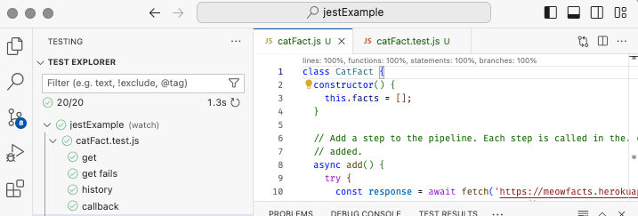

# Jest advanced

🔑 **Key points**

- Jest supports mocking at multiple levels.
- Jest handles asynchronous code and promises.
- Creating comprehensive tests can achieve 100% code coverage.

---

Now that you understand the basics of Jest, it is time to learn some of its advanced features and apply them by writing your own tests.

## Mocking with Jest

[Jest Mocking Documentation](https://jestjs.io/docs/mock-function-api)

Mocking parameters and return values allows you to create isolated unit tests without worrying about the rest of the codebase. This is essential when you need to isolate external dependencies like network requests (`fetch`) or database calls.

Jest supports mocking in two primary ways:
1. **Mock functions (`jest.fn`)**: These track calls made to a function and allow you to define mock return values.
2. **Module mocking (`jest.mock`)**: This replaces an entire module, allowing you to alter how that module interacts with the code under test.

### Mocking functions

You create a mocked function by calling the `jest.fn` method. The returned object has a `mock` property that provides access to all calls and return values. Here is an example of a mocked function that returns a stringified version of its parameter:

```js
test('mocking functions', () => {
  const mockFn = jest.fn((p) => `${p}`);

  mockFn(1);
  mockFn(2);

  expect(mockFn.mock.calls[0][0]).toBe(1);
  expect(mockFn.mock.results[0].value).toBe('1');

  expect(mockFn.mock.calls[1][0]).toBe(2);
  expect(mockFn.mock.results[1].value).toBe('2');
});
```

While this looks like a standard JavaScript function, the power lies in tracking every invocation. By referencing the `calls` and `results` properties, you can inspect exactly what happened. The `calls` property is an array where each entry is an array of the parameters for that specific call. Similarly, the `results` property tracks the return value of each call. This enables you to assert that your code logic flows as expected.

#### Expect mocking helper methods

Jest provides several helper matchers that make it easier to work with mocks. These include `toHaveBeenCalledWith`, which checks if a call was ever made with specific parameters, and `toHaveBeenLastCalledWith`, which asserts the parameters of the most recent call.

```js
test('mocking function matchers', () => {
  const mockFn = jest.fn((p) => `${p}`);

  expect(mockFn(1)).toBe('1');
  expect(mockFn(2)).toBe('2');

  expect(mockFn).toHaveBeenCalledWith(1);
  expect(mockFn).toHaveBeenLastCalledWith(2);
});
```

#### Setting return values

If you don't need a logic-based function to return values, you can set a default return value using `mockReturnValue`. If you need to override the default for specific calls, use `mockReturnValueOnce`. These can be chained together to supply a series of values. Once the specific values are exhausted, the function reverts to the default.

```js
test('mocking function multiple calls', () => {
  const mockFn = jest.fn();

  // Set the default return value to 42
  mockFn.mockReturnValue(42);
  expect(mockFn()).toBe(42);

  // Override the default for the next two calls to 1 and 2
  mockFn.mockReturnValueOnce(1).mockReturnValueOnce(2);
  expect(mockFn()).toBe(1);
  expect(mockFn()).toBe(2);

  // The next call reverts to the default
  expect(mockFn()).toBe(42);
});
```

#### Mocking function parameters

Mocking is particularly useful when passing callbacks. Consider a `Pipeline` class that accepts a series of "step" functions and executes them sequentially when the `run` method is called.

```js
class Pipeline {
  constructor() {
    this.steps = [];
  }

  add(step) {
    this.steps.push(step);
    return this;
  }

  run(data) {
    return this.steps.reduce((result, step) => step(result), data);
  }
}

module.exports = Pipeline;
```

Using mock functions, it is easy to verify that each step in the pipeline is called the correct number of times with the correct data.

```js
test('mocking callback functions', () => {
  const mockStep = jest.fn();

  new Pipeline().add(mockStep).add(mockStep).run('data');

  expect(mockStep).toHaveBeenCalledTimes(2);
  expect(mockStep.mock.calls).toEqual([['data'], [undefined]]);
});
```

Here is a more comprehensive example testing the `Pipeline` functionality:

```js
test('construct pipeline', () => {
  const pipeline = new Pipeline();
  expect(pipeline.steps).toEqual([]);
});

test('chain steps together', () => {
  const mockStep = jest.fn();

  const pipeline = new Pipeline().add(mockStep).add(mockStep);
  expect(pipeline.steps.length).toBe(2);

  pipeline.add(mockStep).add(mockStep);
  expect(pipeline.steps.length).toBe(4);

  expect(pipeline.add(mockStep)).toBe(pipeline);
});

test('pipe data through steps', () => {
  const stepA = jest.fn((d) => d + 'A');
  const stepB = jest.fn((d) => d + 'B');
  const stepC = jest.fn((d) => d + 'C');
  const stepH = jest.fn((_) => 'Hello World!');

  const pipeline = new Pipeline().add(stepA).add(stepB).add(stepC).add(stepH).add(stepA);

  expect(stepA).not.toHaveBeenCalled();
  expect(pipeline.run('I')).toBe('Hello World!A');
  expect(stepA).toHaveBeenCalledTimes(2);
  expect(stepA).toHaveBeenCalledWith('I');
  expect(stepB).toHaveBeenCalledWith('IA');
  expect(stepC).toHaveBeenCalledWith('IAB');
  expect(stepH).toHaveBeenCalledWith('IABC');
  expect(stepA).toHaveBeenCalledWith('Hello World!');

  expect(pipeline.run('J')).toBe('Hello World!A');
  expect(stepA).toHaveBeenCalledTimes(4);
});
```

### Mocking modules

While mocking functions is useful for callbacks, you often need to mock entire classes or modules.

You can mock a class by extending it and overriding its functionality. However, if the code you are testing creates an instance of a class internally, you must mock the entire module using `jest.mock`. Note the use of `jest.requireActual` below; this allows you to use the original implementation while only partially mocking specific behavior.

```js
jest.mock('./pipeline', () => {
  const originalModule = jest.requireActual('./pipeline');
  return class MockPipeline extends originalModule {
    constructor() {
      super();
      this.mockRun = jest.fn();
    }
    run(p) {
      super.run(p);
      return this.mockRun(p);
    }
  };
});
```

In the example below, we reference the mocked class's `mockRun` function to verify how `Pipeline.run` was called:

```js
test('mocking modules', () => {
  const stepMock = jest.fn();
  const pipeline = new Pipeline();

  pipeline.add(stepMock);
  pipeline.add(stepMock);

  pipeline.run('call1');
  pipeline.run('call2');

  expect(stepMock).toHaveBeenCalledTimes(4);
  expect(pipeline.mockRun.mock.calls).toEqual([['call1'], ['call2']]);
});
```

## Dealing with asynchrony

Jest can mock promises and asynchronous functions, which is necessary for testing code that relies on `async/await`.

```js
test('mocking promises', async () => {
  const mockFn = jest.fn().mockResolvedValue(42);

  const result = await mockFn();
  expect(result).toBe(42);
});
```

## Fake Timers

If your code relies on dates, time, or timeouts, Jest allows you to override the runtime execution of those functions. Fake timers put you in control of when time moves forward.

To enable this, call `jest.useFakeTimers()` and configure any necessary [options](https://jestjs.io/docs/jest-object#jestusefaketimersfaketimersconfig). Always reset to real timers after your test by calling `jest.useRealTimers()`.

Here is an example of setting the current date to zero and incrementing it manually:

```js
test('fake timers', async () => {
  jest.useFakeTimers({ now: 0 });
  expect(Date.now()).toBe(0);

  jest.advanceTimersByTime(1000);
  expect(Date.now()).toBe(1000);

  // Still 1000 even after waiting, because time is frozen
  const timeoutMock = jest.fn();
  setTimeout(() => {
    timeoutMock();
  }, 1000);
  expect(timeoutMock).not.toHaveBeenCalled();
  expect(Date.now()).toBe(1000);

  // Move time forward to trigger the timeout
  jest.advanceTimersByTime(2000);
  expect(timeoutMock).toHaveBeenCalled();
  expect(Date.now()).toBe(3000);

  jest.useRealTimers();
});
```

When incrementing a timer that triggers asynchronous code, use `jest.advanceTimersByTimeAsync`. This allows `setInterval` or `setTimeout` callbacks containing `await` to resolve correctly.

```js
test('async fake timers', async () => {
  jest.useFakeTimers({ now: 0 });

  const timerMock = jest.fn();

  setInterval(async () => {
    timerMock(Date.now());
  }, 1000);

  await jest.advanceTimersByTimeAsync(1000);
  expect(timerMock).toHaveBeenCalledTimes(1);

  await jest.advanceTimersByTimeAsync(1000);
  expect(timerMock).toHaveBeenCalledTimes(2);

  jest.useRealTimers();
});
```

## Mocking fetch requests

A common testing requirement is isolating your code from external network calls. To mock the global `fetch` function, assign a mock function to `global.fetch`. The following example uses a switch statement to return different mocked data based on the requested URL:

```js
test('fetches data', async () => {
  global.fetch = jest.fn((url) =>
    Promise.resolve({
      json: () => {
        switch (url) {
          case 'https://one.com':
            return Promise.resolve({ data: 'one data' });
          case 'https://two.com':
            return Promise.resolve({ data: 'two data' });
          default:
            return Promise.resolve({ data: 'default data' });
        }
      },
    })
  );

  const response = await fetch('https://two.com');
  const data = await response.json();
  expect(data).toEqual({ data: 'two data' });
  expect(fetch).toHaveBeenCalledWith('https://two.com');
});
```

## Wrap up

This covers the essential advanced functionality of Jest, but there is much more to explore. As you work through the unit tests for the JWT Pizza service, you will gain the hands-on experience necessary to master these tools.

## ☑ Exercise

Create a project based on the code provided below. Install Jest and write tests until you achieve 100% code coverage.

**catFact.js**

```js
class CatFact {
  constructor() {
    this.facts = [];
  }

  // Fetch a cat fact and add it to the history
  async add() {
    try {
      const response = await fetch('https://meowfacts.herokuapp.com/');
      const payload = await response.json();
      const fact = payload.data[0];
      this.facts.push(fact);
      return fact;
    } catch (error) {
      return null;
    }
  }

  // Get the history of cat facts
  history() {
    return this.facts;
  }

  // Call the given callback with a new cat fact every `time` milliseconds
  call(time, callback) {
    setInterval(async () => {
      const fact = await this.add();
      callback(fact);
    }, time);
  }
}

module.exports = CatFact;
```

Once complete, your code should have 100% coverage with all tests passing.

The following image shows how VS Code displays successful 100% coverage. Note the green indicators and the coverage summary at the top of the file.



```masteryls
{"id":"8dc7f6f6-5a65-49bb-8b35-01fa9a5b92d6", "title":"Jest advanced", "type":"essay", "gradingCriteria":"- The code will achieve 100% line coverage for the CatFact class." }
Once you have your tests working in VS Code, paste the test code below.
```