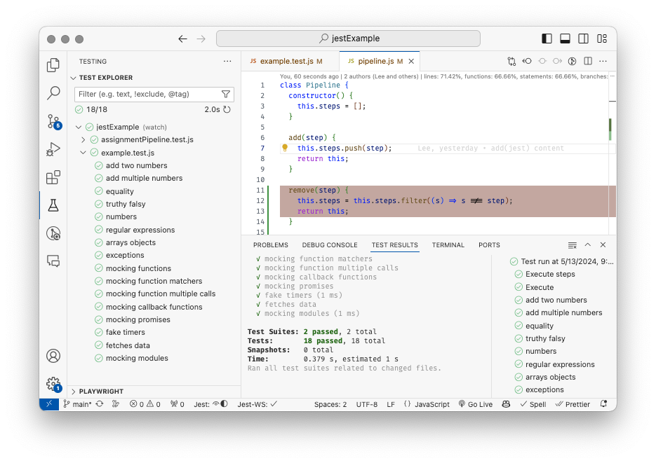

# Jest basics

🔑 **Key points**

- Jest is a commonly used, richly featured, unit testing framework.
- Jest is easy to install and well-supported in Visual Studio Code.
- Jest has all the primitives you need to successfully write unit tests.

---


[Official Jest website](https://jestjs.io/)

Jest is the most common framework for testing JavaScript. It was created back in 2011 when Facebook’s chat feature was rewritten in JavaScript. After extensive internal use, Facebook release Jest as open source in 2014. In 2022, they transferred ownership of Jest to [OpenJS](https://openjsf.org/). We owe many thanks to Facebook for investing in and openly sharing such a valuable piece of code.

## Installing Jest

In order to use Jest as your unit testing framework you need to first create an NPM project and install the Jest package. Note that when installing, we use the `-D` parameter to tell NPM that Jest is only used during development, and it shouldn't be included in any production deployment.

```sh
mkdir jestExample && cd jestExample
npm init -y
npm install -D jest
```

Then change the package.json script so that the `test` command runs Jest.

```json
{
  "scripts": {
    "test": "jest"
  }
}
```

Now you need a simple test that will demonstrate that everything is wired up correctly. All you need to do is include the phrase `.test.` as part of your file name and Jest will pick the test up automatically. In this test we just expect that one plus one will be two. Notice how the Jest syntax reads naturally.

**example.test.js**

```js
test('1 + 1 equals 2', () => {
  expect(1 + 1).toBe(2);
});
```

With the Jest package installed and our first test written, we can run it with the NPM test command. This results in the following:

```sh
npm test

 PASS  ./index.test.js
  ✓ 1 + 1 equals 2 (1 ms)

Test Suites: 1 passed, 1 total
Tests:       1 passed, 1 total
Snapshots:   0 total
Time:        0.122 s
Ran all test suites.
```

## Calling code from the test

The previous test isn't very interesting since it only runs code within the test itself. So instead, let's create a function called `add` in an `add.js` file and have the test call that instead.

```js
function add(...numbers) {
  return numbers.reduce((a, c) => (a += c), 0);
}

module.exports = { add };
```

You can then rewrite the test to import and create a couple tests for our new `add` function.

```js
const { add } = require('./add');

test('add two numbers', () => {
  expect(add(1, 1)).toBe(2);
});

test('add multiple numbers', () => {
  expect(add(1, 2, 3, 4, 5)).toBe(2);
});
```

When we rerun the tests.

```sh
npm test

 FAIL  ./index.test.js
  ✓ add two numbers (1 ms)
  ✕ add multiple numbers (1 ms)

  ● add multiple numbers
    Expected: 2
    Received: 15

       6 |
       7 | test('add multiple numbers', () => {
    >  8 |   expect(add(1, 2, 3, 4, 5)).toBe(2);
         |                              ^
       9 | });
      10 |

Test Suites: 1 failed, 1 total
Tests:       1 failed, 1 passed, 2 total
```

The first test works great, but the second test fails. This is because the test is incorrectly expected the wrong resulting value. After fixing the value to be the correct result of `15`, all the tests pass.

## Jest configuration

[Jest configuration docs](https://jestjs.io/docs/configuration)

You may have noticed that you didn't have to import the Jest dependencies or specify where your test files were in order for the tests to run. That is because when Jest runs it analyzes all the project paths and looks for files that match a regex pattern of `**/?(*.)+(spec|test).[tj]s?(x)`. When it finds those files, it runs them in an environment where the Jest code is already loaded.

You can override the default configuration for Jest by adding a `jest.config.json` file to your project. In that file you can specify options such as a different regex pattern for matching tests, making the output verbose, collecting coverage, and automatically generating mocks.

Here is a configuration file that tests jest to collect coverage information and output verbose information. Everything looks great. All the tests are passing, and you have 100% coverage.

```json
{
  "collectCoverage": true,
  "verbose": true
}
```

Now you get simple coverage information returned when you run the tests.

```sh
npm test

 PASS  ./index.test.js
  ✓ add two numbers (1 ms)
  ✓ add multiple numbers (1 ms)

----------|---------|----------|---------|---------|-------------------
File      | % Stmts | % Branch | % Funcs | % Lines | Uncovered Line #s
----------|---------|----------|---------|---------|-------------------
All files |     100 |      100 |     100 |     100 |
 index.js |     100 |      100 |     100 |     100 |
----------|---------|----------|---------|---------|-------------------
Test Suites: 1 passed, 1 total
Tests:       2 passed, 2 total
```

### Reporters

Jest has multiple types of reports that it can generate. Modify `jest.config.json` in order to specify how you want to report the coverage results.

```json
{
  "collectCoverage": true,
  "coverageReporters": ["json-summary", "text"]
}
```

There are many reporters that you can use. Here are the most common ones.

| Reporter         | Description                                                                                                                                                      |
| ---------------- | ---------------------------------------------------------------------------------------------------------------------------------------------------------------- |
| **text**         | Provides a basic text-based summary of coverage information directly in the Jest console output.                                                                 |
| **text-summary** | Offers a more comprehensive text summary within the console, including details like total lines, statements, functions, branches, and uncovered lines.           |
| **html**         | Generates an HTML report that visually presents code coverage data. This is ideal for detailed inspection and sharing within your team.                          |
| **json**         | Outputs a JSON file containing the complete coverage data. This format is useful for integration with other tools or for further analysis.                       |
| **json-summary** | Similar to "json", but creates a more concise JSON file summarizing the overall coverage percentages.                                                            |
| **cobertura**    | Generates a Cobertura XML report, a format compatible with various continuous integration (CI) tools for automated reporting.                                    |
| **lcov**         | Creates an LCOV report, another popular format supported by CI tools for integration with coverage analysis platforms.                                           |
| **clover**       | Generates a Clover coverage report. This format is specifically designed for the Clover code coverage tool, offering detailed metrics and analysis capabilities. |

Some reporters output to the `coverage` directory while others output to the console. For example, the `text-summary` reporter will output the following to the console.

```sh
=============================== Coverage summary ===============================
Statements   : 90.2% ( 258/286 )
Branches     : 65.57% ( 40/61 )
Functions    : 88.67% ( 47/53 )
Lines        : 90.71% ( 254/280 )
================================================================================
```

The `json-summary` reporter will create a file named `coverage-summary.json` in the `coverage` directory with the following contents.

```json
{
  "total": {
    "lines": { "total": 280, "covered": 254, "skipped": 0, "pct": 90.71 },
    "statements": { "total": 286, "covered": 258, "skipped": 0, "pct": 90.2 },
    "functions": { "total": 53, "covered": 47, "skipped": 0, "pct": 88.67 },
    "branches": { "total": 61, "covered": 40, "skipped": 0, "pct": 65.57 },
    "branchesTrue": { "total": 0, "covered": 0, "skipped": 0, "pct": 100 }
  }
}
```

The default reporters are `["clover", "json", "lcov", "text"]`.

### Coverage thresholds

Jest has the option to require certain levels of coverage. If the requirements are not met then the process will return an error.

```sh
Jest: Uncovered count for statements (28) exceeds global threshold (10)
Jest: "global" coverage threshold for lines (80%) not met: 79.71%
```

To enable coverage requirements, set the `coverageThreshold` option in `jest.config.json`. For example, with the following configuration Jest will fail if there is less than 30% branch, 80% line, 70% function coverage, or if there are more than 10 uncovered statements:

```json
{
  "collectCoverage": true,
  "coverageThreshold": {
    "global": {
      "branches": 30,
      "functions": 70,
      "lines": 80,
      "statements": -10
    }
  }
}
```

## Jest Visual Studio Code Extension

You can run Jest from the console, but it is much nicer to install an extension that allows you to run the test right inside your IDE. With the [Jest Visual Studio Code extension](https://marketplace.visualstudio.com/items?itemName=Orta.vscode-jest) you can selectively run one, or all of your tests and visually see the results. It is highly suggested that you spend some time reading the documentation for the extension so that you can experience its full value.



Make sure you check out the ability for the extension to run the tests whenever they change and also to show the code coverage. To access this functionality click on the gear icon in the Test Explore pane. Then choose when you want the test to run and also toggle the coverage option.


Turning on the coverage will display the coverage statistics at the top of each code window and also highlight lines that are not covered in red.

### Debugging

Using the VS Code extension makes it easier to debug your tests. You can set whatever breakpoint you would like, right-click on the test icon and select the option to debug.

By default, Jest will time out a test if it takes longer than 5 seconds without any activity. You can override this while you are debugging by adding the following to your test code. Note that this only works if you are using VS Code to debug your tests.

```js
if (process.env.VSCODE_INSPECTOR_OPTIONS) {
  jest.setTimeout(60 * 1000 * 5); // 5 minutes
}
```

## Jest expect and matchers

[Jest Expect](https://jestjs.io/docs/expect)

When you create assertions with Jest, you use the `expect` method to generate an expectation object. The expectation object has numerous matcher operations that assert the state of the expectation. You will want to become familiar with all the matchers, but we will give you a taste of the most common ones here.

### Equality

You have already seen one of the most common matcher operations, `toBe()` which tests equality. If you want to test for deep equality then use the `toEqual` matcher. Note that this match will ignore values that are undefined.

```js
test('equality', () => {
  expect(add(1, 1)).toBe(2);
  expect('2').not.toBe(2);

  expect({ id: 2, data: { name: 'cow' }, xid: undefined }).toEqual({ id: 2, data: { name: 'cow' } });
});
```

### Truthy and falsy

Determining if a variable is truthy or falsy is a common operation in JavaScript and so Jest has numerous matchers to help you with this.

```js
test('truthy falsy', () => {
  expect(true).toBeTruthy();
  expect(true).not.toBeFalsy();
  expect(false).not.toBeTruthy();
  expect(false).toBeFalsy();

  expect(undefined).not.toBeDefined();
  expect(undefined).toBeUndefined();

  expect(null).toBeNull();
  expect(null).toBeDefined();
  expect(null).not.toBeUndefined();
  expect(null).not.toBeTruthy();
  expect(null).toBeFalsy();

  expect(0).not.toBeNull();
  expect(0).toBeDefined();
  expect(0).not.toBeUndefined();
  expect(0).not.toBeTruthy();
  expect(0).toBeFalsy();
});
```

### Numbers

There are numerous matchers that help with the comparison of numbers. This includes dealing with situations where floating point precision might be in question.

```js
test('numbers', () => {
  expect(4).toBeGreaterThan(3);
  expect(4).toBeGreaterThanOrEqual(4);

  expect(4).toBeLessThan(5);
  expect(4).toBeLessThanOrEqual(4);

  expect(0.3000001).toBeCloseTo(0.3);
});
```

### Regular expressions

Oftentimes you need to test for things that contain unpredictable variations in results. This is where the regular expression matcher, `toMatch`, comes in handy. In the following example we only check to see if the date field is present without caring for its value.

```js
test('regular expressions', () => {
  const body = JSON.stringify({ date: '20240202T00:00:10Z', name: 'orem' });
  expect(body).toMatch(/{"date":".*","name":"orem"}/);
});
```

### Arrays and objects

You can also match on specific array contents or object properties.

```js
test('arrays objects', () => {
  expect('abcd').toContain('bc');
  expect([1, 2, 3]).toContain(2);
  expect([1, 2, 3]).toEqual(expect.arrayContaining([2, 3]));
  expect({ id: 2, cost: 3 }).toHaveProperty('cost', 3);
  expect({ id: 2, cost: 3 }).toEqual(expect.objectContaining({ id: 2 }));
  expect({ id: 2, cost: 3 }).toMatchObject({ id: 2 });
});
```

### Exceptions

No testing is complete unless it checks for the unhappy paths. You can validate that exceptions are thrown, or not thrown.

```js
test('exceptions', () => {
  expect(() => {
    throw new Error('error');
  }).toThrow();
  expect(() => {}).not.toThrow();
});
```
