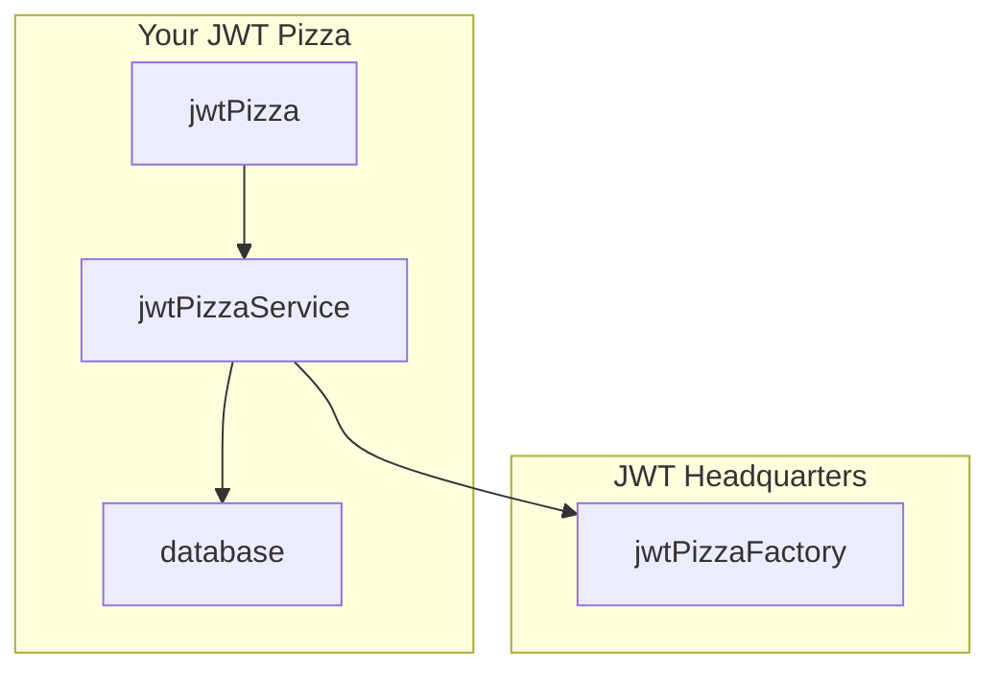
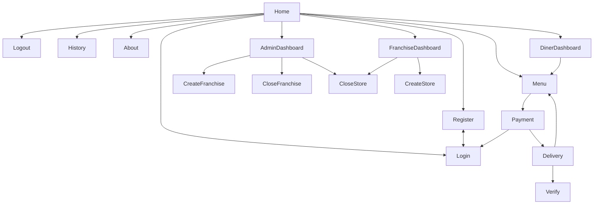

# 🍕 JWT Pizza

🔑 **Key points**

- You will use JWT Pizza to master the concepts of QA and DevOps.

---

In order for us to master the concepts of Quality Assurance and Developer Operations, we will work on a simple web application named JWT Pizza (pronounced Jot Pizza).

JWT Pizza provides the valuable service of exchanging BitCoin for virtual pizzas that are represented by a cryptographically signed token ([JWT](https://jwt.io/introduction)). JWT Pizza also provides the opportunity to create a franchise and cash in on the 🍕 virtual pizza craze.

An external contracted application team has written the code for the application, and you are in charge of the QA and DevOps roles for writing the tests, deploying to, and managing the production and staging environments.

You shouldn't assume that the external development engineers have done a perfect job with JWT Pizza. In fact, there are several known bugs and security vulnerabilities in the code. Part of your job will be to discover and correct these problems.

💡 You might consider a deep dive into JWT technology for your curiosity report. Learn about how it was created, how it works, and what its strengths and weaknesses.

## Deliverables

Each of the follow deliverables will take JWT Pizza from a simple program code to an enterprise deployed, resilient, secure application that you can have confidence in.

| 🍕 Deliverable                                                                              | Video                              | Description                                                                |
| ------------------------------------------------------------------------------------------- | ---------------------------------- | -------------------------------------------------------------------------- |
| [⓵ Development deploy](../deliverable1DevelopmentDeploy/deliverable1DevelopmentDeploy.md)   |                                    | Deploy frontend to GitHub Pages manually                                   |
| [⓶ Automated deploy](../deliverable2AutomatedDeploy/deliverable2AutomatedDeploy.md)         |                                    | Deploy frontend to GitHub Pages using GitHub Actions                       |
| [⓷ Unit test](../deliverable3UnitTesting/deliverable3UnitTesting.md)                        | [🎥](https://youtu.be/PKiRH2ZKZeM) | Backend unit testing and analysis using Jest and GitHub Actions automation |
| [⓸ UI test](../deliverable4UiTesting/deliverable4UiTesting.md)                              | [🎥](https://youtu.be/qvf1kaT_wr0) | User interface unit testing using Playwright and GitHub Actions automation |
| [⓹ CDN deploy](../deliverable5CdnDeploy/deliverable5CdnDeploy.md)                           |                                    | Deploy frontend to AWS CloudFront                                          |
| [⓺ Scalable deploy](../deliverable6ScalableDeploy/deliverable6ScalableDeploy.md)            | [🎥](https://youtu.be/mhFmGVfFA8c) | Deploy backend to AWS Fargate and RDS MySQL                                |
| [⓻ Environments](../deliverable7Environments/deliverable7Environments.md)                   |                                    | Deploy to staging and production environments                              |
| [⓼ Metrics](../deliverable8Metrics/deliverable8Metrics.md)                                  |                                    | Provide metrics with Grafana Prometheus                                    |
| [⓽ Logging](../deliverable9Logging/deliverable9Logging.md)                                  |                                    | Provide logging with Grafana Loki                                          |
| [⓾ Load test](../deliverable10LoadTesting/deliverable10LoadTesting.md)                      |                                    | Execute end to end load testing with K6                                    |
| [⑪ Chaos test](../deliverable11ChaosTesting/deliverable11ChaosTesting.md)                   |                                    | Chaos testing                                                              |
| [⑫ Penetration test](../deliverable12PenetrationTesting/deliverable12PenetrationTesting.md) |                                    | Penetration testing using Burp Suite                                       |

## JWT Pizza architecture

The 10,000-foot overview of the JWT Pizza application consists of the following pieces:

- **jwtPizza** - React frontend representing the website. Customers can order pizzas, review purchases. Administrators create and manage franchises. Franchisees can add stores and review profits.
- **jwtPizzaService** - Express backend that provides all the endpoints necessary to manage users, franchises, and pizza orders.
- **jwtPizzaFactory** - External headquarters service that generates and validates JWTs representing a pizza order.
- **database** - The database persistently stores information about users, menus, franchises, and orders.

## JWT Pizza frontend

The following is the sitemap for JWT Pizza as provided by the product team. Note that while JWT Pizza is a fairly simple website, it has a significant amount of components and views that will require testing.

## JWT Pizza Service

The JWT Pizza frontend makes extensive use of backend endpoints in order to satisfy the required customer functionality. The chief architect for the JWT Pizza Service has defined these endpoints, and you can review their documentation with the following undocumented [service docs](https://pizza.cs329.click/docs/service) endpoint.

## JWT Pizza Factory

The JWT Pizza Factory is called by the JWT Pizza Service to actually fulfill a pizza order and generate a JWT that represents the order. The chief architect for the JWT Pizza Service has defined these endpoints, and you can review their documentation with the following undocumented [factory docs](https://pizza-factory.cs329.click/api/docs/factory) endpoint.

## Application team deployment plan

The application team plans on the following release phases to the QA and DevOps teams. The deliverables will be available via different GitHub repositories. You are expected to **fork** these repositories and use them for your testing and deployment needs.

Note that the application team may release updates to their original deliverable. This will require you to merge your fork with their updates. As long as you do not manipulate the core application code beyond what is necessary to test and deploy the application this should not require you to resolve any merge conflicts.

| Phase | Deliverable                                                          | Notes                                                                                                                                                                                                                                                                                                                 | Repo                                                                |
| :---: | -------------------------------------------------------------------- | --------------------------------------------------------------------------------------------------------------------------------------------------------------------------------------------------------------------------------------------------------------------------------------------------------------------- | ------------------------------------------------------------------- |
|   1   | **[JWT Pizza](https://pizza.cs329.click) (frontend)**                | By using the reference version of the [_JWT Pizza Service_](https://pizza-service.cs329.click) that is provided by _JWT headquarters_ you can deploy the frontend while you are waiting for the application team to deliver the backend service.                                                                      | [JWT Pizza](https://github.com/devops329/jwt-pizza)                 |
|   2   | **[JWT Pizza Service](https://pizza-service.cs329.click) (backend)** | With this deliverable you can change your frontend to use your deployment of this service rather than the JWT headquarters version. Note that you are required to obtain an API key from JWT headquarters before you will be able to deploy your service. The API key is necessary to create a JWT pizza order token. | [JWT Pizza Service](https://github.com/devops329/jwt-pizza-service) |

Take some time playing around with the JWT Pizza application. Register yourself as a diner and order some pizza. The more you become familiar with the application the easier it will be for you to test, deploy, and manage it.
