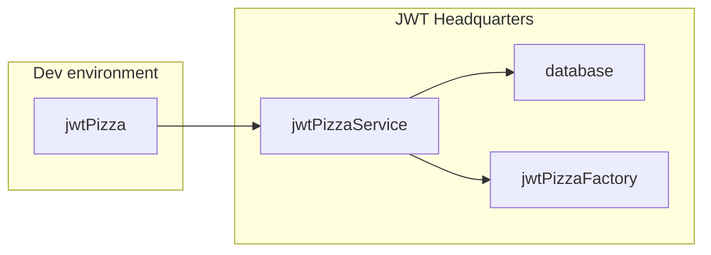
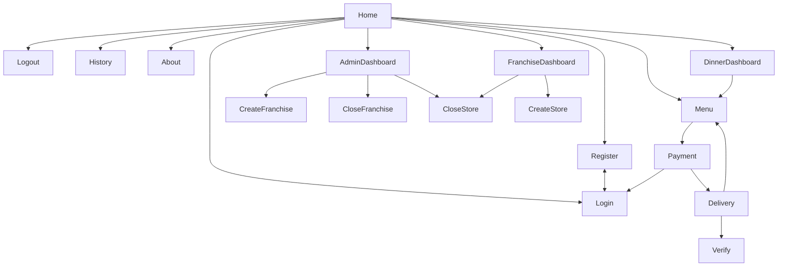

# JWT Pizza Client


The _JWT Pizza application_ team has finally finished their work on the website and has given you access to the frontend application code so that you can start testing and deploying it.

Initially you will only be running the code from your development environment. It will call the JWT Pizza Service and JWT Pizza Factory provided by JWT Headquarters so that it can be fully functional.



Later in the course you will deploy the frontend to production environments on GitHub and AWS.

## Forking the application team's repository

To get started you need to fork the code to your GitHub account, run it locally and study how it works. This will get you comfortable with the code so that you are ready to start putting on your QA and DevOps hat.

Here are the steps to take:

1. Navigate your browser over to the [jwt-pizza](https://github.com/devops329/jwt-pizza) repository on GitHub and select the option to `Fork` the repository.
   > 
1. Create the fork by pressing the `Create fork` button. For clarity reasons, it is highly suggested that you leave the name of the repository `jwt-pizza`.
   > 
1. Copy the URL for your fork of the repository.
   > 
1. Use the URL to clone the repository from your account to your development environment.
   ```sh
   git clone https://github.com/youraccountnamehere/jwt-pizza.git
   ```
1. Change directory into the newly clone repository and install the NPM package dependencies.
   ```sh
   cd jwt-pizza
   npm install
   ```
1. Launch the frontend code in development mode using NPM. Press `o-return` to open your browser.
   ```sh
   npm run dev
   ```

## Keep in sync

As the application team makes changes to the frontend code you will need to sync your fork of the repository. As long as you are only adding tests and not changing the core code, you shouldn't have to merge any code.

To sync your fork, navigate to your account's fork of the `jwt-pizza` repository. It will display if your fork is out of date. Press the `Sync fork` button and confirm the action.


You will then need to pull the changes down to your development environment.

```sh
cd jwt-pizza
git pull
```

## JWT Pizza architecture

The following is the sitemap for JWT Pizza as provided by the application team. Note that while JWT Pizza is a fairly simple website, it has a significant amount of components and views that will require testing.



Make sure you spend reasonable time both playing with the interface and also exploring the code. This will be a key factor in your success for both testing and deploying the application.

## ☑ Assignment

1. Fork the [jwt-pizza](https://github.com/devops329/jwt-pizza) repository.
1. Clone it to your development environment.
1. Build and explore the application code.

Once you are done, go over to Canvas and submit the URL of your forked repository. This should look something like this:

```
https://github.com/youraccountnamehere/jwt-pizza
```
