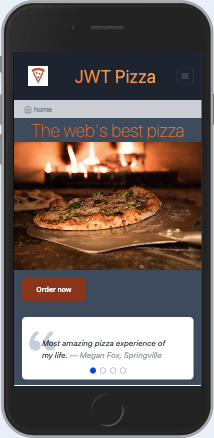
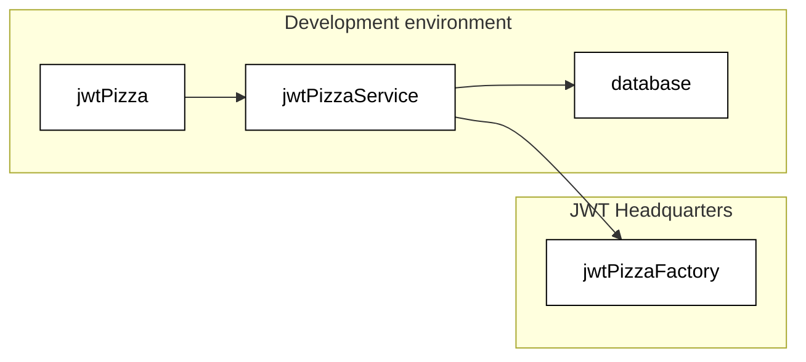
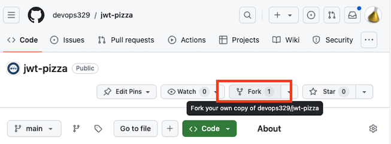
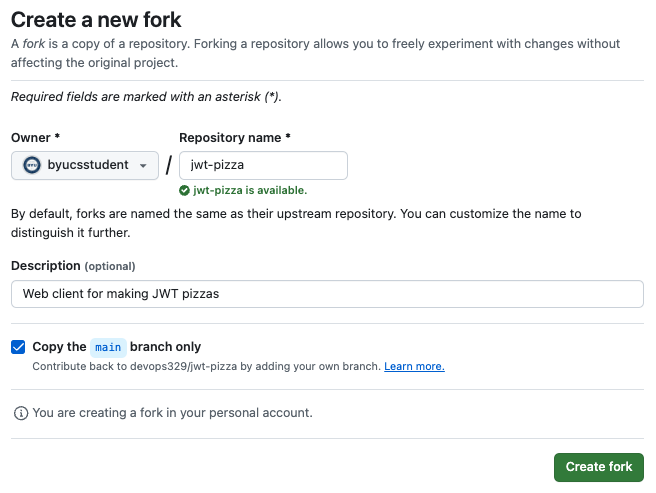
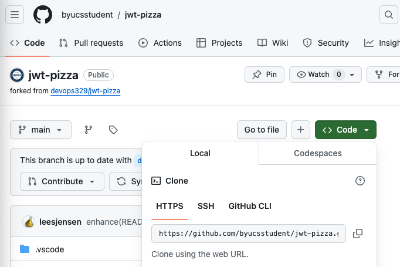
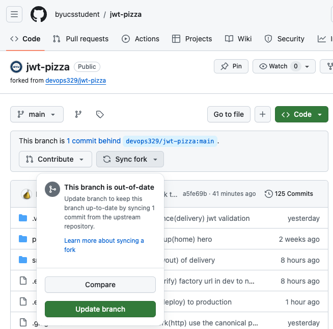
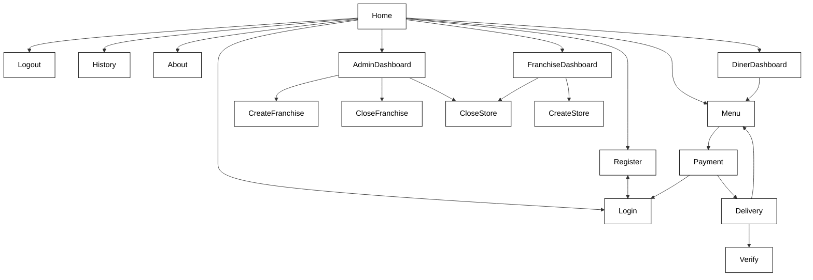
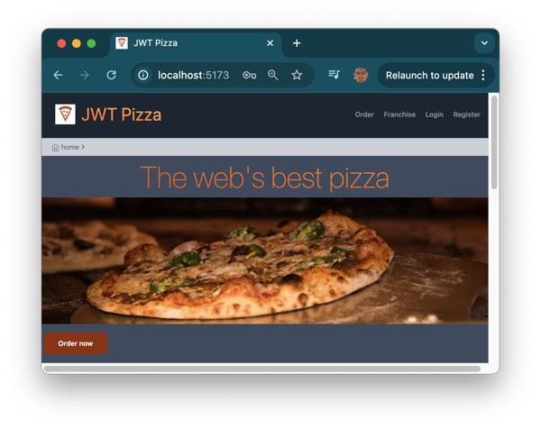
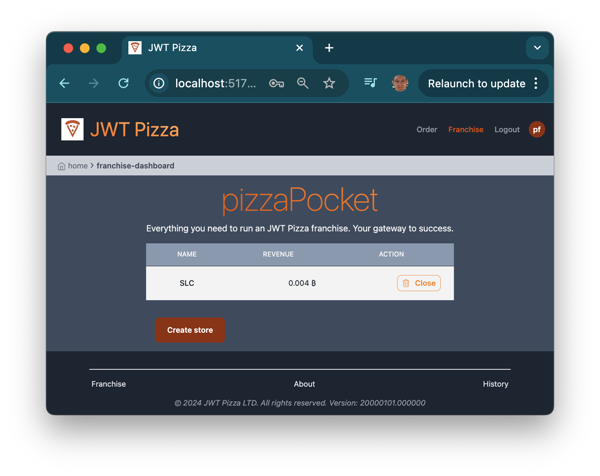

# JWT Pizza Client

🔑 **Key points**

- You need to fork the [jwt-pizza](https://github.com/devops329/jwt-pizza) repository.
- Become intimately familiar with the JWT Pizza frontend code.
- Many upcoming projects revolve around you manipulating this codebase.

---



The _JWT Pizza application team_ has finished their work on the website and provided you with the frontend application code so you can begin testing and deploying it.

Now that you have the frontend application, you can run the full JWT Pizza stack in your development environment. This includes the frontend (_jwt-pizza_), the backend (_jwt-pizza-service_), and the database. The only piece you do not manage directly is the service provided by JWT Headquarters that creates the JWT tokens representing a completed pizza order. Instead, your deployment of the JWT service will call the external factory service provided by JWT Headquarters.


```mermaid
graph LR;
    classDef default fill:#ffffff,stroke:#000000,color:#000000,stroke-width:1px;

    subgraph  Development environment
    jwtPizza-->jwtPizzaService
    jwtPizzaService-->database
    end
    subgraph JWT Headquarters
    jwtPizzaService-->jwtPizzaFactory
    end
```

Later in the course, you will deploy the full JWT Pizza stack to a production environment using AWS.

## Forking the application team's repository

To get started, you need to fork the code to your GitHub account, run it locally, and study how it works. This will help you become comfortable with the code so you are ready to begin your QA and DevOps tasks.

Follow these steps:

1. Navigate to the [jwt-pizza](https://github.com/devops329/jwt-pizza) repository on GitHub and select the **Fork** option.
   > 
1. Create the fork by clicking the **Create fork** button. You **must** keep the repository name as `jwt-pizza` so that the TAs can easily review your work.

   > 

1. Copy the URL for your fork of the repository.
   > 
1. Use the URL to clone the repository from your account to your local development environment.
   ```sh
   git clone https://github.com/youraccountnamehere/jwt-pizza.git
   ```

## Running the frontend in your development environment

1. Change into the newly cloned repository directory and install the NPM package dependencies.
   ```sh
   cd jwt-pizza
   npm install
   ```
1. Launch the frontend code in development mode using NPM. Press `o` + `Enter` to open the application in your browser.
   ```sh
   npm run dev
   ```

## Environment configuration

The JWT Pizza project uses `.env` files to specify the endpoints for the pizza service and factory. There are two `.env` files located in the root of the project: one for **development** (`.env.development`) and one for **production** (`.env.production`). Both configurations use the corporate pizza factory service to generate pizza JWTs.

The development environment is configured to use the local JWT Pizza Service that you set up in the previous [JWT Pizza Service](../jwtPizzaService/jwtPizzaService.md) instruction.

```env
VITE_PIZZA_SERVICE_URL=http://localhost:3000
VITE_PIZZA_FACTORY_URL=https://pizza-factory.cs329.click
```

The production environment is configured to use the corporate JWT Pizza Service hosted at `https://pizza-service.cs329.click`. Later in the course, you will change this to point to your own production service deployment. 

```env
VITE_PIZZA_SERVICE_URL=https://pizza-service.cs329.click
VITE_PIZZA_FACTORY_URL=https://pizza-factory.cs329.click
```

## Keep in sync

As the application team makes changes to the frontend code, you will need to sync your fork of the repository. As long as you are only adding tests and not changing the core application code, you should not encounter merge conflicts.

To sync your fork, navigate to your GitHub fork of the `jwt-pizza` repository. GitHub will display a notification if your fork is out of date. Click the **Sync fork** button and confirm the action.

> [!NOTE]
>
> Do not click the **Discard commits** button if it is available, or you will lose any code you have added to your fork, such as tests you have written.



After syncing on GitHub, pull the changes down to your local development environment:

```sh
cd jwt-pizza
git pull
```

## JWT Pizza architecture

The following is the sitemap for JWT Pizza provided by the application team. While JWT Pizza is a relatively simple website, it contains a significant number of components and views that require testing.
 

```mermaid
graph TB;
    classDef default fill:#ffffff,stroke:#000000,color:#000000,stroke-width:1px;

    Home-->Login
    Home-->Logout
    Home-->Register
    Home-->History
    Home-->About
    Home-->Menu
    Home-->AdminDashboard
    Home-->FranchiseDashboard
    Register<-->Login
    AdminDashboard-->CreateFranchise
    AdminDashboard-->CloseFranchise
    AdminDashboard-->CloseStore
    FranchiseDashboard-->CreateStore
    FranchiseDashboard-->CloseStore
    Home-->DinerDashboard
    DinerDashboard-->Menu
    Menu-->Payment
    Payment-->Login
    Payment-->Delivery
    Delivery-->Verify
    Delivery-->Menu
```

Spend time exploring the interface and the code. Understanding the application flow is a key factor in successfully testing and deploying the project.

## ☑ Exercise

Following the instructions above, you should have already forked and cloned the `jwt-pizza` repository to your development environment. Your fork's URL should look like this:

`https://github.com/youraccountnamehere/jwt-pizza`

```masteryls
{"id":"d6ea467d-336b-4f3c-bd43-bbe38bb5efc6","title":"JWT Pizza Service Repository","type":"url-submission","syncGrade":false,"autoGrade":false,"validateUrl":true,"gradingCriteria":"- The heading '🍕 jwt-pizza' exists","urlPrompt":"Convert the user provided URL to create a URL that is the path to the raw GitHub content for the README.md file."}
After you have cloned the JWT Pizza repository to your account, submit the URL of your pizza repository for review.

_Example: https://github.com/youracountname/jwt-pizza_
```

Now you can build and start the JWT Pizza frontend in your development environment and explore the code.

1. Build and explore the application code.
   ```sh
   cd jwt-pizza
   npm install
   ```
1. Start the JWT Pizza backend by following the [JWT Pizza Service](../jwtPizzaService/) instructions.
1. Start the JWT Pizza frontend by running `npm run dev`. You should be able to access the application in your browser at `http://localhost:5173`.



Open your browser's developer tools, set breakpoints, and begin learning the code. Complete at least the following tasks:

1. **Login as the default admin:** Use email `a@jwt.com` and password `admin`.
2. **Order a pizza:** Walk through the ordering process.
3. **Verify the JWT:** Validate that the generated pizza JWT is valid.
4. **Login as a franchisee:** Use email `f@jwt.com` and password `franchisee`.
5. **View the franchise dashboard:** Observe that the revenue from your previous pizza purchase is reflected in the dashboard.

