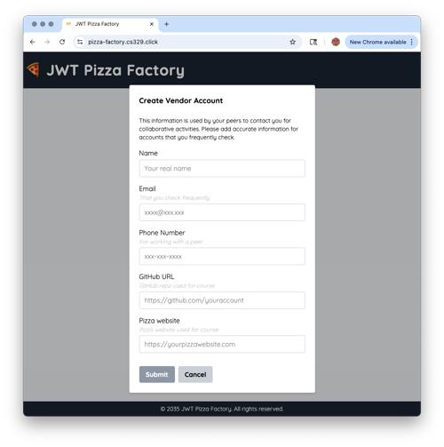
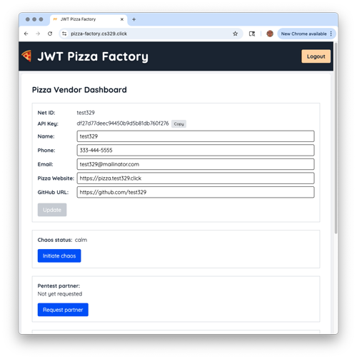

# JWT Pizza Factory

The JWT Pizza Factory is controlled by JWT Pizza Headquarters and provides two major functionalities. First, it creates the pizzas that are served up by your JWT Pizza application. Second, it manages your JWT pizza vendor account.

Before your do any work in the class you must setup your Vendor account with the [JWT Pizza Factory](https://pizza-factory.cs329.click). Register with your **BYU ID** and provide information such as your name, contact information, GitHub repository, and the URL of your pizza service website.

The URL for your pizza website should include the `pizza` subdomain for the DNS hostname. This can be an hosthame you already own, or one that you plan to lease. For example,

```
pizza.byucsstudent.click
```

> [!NOTE]
> 
> You will finish setting up the `pizza` subdomain in Deliverable 2, and you can edit this URL in your JWT Pizza Factory account at any time to match.



It is important that you provide accurate contact information for a location that you check frequently because this is what your peers will use to connect with you. Without proper information you may not be able to complete key deliverables.

After you have provided and verified your information you can use the Vendor Dashboard to take the actions necessary to complete the course. This allows you to do the following:

1. Create badges for display in your CI pipelines.
1. Request chaos testing.
1. Find partners for activities such as penetration testing.



> [!IMPORTANT]
>
> Creating your JWT Pizza Factory account is a prerequisite for all course deliverables. Please take the time to create you account as soon as you have created your GitHub repository and have leased your DNS domain.

## Exercises


```masteryls
{"id":"21f11851-8df8-49ec-a137-48db2bb0746e", "title":"Pizza factory account", "type":"multiple-select" }
I have done the following.

- [x] Created my [JWT Pizza Factory account](https://pizza-factory.cs329.click)
- [x] Provided my correct Net ID, Phone number, email.
- [x] Provided by DNS hostname. If you don't have a hostname then provide the name you plan on leasing soon. You can change it in the future if you get a different hostname.
- [x] Provided by GitHub account.
```


```masteryls
{"id":"ddf00844-13df-4764-8947-8e973f375b29", "title":"URL submission", "type":"url-submission", "syncGrade":false, "autoGrade":false, "validateUrl":true, "gradingCriteria":"The URL is for `https://github.com`" }
My GitHub account URL is:

_Example: https://github.com/myaccountname_
```

