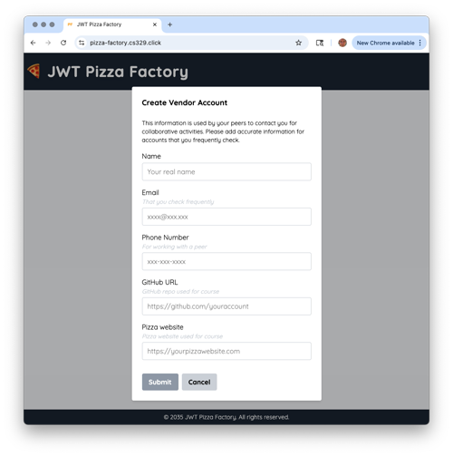
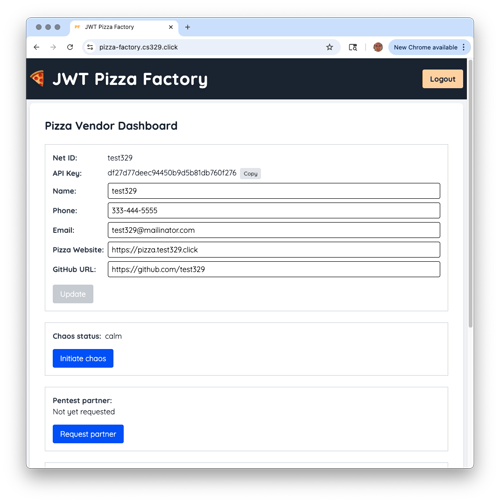

# JWT Pizza Factory

The JWT Pizza Factory is managed by JWT Pizza Headquarters and serves two primary functions: it creates the pizzas served by your JWT Pizza application and manages your JWT Pizza vendor account.

Before starting any coursework, you must set up your vendor account at the [JWT Pizza Factory](https://pizza-factory.cs329.click). Register using your **BYU ID** and provide your name, contact information, GitHub repository, and the URL of your pizza service website.

The URL for your pizza website must include a `pizza` subdomain. This can be a domain you already own or one you plan to lease. For example:

```
pizza.byucsstudent.click
```

> [!NOTE]
>
> You will finalize the `pizza` subdomain setup in Deliverable 2. You can update this URL in your JWT Pizza Factory account settings at any time to match your actual domain.



It is important to provide accurate contact information that you check frequently, as your peers will use this to connect with you. Without valid contact information, you may be unable to complete key deliverables.

Once you have provided and verified your information, you can use the Vendor Dashboard to perform the actions necessary to complete the course. This allows you to:

1. Create badges for display in your CI pipelines.
1. Request chaos testing.
1. Find partners for activities such as penetration testing.



> [!IMPORTANT]
>
> Creating your JWT Pizza Factory account is a prerequisite for all course deliverables. Please create your account as soon as you have established your GitHub repository and leased your DNS domain.

## ☑ Exercise

```masteryls
{"id":"21f11851-8df8-49ec-a137-48db2bb0746e", "title":"Pizza factory account", "type":"multiple-select" }
I have completed the following:

- [x] Created my [JWT Pizza Factory account](https://pizza-factory.cs329.click).
- [x] Provided my correct BYU Net ID, phone number, and email.
- [x] Provided my DNS hostname. **Note**: _If you do not have a hostname yet, provide the name you plan to lease. You can update this in the future if your hostname changes._
- [x] Provided my GitHub account.
```

```masteryls
{"id":"ddf00844-13df-4764-8947-8e973f375b29", "title":"URL submission", "type":"url-submission", "syncGrade":false, "autoGrade":false, "validateUrl":true, "gradingCriteria":"The URL has the form `https://github.com/accountname`" }
My GitHub account URL is:

_Example: https://github.com/myaccountname_
```