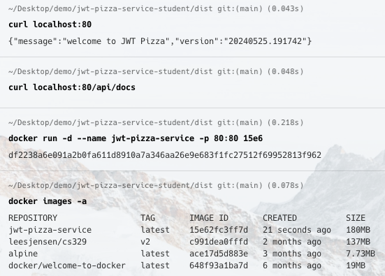

# JWT Pizza Service Container

🔑 **Key points**

- Build a container for the JWT Pizza Service.

---

Now that you know how Docker containers work, you need to create a **jwt-pizza-service** Docker container image from the Pizza Service source code. Here are the steps to take.

1. In your development environment, open your command console and navigate to the directory containing your fork of `jwt-pizza-service`.
1. Create a file named `Dockerfile` in the project directory with the following content. Make sure you match the case of the filename.

   ```dockerfile
   ARG NODE_VERSION=22

   FROM node:${NODE_VERSION}-alpine
   WORKDIR /usr/src/app
   COPY . .
   RUN npm ci
   EXPOSE 80
   CMD ["node", "index.js", "80"]
   ```

1. Modify/Create the `src/config.js` file. Set the database host field so that it looks outside the container for the MySQL server by specifying the value of `host.docker.internal`. Make sure you include the `config.js` file in your `.gitignore` file so that you do not accidentally push it to your repository. Set the parameters, such as the user, password, jwtSecret and factory.apiKey, according to your environment.
   ```sh
   module.exports = {
    jwtSecret: 'yourRandomJWTGenerationSecretForAuth',
    db: {
      connection: {
        //host: '127.0.0.1',
        host: 'host.docker.internal',
        user: 'root',
        password: 'yourDatabasePassword',
        database: 'pizza',
        connectTimeout: 60000,
      },
      listPerPage: 10,
    },
    factory: {
      url: 'https://pizza-factory.cs329.click',
      apiKey: 'yourHeadquartersProvidedApiKey',
    },
   };
   ```
1. Copy the source code files to `dist` that we want to distribute.
   ```sh
   mkdir dist
   cp Dockerfile dist
   cp -r src/* dist
   cp *.json dist
   ```
1. Navigate to the `dist` directory.
   ```sh
   cd dist
   ```
1. Build the image.
   ```sh
   docker build -t jwt-pizza-service .
   ```
1. Verify that the container exists.

   ```sh
   docker images -a

   REPOSITORY         TAG      IMAGE ID       CREATED         SIZE
   jwt-pizza-service  latest   9689e2852c3a   2 seconds ago   132MB
   ```

1. Run the container and make sure it works by using curl to hit the default endpoint. The `-p` parameter specifies the port mapping. The `-d` parameter starts the container as a background process. `--name` specifies the repository name to associate with the container.

   ```sh
   docker run -d --name jwt-pizza-service -p 80:80 jwt-pizza-service

   curl localhost:80
   ```

   This should return the service welcome response if the container is successfully running.

1. Stop and delete the container using the container ID. You can use `docker ps -a` to find the value.
   ```sh
   docker rm -fv jwt-pizza-service
   ```

## ☑ Exercise

Create a JWT Pizza Service container using the instructions given above. This includes the following steps:

1. Create the Dockerfile.
1. Create a distribution directory.
1. Modify your `config.json` file so that the container can access your external database.
1. Build the container image.
1. Run the container.
1. Shutdown the container.

Once you are done, your console window should show the build, list, and run commands.



> [!IMPORTANT]
>
> Once you have completed this exercise, make sure that you go back to your `config.js` and change the **host** back to `127.0.0.1` so that when you run your pizza service outside of a container it will find your MySQL database server.
>
> ```js
> db: {
>  connection: {
>    host: '127.0.0.1',
>    //host: 'host.docker.internal',
>    user: 'root',
>    password: 'yourDatabasePassword',
>    database: 'pizza',
>    connectTimeout: 60000,
>  },
>  listPerPage: 10,
> },
> ```
