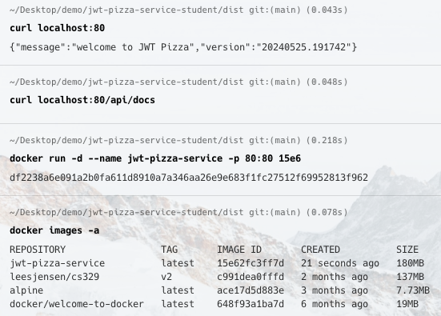

# JWT Pizza Service Container

🔑 **Key points**

- Build a Docker container image for the JWT Pizza Service.
- Configure networking to allow the container to communicate with a database on the host machine.

---

Now that you understand the basics of Docker, you will create a container image for the **jwt-pizza-service** using its source code. Follow these steps to build and run your container.

1.  **Navigate to your project:** Open your terminal and navigate to the directory containing your fork of the `jwt-pizza-service` repository.

2.  **Create the Dockerfile:** Create a file named `Dockerfile` (case-sensitive) in the project root with the following content:

    ```dockerfile
    ARG NODE_VERSION=22

    FROM node:${NODE_VERSION}-alpine
    WORKDIR /usr/src/app
    COPY . .
    RUN npm ci
    EXPOSE 80
    CMD ["node", "index.js", "80"]
    ```

3.  **Configure the database host:** Modify or create the `src/config.js` file. To allow the code inside the container to connect to the MySQL server running on your host machine, set the database host to `host.docker.internal`.

    > [!WARNING]
    > Add `config.js` to your `.gitignore` file to ensure you do not accidentally push sensitive credentials to your repository.

    Update the parameters (user, password, jwtSecret, and factory.apiKey) to match your environment:

    ```javascript
    module.exports = {
      jwtSecret: 'yourRandomJWTGenerationSecretForAuth',
      db: {
        connection: {
          //host: '127.0.0.1',
          host: 'host.docker.internal',
          user: 'root',
          password: 'yourDatabasePassword',
          database: 'pizza',
          connectTimeout: 60000,
        },
        listPerPage: 10,
      },
      factory: {
        url: 'https://pizza-factory.cs329.click',
        apiKey: 'yourHeadquartersProvidedApiKey',
      },
    };
    ```

4.  **Prepare the distribution directory:** Create a `dist` directory and copy the necessary files into it. This simulates a clean build environment.

    ```sh
    mkdir dist
    cp Dockerfile dist
    cp -r src/* dist
    cp *.json dist
    ```

5.  **Navigate to the distribution directory:**

    ```sh
    cd dist
    ```

6.  **Build the image:** Use the `docker build` command to create an image named `jwt-pizza-service`.

    ```sh
    docker build -t jwt-pizza-service .
    ```

7.  **Verify the image:** Check that the image was successfully created and is listed in your local registry.

    ```sh
    docker images -a

    REPOSITORY         TAG      IMAGE ID       CREATED         SIZE
    jwt-pizza-service  latest   9689e2852c3a   2 seconds ago   132MB
    ```

8.  **Run the container:** Start the container in the background.
    - The `-p 80:80` parameter maps the host's port 80 to the container's port 80.
    - The `-d` parameter runs the container in "detached" mode (background).
    - The `--name` parameter assigns a friendly name to the container instance.

    ```sh
    docker run -d --name jwt-pizza-service -p 80:80 jwt-pizza-service
    ```

    Verify the service is responding by using `curl` to hit the endpoints:

    ```sh
    curl localhost:80
    curl localhost:80/api/order/menu
    ```

    If successful, you will receive the service welcome response and the pizza menu.

9.  **Clean up:** Stop and remove the container when you are finished testing.
    ```sh
    docker rm -fv jwt-pizza-service
    ```

## ☑ Exercise

Create a JWT Pizza Service container by following the instructions above. Your workflow should include:

1.  Creating the `Dockerfile`.
2.  Setting up the `dist` directory.
3.  Modifying `config.js` to allow external database access.
4.  Building the container image.
5.  Running the container and verifying connectivity.
6.  Shutting down the container.

Once complete, your console history should reflect the build, list, and run commands.



```masteryls
{"id":"126355a7-4172-487f-b7e2-04447d8614d3", "title":"JWT Pizza container", "type":"file-submission", "gradingCriteria":"Successful docker run command for jwt-pizza-service" }
Upload a screenshot of your working container.
```

> [!IMPORTANT]
> After completing this exercise, remember to revert the **host** in your `src/config.js` file back to `127.0.0.1`. This ensures that the service can still connect to your MySQL database when running natively (outside of Docker).
>
> ```javascript
> db: {
>  connection: {
>    host: '127.0.0.1',
>    //host: 'host.docker.internal',
>    ...
>  },
> },
> ```
