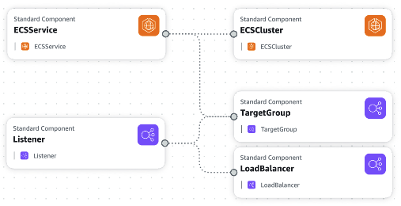
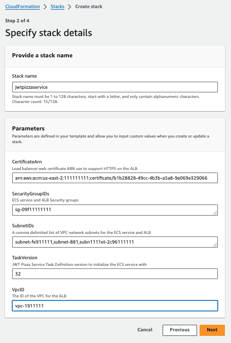
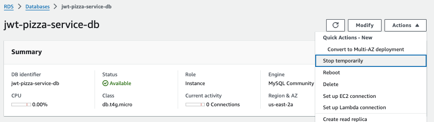

# JWT Pizza Service infrastructure automation

🔑 **Key points**

- Convert your manual JWT Pizza Service deployment to IaC using CloudFormation.

---

For the last step in your backend DevOps automation, you will create a CloudFormation template that will allow you to quickly set up and tear down the ECS and ALB service configuration that hosts your JWT Pizza Service backend.

## Delete the manual deployment

Before you do that you need to delete all the existing AWS infrastructure that you created previously. You can then rebuild the infrastructure using CloudFormation stack automation.

To delete the backend infrastructure you can simply delete the ECS `jwt-pizza-service` cluster. This should cause the ECS `jwt-pizza-service` service and EC2 ALB load balancer to also be deleted.

## Cutting your AWS bill

Using CloudFormation to automate the creation and tear down of your backend JWT Pizza Service infrastructure will provide some significant cost savings. Instead of paying for keeping your backend service running throughout the month, or going through the pain of manually recreating it when needed, you can tear it down and start it up in a matter of minutes.

## Creating a JWT Pizza Service backend CloudFormation template

The following is a complete CloudFormation template that deploys the JWT Pizza Service to ECS and ALB.



The resources that are created include:

1. **ECS Cluster** - Controls the management of the ECS service.
1. **ECS Service** - Deploys the Docker containers and coordinates with the ALB target group to handle a rolling deployment.
1. **ALB Load Balancer** - Exposes the containers in the ALB Target Group to the public internet as defined by the ALB Listener.
1. **ALB Target Group** - Manages the connections to the Docker containers in the ECS Service.
1. **ALB Listener** - Defines the connection on port 443 and terminates the HTTPS connection.

Take the time to completely review the template and become familiar with what it does. It follows the pattern discussed in the [CloudFormation](../awsCloudFormation/awsCloudFormation.md) instruction of declaring parameters, specifying resources to create, and outputting the results.

```json
{
  "AWSTemplateFormatVersion": "2010-09-09",
  "Description": "JWT Pizza Service infrastructure",
  "Parameters": {
    "TaskVersion": {
      "Type": "String",
      "Description": "JWT Pizza Service Task Definition version to initialize the ECS service with",
      "Default": ""
    },
    "CertificateArn": {
      "Type": "String",
      "Description": "Load balancer web certificate ARN use to support HTTPS on the ALB",
      "Default": ""
    },
    "SecurityGroupIDs": {
      "Type": "CommaDelimitedList",
      "Description": "ECS service and ALB Security groups",
      "Default": ""
    },
    "SubnetIDs": {
      "Type": "CommaDelimitedList",
      "Description": "A comma delimited list of VPC network subnets for the ECS service and ALB",
      "Default": ""
    },
    "VpcID": {
      "Type": "String",
      "Description": "The ID of the VPC for the ALB",
      "Default": "",
      "AllowedPattern": "^(?:vpc-[0-9a-f]{8,17}|)$",
      "ConstraintDescription": "VPC ID must begin with 'vpc-' and have a valid uuid"
    }
  },
  "Resources": {
    "ECSCluster": {
      "Type": "AWS::ECS::Cluster",
      "Properties": {
        "ClusterName": "jwt-pizza-service"
      }
    },
    "ECSService": {
      "Type": "AWS::ECS::Service",
      "Properties": {
        "Cluster": { "Ref": "ECSCluster" },
        "CapacityProviderStrategy": [{ "CapacityProvider": "FARGATE", "Base": 0, "Weight": 1 }],
        "TaskDefinition": {
          "Fn::Join": [
            ":",
            ["arn:aws:ecs", { "Ref": "AWS::Region" }, { "Ref": "AWS::AccountId" }, "task-definition/jwt-pizza-service", { "Ref": "TaskVersion" }]
          ]
        },
        "ServiceName": "jwt-pizza-service",
        "SchedulingStrategy": "REPLICA",
        "DesiredCount": 1,
        "LoadBalancers": [
          {
            "ContainerName": "jwt-pizza-service",
            "ContainerPort": 80,
            "LoadBalancerName": {
              "Ref": "AWS::NoValue"
            },
            "TargetGroupArn": {
              "Ref": "TargetGroup"
            }
          }
        ],
        "NetworkConfiguration": {
          "AwsvpcConfiguration": {
            "AssignPublicIp": "ENABLED",
            "SecurityGroups": {
              "Ref": "SecurityGroupIDs"
            },
            "Subnets": {
              "Ref": "SubnetIDs"
            }
          }
        },
        "PlatformVersion": "LATEST",
        "DeploymentConfiguration": {
          "MaximumPercent": 200,
          "MinimumHealthyPercent": 100,
          "DeploymentCircuitBreaker": {
            "Enable": true,
            "Rollback": true
          }
        },
        "DeploymentController": {
          "Type": "ECS"
        },
        "ServiceConnectConfiguration": {
          "Enabled": false
        },
        "Tags": [],
        "EnableECSManagedTags": true
      },
      "DependsOn": ["Listener"]
    },
    "LoadBalancer": {
      "Type": "AWS::ElasticLoadBalancingV2::LoadBalancer",
      "Properties": {
        "Type": "application",
        "Name": "jwt-pizza-service",
        "SecurityGroups": {
          "Ref": "SecurityGroupIDs"
        },
        "Subnets": {
          "Ref": "SubnetIDs"
        }
      }
    },
    "TargetGroup": {
      "Type": "AWS::ElasticLoadBalancingV2::TargetGroup",
      "Properties": {
        "HealthCheckPath": "/",
        "Name": "jwt-pizza-service",
        "Port": 80,
        "Protocol": "HTTP",
        "TargetType": "ip",
        "HealthCheckProtocol": "HTTP",
        "VpcId": {
          "Ref": "VpcID"
        },
        "TargetGroupAttributes": [
          {
            "Key": "deregistration_delay.timeout_seconds",
            "Value": "300"
          }
        ]
      }
    },
    "Listener": {
      "Type": "AWS::ElasticLoadBalancingV2::Listener",
      "Properties": {
        "DefaultActions": [
          {
            "Type": "forward",
            "TargetGroupArn": {
              "Ref": "TargetGroup"
            }
          }
        ],
        "LoadBalancerArn": {
          "Ref": "LoadBalancer"
        },
        "Port": 443,
        "Protocol": "HTTPS",
        "Certificates": [
          {
            "CertificateArn": { "Ref": "CertificateArn" }
          }
        ]
      }
    }
  },
  "Outputs": {
    "ClusterName": {
      "Description": "Cluster",
      "Value": {
        "Ref": "ECSCluster"
      }
    },
    "ECSService": {
      "Description": "Service",
      "Value": {
        "Ref": "ECSService"
      }
    },
    "LoadBalancer": {
      "Description": "Load balancer",
      "Value": {
        "Ref": "LoadBalancer"
      }
    },
    "Listener": {
      "Description": "Load balancer listener",
      "Value": {
        "Ref": "Listener"
      }
    },
    "TargetGroup": {
      "Description": "Load balancer target group",
      "Value": {
        "Ref": "TargetGroup"
      }
    }
  }
}
```

## Creating the CloudFormation stack

1. Create a new CloudFormation stack using the above template.
1. Name the stack `jwtpizzaservice`.

   

1. Supply the requested parameters based upon your AWS account. You can obtain these values from the following locations:
   1. The VPC ID and VPC subnets from the AWS VPC service dashboard.
      1. To copy the list of subnets, you can click the checkbox next to 'Name' to select all subnets, which will create a comma-separated list in the lower window.
   1. The latest Task Definition version from the ECS service dashboard.
   1. The web certificate ARN from the Certificate Manager service dashboard.
   1. The security group from the EC2 service dashboard.
1. Complete the creation process as you did with the previous simple S3 bucket example.

## DNS update

Because you are recreating the ALB, the DNS record you previously created for `pizza-service.YOURDOMAIN` is no longer valid. You will need to copy the new ALB DNS Name and update the DNS record before you can connect to your backend through the internet.

Once you have updated the DNS record you should be able to connect to your backend using curl as demonstrated in the example below.

```sh
➜  curl https://pizza-service.byucsstudent.click/

{"message":"welcome to JWT Pizza","version":"20240525.191742"}
```

## MySQL Database

As part of this automation, we did not automate the deployment of the MySQL database. There are three things you can do to manage your DB.

1. **Leave it running**: You can leave your database continually running. This will cost you about $15/month, but has the advantage of not having to worry about changing anything. The disadvantage is that you will not gain any experience from managing the database.
1. **Manual management**: You can manually tear down and deploy the database as desired.
1. **Automate**: You can create a CloudFormation template in order to automate the creation and destruction of the database. As part of the automation you can also create and restore a snapshot of the database's data.
1. **Temporary stop**: RDS allows you to temporarily stop the database by selecting the database actions in the RDS service console and pressing `Stop temporarily`.

   

   You will still pay for any storage associated with the database, but you don't pay for the instance when it is stopped. When you are ready to use the database again press the `Start` action.

   

   Note that it does take a few minutes for the database to stop or start.

If you do choose an option that deletes and recreates your database, either manually or with automation, then you will need to update the DB_HOSTNAME secret in your GitHub Actions workflow since a new hostname will be generated. You will also lose any data you have stored in the database unless you take a snapshot before you delete the database and then restore it after you recreated it.

## ☑ Exercise

Complete the following.

1. Delete your previous ECS and ALB infrastructure.
1. Create a S3 bucket to host your CloudFormation templates.
1. Create the `jwt-pizza-service.json` template file.
1. Save the CloudFormation template to your fork of the `jwt-pizza-service` in a folder named `cloudFormation`.
1. Deploy a CloudFormation stack using the `jwt-pizza-service.json` template.
1. Fix your JWT Pizza Service DNS entry to point to the new ALB URL.
1. Trigger your `jwt-pizza-service` CI deployment pipeline and verify that the new service is deployed.

Once this is all working, your GitHub URL to the CloudFormation template file should look something like this:

```
https://github.com/youraccountnamehere/jwt-pizza-service/blob/main/cloudFormation/jwt-pizza-service.json
```

💡 A great creativity report would be to dig into CloudFormation and figure out how you could also automate the deployment of your RDS MySQL database or S3/CloudFront infrastructure.
