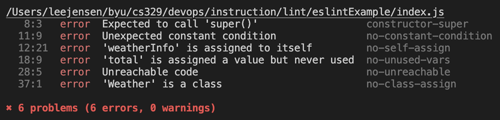

# Lint

🔑 **Key points**

- Standardizing coding styles and practices creates better code.
- Lint is an automated tool that checks your code for compliance.
- Gain mastery by linting a project.

---

Linting your code is the process of analyzing your code for little bits of fluff that should be removed. This includes things like unused variables, variables that should be marked as constant, and missing semicolons. Often times these problems are benign, but sometimes they expose real problems, and it is well worth the trouble to install and listen to a linter.

One of the most popular linting tools for JavaScript is [eslint](https://eslint.org/docs/latest/). Let's walk through the process of using eslint for a simple node.js project.

## Project creation

Create a node.js project and install eslint.

```sh
mkdir eslintExample && cd eslintExample
npm init -y
```

## Install eslint

```sh
npm init @eslint/config@latest
```

As part of the eslint install, select the options:

- `To Check syntax and find problems`
- `CommonJS (require/exports)`
- No framework
- Not use TypeScript
- Remove the option to run in a Browser and select the one to run in Node
- Select NPM as your package manager

This will add eslint as a dev dependency and create a file name `eslint.config.mjs`. You can review what this file contains. It mostly specifies to use the default linting rules, expect node.js code, and look for files in a specific location.

## Configure the project

Alter `package.json` to contain a script to run eslint.

```json
"scripts": {
  "start": "node index.js",
  "lint": "eslint ."
}
```

## Create some JavaScript that we can lint

Create a file named `index.js` and put the following code in it.

```js
class Info {
  constructor() {
    this.data = [];
  }
}

class Weather extends Info {
  constructor() {}

  report(weatherInfo) {
    if (true) {
      weatherInfo = weatherInfo;
      this.data.push(weatherInfo);
    }
  }

  getAverageTemperature() {
    let total = 0;
    let sum = 0;
    if (this.data.length > 0) {
      for (let i = 0; i < this.data.length; i++) {
        sum += this.data[i].temperature;
      }

      return sum / this.data.length;
    }
    return sum;
    return sum;
  }
}

let weather = new Weather();
weather.report({ temperature: 25, humidity: 60 });
weather.report({ temperature: 30, humidity: 70 });
console.log(weather.getAverageTemperature());

Weather = new Weather();
console.log(weather.getAverageTemperature());
```

## Run the linter

Open your command console and run eslint.

```sh
npm run lint

eslintExample/index.js
   8:3   error  Expected to call 'super()'                  constructor-super
  11:9   error  Unexpected constant condition               no-constant-condition
  12:21  error  'weatherInfo' is assigned to itself         no-self-assign
  18:9   error  'total' is assigned a value but never used  no-unused-vars
  28:5   error  Unreachable code                            no-unreachable
  37:1   error  'Weather' is a class                        no-class-assign

✖ 6 problems (6 errors, 0 warnings)
```

This shows several errors. Some of them suggest serious problems. For example, the failure to call `super()` will cause the code to immediately crash. Reassigning the class `Weather` to a different value is going to be problematic.

Some problems are more benign. For example, having an unreachable return value, or a conditional that is always true. However, the extra lint in your code usually creates a maintenance problem and slows down code cognition. So it is almost always a good idea to run a linter and follow its suggestions.

## ☑ Exercise

Create a project based on the steps provided above. Run the linter and review and fix the items it reports.

Review the [rules](https://eslint.org/docs/latest/rules/) that eslint is configured to report. Find a couple that look interesting and change the project code to trigger them.

Once you are done, you should see something like this:


