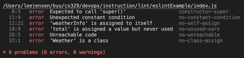

# Lint

🔑 **Key points**

- Standardizing coding styles and practices improves code quality and maintainability.
- A linter is an automated tool that analyzes your code for errors and stylistic inconsistencies.
- Mastery is gained by configuring and resolving linter feedback in a project.

---

Linting is the process of running a tool that analyzes your source code to flag programming errors, bugs, stylistic errors, and suspicious constructs. This includes identifying unused variables, variables that should be marked as constants, and missing semicolons. 

Oftentimes these problems are benign, but they frequently expose logical flaws or potential runtime errors. It is well worth the effort to install a linter and address the issues it identifies.

One of the most popular linting tools for JavaScript is [ESLint](https://eslint.org/docs/latest/). Let's walk through the process of using ESLint for a simple Node.js project.

## Project creation

First, create a Node.js project directory and initialize it.

```sh
mkdir eslintExample && cd eslintExample
npm init -y
```

## Install ESLint

Run the following command to install and configure ESLint:

```sh
npm init @eslint/config@latest
```

During the configuration process, select the following options:

- **How would you like to use ESLint?**: `To check syntax and find problems`
- **What type of modules does your project use?**: `CommonJS (require/exports)`
- **Which framework does your project use?**: `None of these`
- **Does your project use TypeScript?**: `No`
- **Where does your code run?**: Uncheck `Browser` and select `Node`
- **Which package manager do you want to use?**: `npm`

This will add ESLint as a development dependency and create a configuration file named `eslint.config.mjs`. This file specifies the default linting rules, the target environment (Node.js), and the files to analyze.

## Configure the project

Update your `package.json` file to include a script for running ESLint.

```json
"scripts": {
  "start": "node index.js",
  "lint": "eslint ."
}
```

## Create JavaScript code to lint

Create a file named `index.js` and add the following code. Note that this code contains several intentional errors for the linter to catch.

```js
class Info {
  constructor() {
    this.data = [];
  }
}

class Weather extends Info {
  constructor() {}

  report(weatherInfo) {
    if (true) {
      weatherInfo = weatherInfo;
      this.data.push(weatherInfo);
    }
  }

  getAverageTemperature() {
    let total = 0;
    let sum = 0;
    if (this.data.length > 0) {
      for (let i = 0; i < this.data.length; i++) {
        sum += this.data[i].temperature;
      }

      return sum / this.data.length;
    }
    return sum;
    return sum;
  }
}

let weather = new Weather();
weather.report({ temperature: 25, humidity: 60 });
weather.report({ temperature: 30, humidity: 70 });
console.log(weather.getAverageTemperature());

Weather = new Weather();
console.log(weather.getAverageTemperature());
```

## Run the linter

Open your terminal and run the lint script:

```sh
npm run lint
```

You should see output similar to this:

```sh
eslintExample/index.js
   8:3   error  Expected to call 'super()'                  constructor-super
  11:9   error  Unexpected constant condition               no-constant-condition
  12:21  error  'weatherInfo' is assigned to itself         no-self-assign
  18:9   error  'total' is assigned a value but never used  no-unused-vars
  28:5   error  Unreachable code                            no-unreachable
  37:1   error  'Weather' is a class                        no-class-assign

✖ 6 problems (6 errors, 0 warnings)
```

The output identifies several issues. Some suggest serious logical problems; for example, failing to call `super()` in a derived class constructor will cause the code to crash at runtime. Reassigning the class name `Weather` to an instance is also problematic.

Other problems are more benign, such as unreachable code or a constant conditional. However, "lint" in your code creates maintenance debt and slows down code comprehension. It is almost always best practice to run a linter and follow its suggestions.

## ☑ Exercise

1. Create a project following the steps above.
2. Run the linter, then review and fix each reported item in `index.js`.
3. Review the [available ESLint rules](https://eslint.org/docs/latest/rules/). Find two rules that look interesting and modify your code to trigger them.
4. Verify that the linter correctly identifies your new violations.

Once you have resolved the errors, your terminal should report no problems found:

